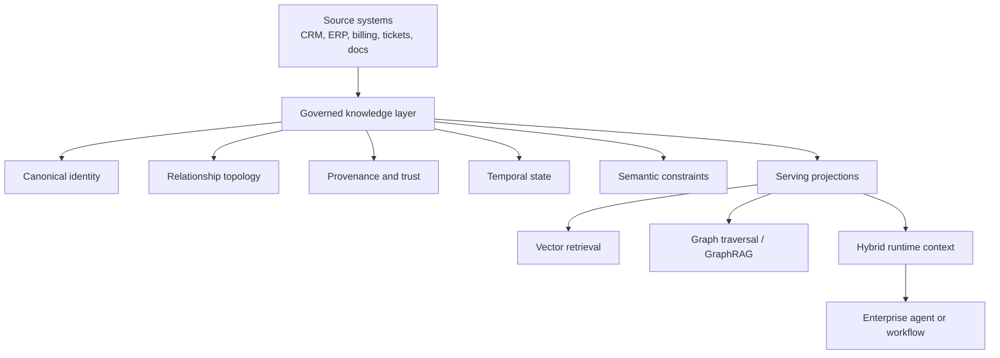
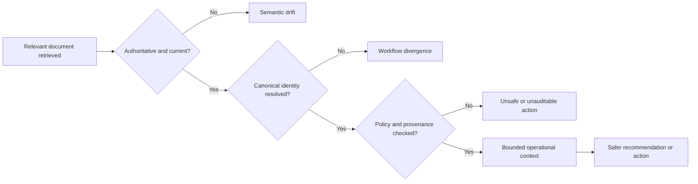

# Stateful Enterprise Cognition

## Abstract

Enterprise agents do not fail mainly because models cannot generate plausible text. They fail because enterprise state is fragmented, stale, weakly governed, and hard to interpret across systems. This note argues that useful enterprise autonomy requires a governed knowledge layer that externalizes canonical identity, relationships, provenance, policy constraints, and temporal state. Without that layer, retrieval systems can sound informed while still acting on the wrong version of reality.

## Context and motivation

Early enterprise AI deployments mostly treated large language models as conversational interfaces over existing documents and systems. Retrieval-augmented generation improved access to knowledge by moving beyond purely parametric memory and grounding outputs in external sources. That pattern works reasonably well for search, summarization, and lightweight assistance.

It breaks down when the system is expected to participate in operational workflows.

Once an agent must inspect business state, coordinate across systems, evaluate policy, preserve traceability, and prepare or execute bounded actions, the main problem is no longer only language understanding. The harder problem is reconstructing enough trustworthy operational context to act safely.

That is the structural shift now underway. Enterprise AI is moving from conversational retrieval toward stateful operational cognition.

## Core thesis

Enterprise agent systems require a governed knowledge layer because reliable autonomy depends on bounded, trustworthy operational state rather than document similarity alone.

The practical bottleneck is not just model intelligence. It is whether the organization has externalized enough usable meaning for a machine to reason over:

- who or what an entity actually is;
- how it relates to other entities and workflows;
- which source is authoritative;
- what changed over time;
- which constraints and approvals apply; and
- what evidence supports an action.

If that semantic substrate is missing, agents drift away from enterprise reality even when their language output looks correct.

## Mechanism: the governed knowledge layer

The enterprise knowledge layer is not just a graph database, a vector store, or a document index. It is a coordination layer that stabilizes meaning across heterogeneous systems.

At minimum, it needs to provide six capabilities.

### 1. Canonical identity

The same customer, vendor, system, or policy object often appears under incompatible identifiers across CRM, ERP, billing, support, compliance, spreadsheets, and internal documents.

An agent cannot reason consistently across workflows unless those representations are reconciled into a canonical identity model with aliases and cross-system mappings.

### 2. Relationship topology

Enterprise operations are relational by default. Contracts govern accounts. Policies constrain approvals. Services depend on suppliers. Incidents affect downstream systems. Teams own workflows.

These relationships are often implicit inside separate tools. A governed knowledge layer makes them explicit enough for impact analysis, dependency tracing, policy inheritance, and multi-hop reasoning.

### 3. Provenance and trust

Operational reasoning needs evidence, not only answers.

For any material claim, the system should be able to answer:

- which source system produced it;
- when it was updated;
- whether it was transformed;
- whether it remains authoritative; and
- which workflow or decision consumed it.

Without provenance, the system cannot distinguish justified state from plausible synthesis.

### 4. Temporal state

Enterprise truth changes continuously. Contracts are revised. Approvals expire. Inventory moves. Risk posture shifts. Policy versions change.

Operational reasoning therefore depends on time semantics:

- what is true now;
- what was true at decision time; and
- what changed after a recommendation or action.

Static retrieval snapshots are too weak for this class of work.

### 5. Semantic constraints

Enterprise workflows are bounded by policy, contract, approvals, permissions, and organizational rules.

A governed knowledge layer should externalize those constraints in machine-readable form so systems can validate eligibility and preconditions before execution rather than infer them after the fact.

### 6. Serving projections

Canonical meaning and retrieval optimization should be separated.

The semantic layer should remain relatively stable. Retrieval projections such as embeddings, chunk indexes, graph traversals, summaries, and caches can change as models and serving infrastructure evolve. That separation reduces semantic drift when the retrieval stack changes.

## Why current enterprise agent systems fail

Most enterprise failures cluster around a few recurring patterns.

### Semantic fragmentation

An agent retrieves several records that refer to the same real entity but cannot reliably prove that they are the same thing. Small identity mismatches then become duplicate actions, policy errors, and workflow divergence.

### Retrieval drift

Similarity is not correctness. A semantically similar contract, policy, or customer record can still be operationally wrong for the current workflow state.

### Missing provenance

The answer may sound reasonable, but nobody can establish where it came from, which version was used, or whether the underlying source is still authoritative.

### Temporal inconsistency

The system reasons over a stale snapshot while the enterprise has already changed. The output is coherent but no longer valid.

### Action without bounded meaning

The agent can call tools or APIs, but it lacks enough semantic grounding to understand the operational implications of its actions. Tool access without governed meaning is where enterprise risk becomes real.

## Concrete examples

### Example 1: order exception handling

Consider an order exception workflow.

The agent needs more than semantically relevant documents. It needs to determine:

- which customer record is canonical across CRM, ERP, and billing;
- which contract version is active;
- which inventory state is current;
- which approval rules apply to the exception;
- whether risk thresholds have already been exceeded; and
- which downstream systems will be affected if the order is modified.

These are state questions. A vector retrieval system may surface related policies and prior tickets, but it cannot by itself guarantee that the retrieved material reflects the authoritative operational state at decision time.

### Example 2: policy-aware approval workflows

Now consider an internal approval agent that prepares a recommendation for a vendor onboarding decision.

If the system has a governed knowledge layer, it can assemble a bounded runtime context:

- canonical vendor identity and aliases;
- current policy version;
- outstanding compliance documents;
- manager approval threshold;
- source lineage for each fact; and
- validity windows on prior checks.

That does not make the final decision inherently safe, but it does make the recommendation inspectable, auditable, and constrained by current enterprise meaning rather than detached document recall.

## Knowledge graphs in this architecture

Knowledge graphs matter here because they are a practical way to externalize connected operational meaning.

Their value is not only graph traversal. Their value is that they can represent:

- entities and aliases;
- relationship topology;
- provenance links;
- constraints;
- organizational ownership; and
- evolving workflow state.

That makes them useful as operational semantic memory. But they are still only one part of the knowledge layer. A graph database alone is not enough. The important distinction is between storing edges and governing meaning.

## Trade-offs and failure modes

This approach is not a shortcut.

### It assumes organizational discipline

If ownership is unclear, policies are inconsistent, or source systems are already contradictory, the knowledge layer will expose those problems before it fixes them.

### It can be adopted too early

Small teams with narrow workflows may not need a broad semantic layer yet. In those cases, the governance overhead can exceed the benefit.

### Graph enthusiasm can become architecture theater

Teams sometimes treat knowledge graphs as the answer rather than as one implementation component. Without canonical models, provenance discipline, and operational integration, a graph can still become another disconnected system.

### Governance adds latency and cost

Identity reconciliation, provenance capture, constraint validation, and approval logic all add work. That cost is usually justified only where workflow errors are materially expensive.

### It does not remove the need for human judgment

A governed knowledge layer can improve context quality and action safety, but it does not eliminate ambiguity, policy trade-offs, or the need for accountable review in consequential workflows.

## Practical takeaways

1. Treat enterprise autonomy as a state problem before treating it as a prompt problem.
2. Separate canonical semantic meaning from retrieval and serving optimizations.
3. Externalize provenance, versioning, and validity windows for any workflow that matters operationally.
4. Do not grant tool execution authority without policy-aware semantic context.
5. Introduce knowledge-layer governance where errors are costly, state is fragmented, and workflows span multiple systems.

## Positioning and scope

This is not academic research. It does not propose a new formalism for enterprise semantics or benchmark a complete system design.

It is also not a generic blog opinion about knowledge graphs. The claim is narrower: enterprise agents become unreliable when operational meaning remains fragmented across systems, and a governed knowledge layer is the most practical way to externalize that meaning.

It is not vendor documentation either. Vendor materials usually describe a product boundary. This note is about the architectural conditions required for trustworthy enterprise cognition across many systems and teams.

## Status and disclaimer

This note reflects exploratory but evidence-backed lab thinking. The framing is practical and interpretive, not authoritative. It is intended as a systems model for experienced operators designing agent workflows under real enterprise constraints, especially where provenance, policy, and auditability matter.

## Sources

- [Retrieval-Augmented Generation for Knowledge-Intensive NLP Tasks](https://arxiv.org/abs/2005.11401)
- [ReAct: Synergizing Reasoning and Acting in Language Models](https://arxiv.org/abs/2210.03629)
- [Entity Resolution: Past, Present, and Yet-to-Come](https://arxiv.org/abs/1905.06397)
- [From Local to Global: A GraphRAG Approach to Query-Focused Summarization](https://arxiv.org/abs/2404.16130)
- [Knowledge Graphs](https://dl.acm.org/doi/10.1145/3447772)
- [PROV-DM: The PROV Data Model](https://www.w3.org/TR/prov-dm/)
- [RDF 1.1 Concepts and Abstract Syntax](https://www.w3.org/RDF/)
- [OWL 2 Web Ontology Language: Overview](https://www.w3.org/TR/owl2-overview/)
- [Shapes Constraint Language (SHACL)](https://www.w3.org/TR/shacl/)
- [NIST AI Risk Management Framework 1.0](https://nvlpubs.nist.gov/nistpubs/ai/NIST.AI.100-1.pdf)
