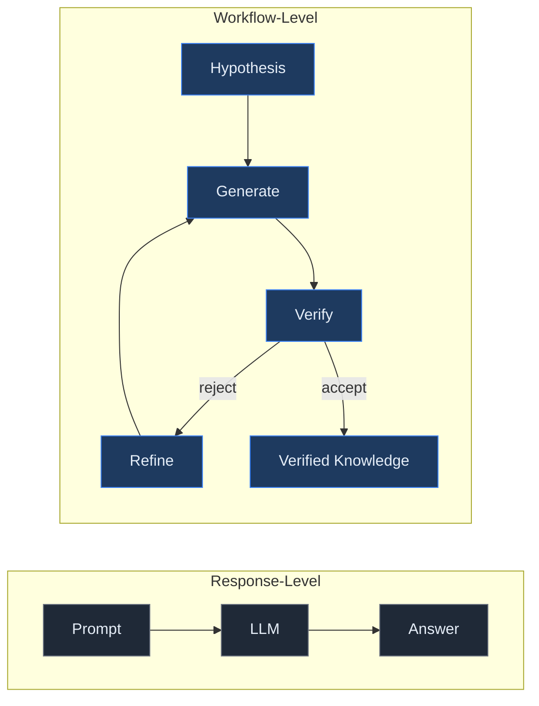
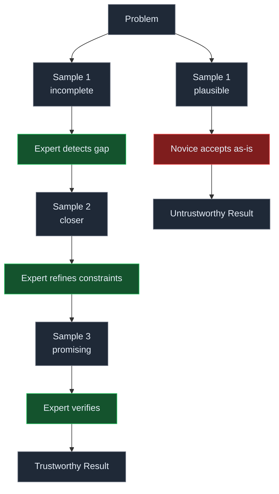
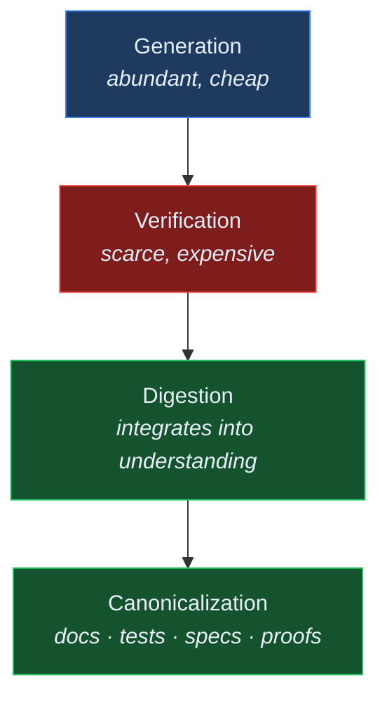

# Stop Evaluating AI One Response at a Time

## Why Workflow-Level Convergence Explains the Real Value of Expert–AI Collaboration

> As AI systems become increasingly capable, evaluating them one response at a time is becoming the wrong abstraction. In mathematics, software engineering, scientific research, and engineering design, the true unit of intelligence is not an individual answer but an iterative workflow that converges toward verified understanding.

---

## Introduction

Most evaluations of large language models assume that intelligence is expressed in a single response: a user asks a question, the model produces an answer, and humans judge whether that answer is correct.

```
Prompt
    ↓
   LLM
    ↓
 Answer
```

This framework has produced valuable benchmarks — MMLU, SWE-bench, HumanEval, GPQA — that measure important capabilities and have reliably tracked rapid improvements in modern models. These benchmarks are not obsolete. They capture local capabilities effectively.

But they do not adequately predict performance in the settings where frontier models create the most value.

Professional mathematicians rarely expect their first proof sketch to be correct. Software engineers rarely expect the first implementation to survive production review unchanged. Scientists routinely generate hypotheses they later discard. In each case, intelligence is not localized in any single artifact — it is distributed across an iterative process of generation, critique, and refinement.

The thesis of this essay is that **evaluating AI through isolated responses increasingly misses the point**. For expert use cases, the correct unit of evaluation is the workflow — the entire human–AI interaction chain — and how efficiently it converges toward verified knowledge.

Modern AI systems increasingly participate in this process. Rather than replacing human reasoning, they accelerate exploration. The appropriate unit of evaluation is therefore shifting from isolated responses to entire workflows.

---

## The Wrong Mental Model

The dominant mental model treats an LLM as a function.

$$f: X \rightarrow Y$$

Given an input, the system produces a single output.

This abstraction works well for arithmetic, factual retrieval, translation, or simple classification. It breaks down for complex intellectual work.

Real expert workflows look far more like iterative search — a framing Herbert Simon articulated decades before large language models existed. In *The Sciences of the Artificial*, Simon argued that design and problem-solving are fundamentally search through large problem spaces, where the quality of the solution depends on the efficiency of the search process rather than the correctness of any single intermediate step ([Simon, 1969](https://mitpress.mit.edu/9780262691918/the-sciences-of-the-artificial/)). Newell and Simon's later work on human problem solving demonstrated that experts navigate problem spaces through heuristic search — generating candidates, testing them against constraints, and reformulating when they fail ([Newell & Simon, 1972](https://archive.org/details/humanproblemsolv00newe)). The parallel to modern AI-assisted workflows is not accidental.

```
Problem
   ↓
Hypothesis
   ↓
LLM
   ↓
Verification
   ↓
Correction
   ↓
New prompt
   ↓
Experiments
   ↓
Reflection
   ↓
Verified result
```



Every stage influences the next. Individual responses may contain mistakes. Intermediate hypotheses may be abandoned. Entire reasoning paths may be discarded. Yet the overall process can still converge toward a better solution.

Sean Goedecke argues that experienced practitioners obtain substantially more value from LLMs than beginners because they understand how to guide this iterative process rather than treating the first response as authoritative ([LLMs Reward Expertise](https://www.seangoedecke.com/llms-reward-expertise/)).

Terence Tao describes a remarkably similar workflow in mathematics. Rather than asking ChatGPT to prove a theorem, he uses it to explore alternative representations, generate examples, test intuitions, and expose possible directions — before independently verifying every significant mathematical claim ([AI and mathematics writings](https://terrytao.wordpress.com/)).

The interaction itself becomes part of the reasoning process.

---

## LLMs Are Stochastic Search Partners

Language models are often described as functions.

A more accurate description is that the model defines a conditional probability distribution over continuations, and decoding samples from that distribution.

$$\mu: X \rightarrow \Pr(Y)$$

Rather than producing one deterministic answer, the model generates a distribution over plausible continuations. Every response represents one sample from an enormous search space.

This distinction matters because search behaves differently from deterministic computation.

When using a compiler, a wrong intermediate state is simply an error.

When performing search, a seemingly poor intermediate step can reveal an entirely new region of the solution space.

This is familiar throughout computer science: beam search intentionally explores multiple partially successful candidates; Monte Carlo Tree Search expands many imperfect branches before converging on a high-quality strategy.

The important observation is not whether individual responses are correct. Many are incomplete or inaccurate. The important observation is that the interaction helps structure subsequent human reasoning.

The conversation functions as exploratory search. Mathematical rigor still comes from formal proof, independent verification, and expert judgment. The AI primarily accelerates exploration.

This distinction explains why evaluating isolated responses misses most of the value.

---

## Local Mistakes Can Improve Global Outcomes

One of the most counterintuitive properties of search systems is that incorrect intermediate states may still improve final outcomes.

Imagine climbing a mountain in dense fog. A few steps downhill may actually be necessary to reach a higher summit.

Optimization algorithms encounter this phenomenon constantly. Machine learning optimization escapes local minima. Monte Carlo Tree Search intentionally explores uncertain branches. Scientific discovery advances through conjectures that are ultimately rejected.

Karl Popper argued that science progresses through conjectures and refutations rather than direct accumulation of truths. Incorrect hypotheses are valuable because they eliminate possibilities and improve future theories. Likewise, Imre Lakatos viewed mathematical progress as a process of continuously refining conjectures through counterexamples rather than producing perfect proofs on the first attempt ([Proofs and Refutations](https://www.cambridge.org/core/books/proofs-and-refutations/)).



The same phenomenon appears during AI-assisted work.

A partially incorrect explanation can reveal hidden assumptions. A flawed implementation can expose missing requirements. An incorrect analogy can inspire a better abstraction.

Consider a concrete example: debugging a latency spike in a distributed system. An engineer asks an LLM to suggest possible causes. The model proposes investigating a recent database migration — a plausible hypothesis that turns out to be wrong. But the investigation reveals that the relevant database metrics aren't being exported to the observability stack. Fixing that gap exposes the actual cause: a network partition between two service tiers that had been invisible to monitoring. The initial incorrect suggestion, by prompting the investigation, improved the system's observability and led to the correct diagnosis. Evaluating only the model's first response as "wrong" misses the entire value of the interaction.

Evaluating every intermediate response independently misses this dynamic entirely.

The relevant question becomes:

> Did the workflow converge more efficiently because of this interaction?

---

## Programming as Theory Building

If workflows become the unit of intelligence, what persists across iterations is not the conversation transcript but the evolving understanding that the interaction produces.

Peter Naur's classic 1985 essay *Programming as Theory Building* argued that software is fundamentally not source code. The real artifact is the understanding held by developers. Code merely records part of that understanding. When the theory disappears, maintaining the software becomes dramatically more difficult regardless of whether the source code still exists ([Programming as Theory Building](https://pages.cs.wisc.edu/~remzi/Naur.pdf)).

AI-assisted work suggests an analogous shift. The valuable artifact is increasingly not the conversation transcript. It is the evolving shared theory between human and machine.

Successful sessions gradually construct:

- architectural understanding;
- design constraints;
- evaluation criteria;
- causal explanations;
- verified abstractions.

The transcript is largely disposable. The shared theory is not.

This perspective also explains why preserving provenance, verification, and design rationale becomes increasingly important as AI-generated artifacts proliferate.

---

## Verification Becomes the Bottleneck

As generation becomes inexpensive, verification becomes the dominant engineering cost.

This shift is not confined to any single discipline. It appears wherever AI systems participate in knowledge work:

- **Mathematics**: AI exploration increasingly pairs with formal proof assistants such as Lean, where the model proposes and the proof checker verifies.
- **Software engineering**: tests, CI pipelines, evaluations, and code review form a verification stack that grows in importance as implementation accelerates.
- **Coding agents**: systems like Claude Code and Codex invest substantial engineering in evaluation harnesses, sandboxed execution, and deterministic checks that run before model judgments.
- **Scientific workflows**: reproducibility requirements and independent validation become more critical — not less — when AI accelerates hypothesis generation.
- **Frontier AI research**: OpenAI's reasoning work emphasizes extended inference and verification ([Learning to Reason with LLMs](https://openai.com/research/learning-to-reason-with-llms)), while Anthropic has described the evaluation infrastructure behind Claude Code as a first-class engineering system in its own right ([The Making of Claude Code](https://www.anthropic.com/features/making-of-claude-code)).

Across all of these, the pattern is the same: generation becomes abundant; verification becomes the bottleneck.



Generation produces candidate artifacts. Verification determines correctness. Digestion integrates validated knowledge into human understanding. Canonicalization records stable results in durable forms — documentation, tests, specifications, proofs, production systems.

As implementation becomes cheaper, organizations increasingly invest in mechanisms that determine whether generated work is trustworthy. Verification — not generation — becomes the scarce resource.

---

## Artificial Versus Natural Friction

Terence Tao distinguishes between productive intellectual effort and unnecessary mechanical effort.

Some friction improves understanding. Other friction merely wastes attention.

AI is particularly effective at removing artificial friction. Examples include API lookup, documentation search, boilerplate generation, repetitive transformations, syntax conversion, and formatting. These tasks consume cognitive bandwidth while contributing little to understanding.

Natural friction is different. Architectural reasoning, mathematical proof construction, scientific interpretation, and system design are intellectually valuable precisely because they require sustained thought.

Educational research by Robert Bjork describes similar ideas through "desirable difficulties" — certain forms of effort improve long-term learning rather than hindering it ([Desirable Difficulties in Learning](https://bjorklab.psych.ucla.edu/research/)). Richard Sennett likewise argues that craftsmanship develops through deliberate engagement with meaningful complexity rather than avoidance of difficult work ([The Craftsman](https://yalebooks.yale.edu/book/9780300151190/the-craftsman/)).

The objective is therefore not to eliminate thinking. It is to eliminate distractions that prevent thinking.

---

## Organizational Implications

These ideas extend beyond individual productivity.

Organizations increasingly deploy coding agents, research assistants, workflow automation, and autonomous systems. Most current evaluations still optimize response accuracy. Future organizations will instead optimize workflow convergence.

Questions become: How quickly does work converge toward verified outcomes? How much human steering is required? How efficiently are mistakes detected? How recoverable are hallucinations? How effectively is knowledge preserved?

What connects the emerging engineering practices is a shared architectural shift. Systems are increasingly designed to treat workflows, execution traces, verification results, provenance graphs, and causal relationships as first-class engineering artifacts — not as auxiliary metadata generated alongside model outputs, but as the primary substrate for security decisions, evaluation, and organizational learning.

Verification-first software engineering emphasizes executable specifications over generated implementations. Evaluation harnesses measure entire workflows rather than isolated outputs. Agent telemetry systems record causal execution traces. Provenance graphs preserve evidence connecting decisions, tools, and outcomes. Human checkpoints provide strategic steering instead of low-level implementation.

Recent systems — Uber's Agentic Detection and Response ([ADR](https://github.com/uber/ADR)), Google's research on scaling agent systems ([Towards a Science of Scaling Agent Systems](https://research.google/blog/towards-a-science-of-scaling-agent-systems-when-and-why-agent-systems-work/)), Anthropic's Claude Code engineering work, and provenance-focused architectures such as Zep's Graffiti ([Citation Needed: Provenance for LLM-Built Knowledge Graphs](https://www.youtube.com/watch?v=1mN8gM7bRkQ)) — all move toward richer representations of workflows rather than isolated model outputs.

The workflow increasingly becomes the security boundary, evaluation boundary, and organizational memory.

---

## Toward Workflow-Level Evaluation

If workflows become the primary unit of intelligence, evaluation should evolve accordingly.

Future benchmarks should measure properties organized across three dimensions:

**Efficiency**
- Convergence speed — how many iterations to reach a verified result?
- Human effort — how much steering, correction, and reformulation is required?
- Steering interventions — how many explicit redirects does the expert need to provide?

**Reliability**
- Hallucination recovery — when the model produces incorrect information, how quickly does the workflow self-correct?
- Correction distance — how far does each iteration move the workflow toward the correct solution?
- Final artifact quality — does the converged result meet production standards?

**Knowledge Quality**
- Provenance completeness — can every claim be traced to its source in the workflow?
- Reproducibility — would a different expert following the same workflow reach a comparable result?
- Maintainability — can the resulting artifact be updated without reconstructing the entire workflow?
- Human understanding — does the expert's own mental model improve through the interaction?

Notice that none of these metrics require every intermediate response to be correct. Instead, they measure whether humans and AI reliably converge toward verified knowledge.

This suggests a broader research agenda.

Rather than asking:

> *How accurate was the model's first answer?*

We should increasingly ask:

> *How efficiently did the human–AI system reach a trustworthy result?*

The intelligence emerges from the collaborative process.

---

## Conclusion

Frontier AI systems should not be judged solely by whether every intermediate response is correct. They should be judged by whether humans and AI reliably converge toward verified understanding.

As generation approaches negligible cost, the scarce resources shift toward verification, digestion, provenance, and human judgment.

This represents more than a change in evaluation methodology. It reflects a broader shift in how we think about intelligence itself.

As AI becomes embedded in expert workflows, the unit of intelligence shifts from isolated responses to collaborative processes. The central question is no longer whether the model produced the correct next token, but whether the human–AI system reliably converged on trustworthy knowledge.

The future of AI evaluation will not be built on response-level accuracy. It will be built on workflow-level convergence — and the systems that measure it are already under construction.

---

## References

- Anthropic. *The Making of Claude Code.* https://www.anthropic.com/features/making-of-claude-code
- Bjork, R. A. *Desirable Difficulties in Learning.* https://bjorklab.psych.ucla.edu/research/
- Chalef, D. *Citation Needed: Provenance for LLM-Built Knowledge Graphs.* https://www.youtube.com/watch?v=1mN8gM7bRkQ
- Goedecke, S. *LLMs Reward Expertise.* https://www.seangoedecke.com/llms-reward-expertise/
- Google Research. *Towards a Science of Scaling Agent Systems: When and Why Agent Systems Work.* https://research.google/blog/towards-a-science-of-scaling-agent-systems-when-and-why-agent-systems-work/
- Lakatos, I. *Proofs and Refutations.* Cambridge University Press. https://www.cambridge.org/core/books/proofs-and-refutations/
- Naur, P. *Programming as Theory Building.* 1985. https://pages.cs.wisc.edu/~remzi/Naur.pdf
- Newell, A. & Simon, H. A. *Human Problem Solving.* 1972. https://archive.org/details/humanproblemsolv00newe
- OpenAI. *Learning to Reason with LLMs.* https://openai.com/research/learning-to-reason-with-llms
- OpenAI. *Ten Proofs.* https://cdn.openai.com/pdf/ten-proofs-oai.pdf
- Popper, K. *Conjectures and Refutations.* Routledge.
- Sennett, R. *The Craftsman.* Yale University Press. https://yalebooks.yale.edu/book/9780300151190/the-craftsman/
- Simon, H. A. *The Sciences of the Artificial.* 1969. MIT Press. https://mitpress.mit.edu/9780262691918/the-sciences-of-the-artificial/
- Tao, T. *AI and Mathematics writings.* https://terrytao.wordpress.com/
- Tao, T. *On using ChatGPT to investigate the Jacobian Conjecture.* https://terrytao.wordpress.com/
- Uber Engineering. *Agentic Detection and Response (ADR).* https://github.com/uber/ADR
