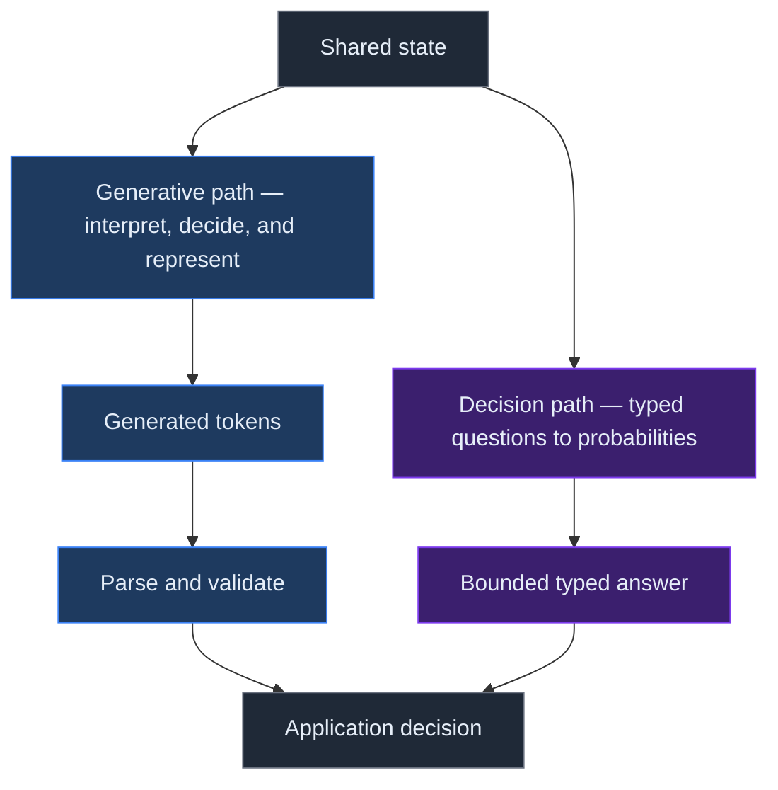
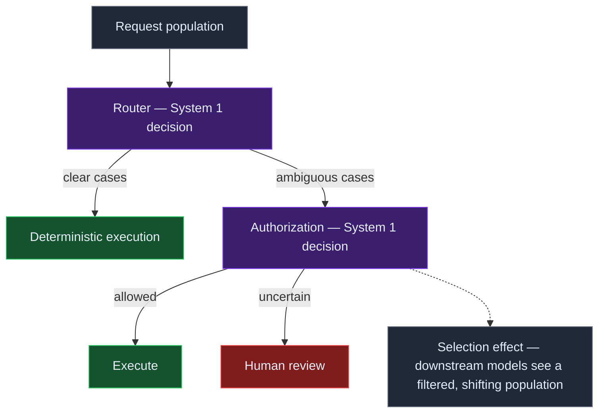
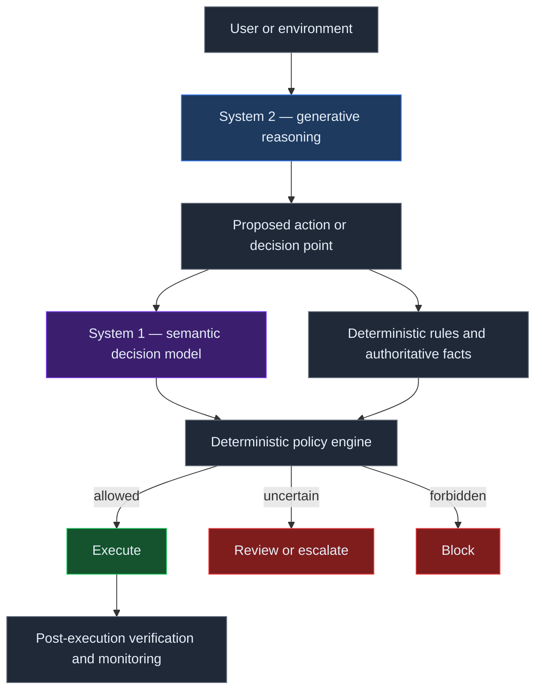

# System One Decision Models as Agent Infrastructure

*A systems argument for separating bounded semantic judgment from text generation.*

Agent runtimes often ask generative models to classify, route, score, or assess a proposed action, then constrain the answer so software can consume it. Those tasks need interpretation, but they do not always need generated prose. This note argues that a dedicated semantic-decision layer may fit between deterministic software and open-ended reasoning. The layer is useful only if its probabilities hold on the deployment distribution, its output remains evidence rather than authority, and its decisions are evaluated as part of the complete workflow. Jev makes the interface concrete; it does not establish that the architecture works.

## Generative models became the universal semantic primitive

Generative models are a convenient default for judgments over messy text or state: one interface can classify, route, score, and explain. That flexibility helps while requirements change, but it groups interpretation, selection, and representation in one call.

A runtime needing continue, review, or block can ask a generative model to interpret state, choose an outcome, and encode it as tokens; software then parses and validates the answer. Structured output constrains representation while leaving this generative path in place.

Jev makes the contrast concrete. TypeSafe’s [System One Model announcement](https://typesafe.ai/blog/introducing-system-one-models-and-jev) describes state plus typed questions returning bounded answers and probabilities. Vercel offers the model as [typesafe-ai/jev](https://vercel.com/ai-gateway/models/jev) through AI SDK’s `experimental_evaluate` interface, with independent Boolean, Choice, and Score questions evaluated in parallel over shared state. These interface facts do not verify vendor claims about calibration or performance.

The architectural question is whether the application needs a paragraph, or a judgment that the application can use. A decision interface can make that boundary explicit:

The interfaces trade generated representation for a bounded decision contract. That makes schema shape more direct while shifting assurance toward question design, probability quality, and policy.

## A useful mental model: the amortized semantic predicate

Deterministic software uses predicates for structured, authoritative facts. Permissions, limits, and required fields can be checked directly against known values and visible rules.

Other predicates ask about meaning: whether a support request concerns billing, an action exposes a credential, or an incident fits a severity rubric. Linguistic context makes exhaustive rules brittle, while the branch often needs no generated explanation.

This note frames a learned decision model as an **amortized semantic predicate**: it applies learned interpretation to recurring inputs and returns a bounded probabilistic answer. This is our architectural inference, not TypeSafe terminology. “Amortized” means reuse across calls; it does not mean the decision is free, exact, or permanently valid.

A bounded answer remains probabilistic. It can simplify branching, but its semantic interpretation still requires evaluation.

## Evidence should not be confused with authority

Suppose an agent proposes deleting a production repository. A semantic model can assess whether the action appears destructive or unusual and whether its arguments mention sensitive material. That evidence may help policy decide what happens next.

Model judgments do not establish caller authorization. Identity, permissions, environment allowlists, transaction limits, and deny rules belong to deterministic systems that own those facts. A policy engine combines those facts with model evidence, then applies explicit thresholds, approvals, and execution rules. The model does not grant permission, choose its threshold, invoke a tool, or authorize an irreversible action.

This division follows [Vercel’s agent-loop guidance](https://vercel.com/i/jev-agent-control): keep permission checks, tool execution, and policy in application code. The earlier note on [typed software decisions](/notes/jev-vs-generative-models-for-typed-software-decisions/) examines the interface; this note extends the question to authority and composition.

Failure handling should be explicit. Policy can require independent authorization despite a low risk estimate, route missing results to review, or escalate uncertainty without changing permissions. Evidence informs the decision; it does not own it.

## Type safety eliminates one failure class, not correctness

Constrained outputs can eliminate malformed or out-of-vocabulary answers when a schema defines the allowed values. A risk rubric can prevent “banana” as a value. TypeSafe describes Jev’s type errors as impossible and calls it “unable to hallucinate”; the useful interpretation is structural: the result stays inside the declared answer space.

The same interface can return a valid value that misreads the evidence: a credential leak labeled benign is schema-valid and wrong. [Vercel’s Jev explainer](https://vercel.com/i/what-is-jev) makes this distinction and recommends testing decisions against known outcomes before they trigger actions. Parseability is an interface property; semantic correctness is empirical.

Schemas, constrained decoding, tool signatures, and typed APIs remove malformed-output failure modes; they do not prove a selected value is true, safe, or appropriate. Validation must cover both answer shape and meaning in context.

## Probabilities become useful only when they mean something

A categorical result selects a branch. A probability distribution can expose uncertainty and support different handling for reversible and consequential actions, but a number between zero and one is not automatically a reliable event estimate.

Calibration asks whether predictions assigned a probability match observed frequencies over relevant cases. If cases assigned about 0.9 risk are correct roughly 90 percent of the time, the estimate is calibrated for that population and outcome. Modern neural networks are not automatically calibrated; [Guo et al.](https://arxiv.org/abs/1706.04599) distinguish probability quality from predictive accuracy. This does not establish Jev’s behavior.

TypeSafe describes Jev as returning “calibrated probabilities and confidence scores” and says its training method is Reinforcement Learning for Calibrated Decisions (RLCD). These vendor claims need testing. Applications must measure probability quality on their deployment distribution, using their question wording, state, labels, and policy. Emitted probabilities do not establish deployment calibration.

Evaluation should include Brier score or log loss, reliability plots, false-positive and false-negative rates at operational thresholds, and selective risk as uncertain cases are escalated. Define the population and outcome labels first. Calibration can vary by class, user, tool, or severity, so an aggregate score can hide a weak high-risk slice.

New tools, policy updates, adversarial inputs, and user mix can shift the target distribution and invalidate earlier measurements. Monitor probability quality and recalibrate when thresholds influence action. Whether a model sustains useful calibration under these conditions is a test, not a default property.

## This changes how to think about LLM judges

A second generative model can judge a proposed action when the case needs broad reasoning, evidence synthesis, or explanation. A typed decision model offers another mechanism for bounded questions where the runtime needs evidence rather than prose.

A pre-action control asks whether a proposed step may proceed; a verifier asks what can be established after execution; an evaluation measures behavior across cases. The workflow gives an output its role. [Beyond Evals: A Practical Assurance Model for Agentic Systems](/notes/beyond-evals-assurance-model/) distinguishes these evidence functions.

A runtime can combine deterministic checks, decision models, generative judges, verifiers, and human review. Choose by uncertainty, error cost, explanation needs, and independent checkability. A typed decision model is one candidate in an evidence portfolio, not a universal replacement for a generative judge.

## The deeper systems problem is composition

A router may send ordinary cases to deterministic handling and ambiguous cases to an authorization model. The downstream model then sees a filtered population, not the original request distribution. Calibration measured at each node does not ensure calibration in the composed workflow.

Confidence, question design, policy, and upstream errors can shape selection. A downstream model may face a different class mix; nodes using the same misleading state may share errors. Local reliability curves do not describe the probability of a correct end-to-end decision.

Policy changes also reshape the graph. A tighter threshold changes which cases proceed, reach review, and supply feedback. Node-only measurements miss these conditional populations and the workflow outcomes.

The systems question is how uncertainty and evidence compose across the execution graph. Retain route provenance, measure conditional performance at important branches, and assess end-to-end outcomes as policies change. These are proposed measurement needs; no settled composition method is claimed.

## A heterogeneous agent runtime

If a semantic decision layer proves useful, a runtime can assign different work to different mechanisms: deterministic code for identity, permissions, invariants, authoritative facts, and execution; bounded decision models for ambiguous state; generative models for planning, synthesis, explanation, and open-ended problems.

A deterministic policy engine must sit between model evidence and side effects, deciding whether to allow, escalate, or block. Post-execution verification checks what happened; a pre-action estimate cannot prove that a tool behaved as expected.

This remains a runtime hypothesis, not a deployment prescription. Record which mechanism produced each item of evidence, which policy consumed it, and what execution followed. [The Harness Is Becoming the Runtime](/notes/the-harness-is-becoming-the-runtime/) offers a related architecture frame.

## Jev is an early case study, not proof of the category

“System One Model” is TypeSafe’s product and research terminology, inspired by fast and slow thinking. It is not an established industry category, and the analogy does not show that model architectures map cleanly onto human cognition.

A specialized interface matters only if it improves properties builders need, such as semantic accuracy, probability quality, robustness, latency, cost, or policy integration. TypeSafe’s performance and calibration statements are vendor claims; this note asserts no independent benchmark result. The task-specific value remains empirical.

Deterministic rules or conventional classifiers may remain better for stable problems with structured inputs. A semantic model adds little when authoritative fields determine the label, probabilities do not affect policy, or the workflow needs a generative explanation. Distribution changes can invalidate earlier measurements.

Comparisons should hold task, evidence, and policy constant while measuring semantic errors, calibration, selective risk, operational cost, and behavior after composition. They should also show which cases remain in human review. A typed interface is an option whose value depends on whole-workflow evidence.

## The Jev Assurance Lab

The planned [Beyond Evals Lab](https://github.com/rmax-ai/beyond-evals-lab) experiment includes a [Jev Assurance Lab case](https://github.com/rmax-ai/beyond-evals-lab/issues/11) to test this argument. It compares deterministic rules, Jev typed decisions, and a generative structured-output evaluator on the same proposed tool actions. The lab is an evidence-generation instrument, not a result or proof of superiority.

The case design covers ordinary actions and boundary cases: destructive operations, credential exposure, prompt-injection-tainted arguments, authorization mismatches, and ambiguous examples. Planned measures include false positives and negatives, Brier score and reliability, selective risk, latency, schema failures, and available cost metadata. Dataset and label design bound what results can support.

The first experiment can compare individual decisions under controlled conditions. A follow-up should test linked nodes, where routing changes the cases reaching authorization and review. No live benchmark or deployment-calibration claim follows before results are collected and inspected.

## The model may stop being the unit of architecture

“Which model should run the agent?” compresses distinct jobs into one selection. A runtime may schedule exact code, bounded semantic judgment, open-ended reasoning, and post-execution verification where each fits. Evidence from the workflow must show whether that division helps.

If useful, the decision layer needs explicit authority and uncertainty boundaries. It also needs measurements of how routing, policy, and execution change the population. The workflow remains the unit whose behavior matters.

## Practical Takeaways

- Use deterministic code for facts, permissions, invariants, and execution rules the system can know directly.
- Ask whether a bounded decision needs generated prose; if not, compare a decision interface against the existing path.
- Treat a typed answer as structurally constrained evidence, not proof of semantic correctness.
- Measure probability calibration on the deployment distribution before using scores to set operational thresholds.
- Evaluate conditional and end-to-end behavior after routing, escalation, and policy composition.
- Preserve human review and post-execution verification where uncertainty or consequence requires them.

## Positioning Note

This note is an architectural analysis based on public product documentation and a proposed experiment. It is not academic validation, vendor documentation, or a product recommendation. “System One decision model,” “semantic decision layer,” and “amortized semantic predicate” describe framing used here; only the first is TypeSafe’s terminology. The claims about whether this layer improves runtime behavior remain open to measurement.

## Status & Scope

This is an exploratory rmax.ai research note. It makes no claim that Jev is calibrated on a reader’s deployment distribution, that typed decisions are semantically correct, or that a heterogeneous decision layer improves safety, latency, cost, or performance. The companion lab is planned work, and no experiment results are asserted. Product interfaces and vendor statements may change.

## References

1. TypeSafe AI — [Introducing System One Models & Jev](https://typesafe.ai/blog/introducing-system-one-models-and-jev)
2. TypeSafe AI — [Documentation](https://docs.typesafe.ai/)
3. Vercel AI Gateway — [Jev model page](https://vercel.com/ai-gateway/models/jev)
4. Vercel — [What is Jev, TypeSafe AI’s System One model?](https://vercel.com/i/what-is-jev)
5. Vercel — [Where does Jev fit in an AI agent loop?](https://vercel.com/i/jev-agent-control)
6. Chuan Guo, Geoff Pleiss, Yu Sun, and Kilian Q. Weinberger — [On Calibration of Modern Neural Networks](https://arxiv.org/abs/1706.04599)
7. rmax.ai — [Beyond Evals: A Practical Assurance Model for Agentic Systems](/notes/beyond-evals-assurance-model/)
8. rmax.ai — [The Harness Is Becoming the Runtime](/notes/the-harness-is-becoming-the-runtime/)
9. rmax.ai — [Jev vs. Generative Models for Typed Software Decisions](/notes/jev-vs-generative-models-for-typed-software-decisions/)
10. rmax.ai — [Beyond Evals Lab](https://github.com/rmax-ai/beyond-evals-lab)
11. rmax.ai — [Jev Assurance Lab issue](https://github.com/rmax-ai/beyond-evals-lab/issues/11)
