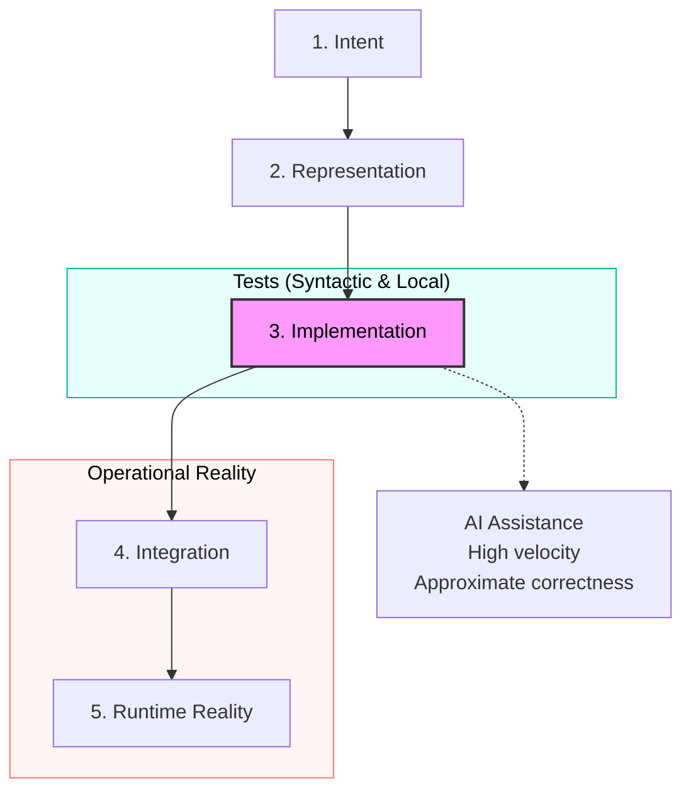
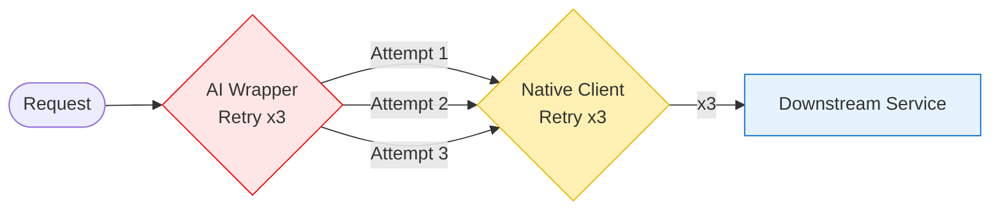

# Tests Aren’t the Primary Safety System in High-Velocity, AI-Assisted Codebases

## Abstract
As AI-generated code becomes a routine input to production systems, new code should be treated as an approximation: often locally plausible, globally inconsistent, and weakly coupled to the original intent. In that environment, production bugs stop being exceptional events and become structural outcomes of throughput. Tests remain necessary, but they cannot be the primary line of defense. The operationally durable approach is to build systems that make incorrectness observable, explainable, and survivable in production.

## Core thesis
If we accept AI-generated code as approximate rather than replica-quality production code, then production bugs are structural. Therefore, the primary safety system must be **operational survivability**: instrumentation, runtime constraints, and recovery mechanisms that keep failure bounded and diagnosable when (not if) incorrectness ships.

## Context & motivation
Two things changed in practice:

1. **Code throughput rose faster than understanding.** Teams can now produce more code per unit time (via agents, scaffolding tools, and assisted refactors) than they can fully internalize. Review becomes sampling, not comprehension.
2. **Change surfaces widened.** Modern services are already a lattice of SDKs, queues, retries, caches, feature flags, and third-party APIs. AI assistance increases the rate at which those surfaces are touched—often via “reasonable defaults” that don’t match your actual invariants.

This makes the older mental model—“tests catch most regressions; production failures are rare anomalies”—less predictive. You still need tests, but the center of gravity shifts toward runtime defenses.

## Mechanism / model
A useful model is to treat your system as a pipeline that transforms intent into running behavior:

1. **Intent** (product requirement, incident follow-up, “make it faster”)
2. **Representation** (tickets, docs, prompts, code review comments)
3. **Implementation** (human code, AI code, library defaults, generated glue)
4. **Integration** (service boundaries, data contracts, concurrency, retries)
5. **Runtime reality** (partial failures, skew, overload, bad inputs)

AI assistance changes step 3: the implementation stage increasingly produces code that is:
- **Syntactically correct** and often idiomatic
- **Semantically underconstrained** (missing invariants, edge cases, operational intent)
- **Integration-fragile** (works in isolation, fails across boundaries)

Tests primarily validate step 3 against a finite set of expected behaviors. They do not reliably validate steps 4–5 under the full distribution of real-world conditions: latency spikes, queue backlogs, duplicated messages, retry amplification, and partial outages.

So the safety posture must assume:
- Incorrect behavior will be deployed.
- The system must make it apparent quickly.
- The system must degrade gracefully instead of cascading.

## Concrete examples

### Example 1: Retry storms created by “helpful” client defaults
A service calls a downstream dependency with a client that automatically retries on timeouts. An AI-generated change adds an additional retry wrapper “for resilience” without understanding that:
- The downstream already retries.
- The queue consumer already retries failed messages.
- The load balancer has its own timeouts.

In steady state, nothing fails. Under partial degradation, latency rises, timeouts trigger, retries multiply, and throughput collapses.

What helps in practice is not “more tests,” because the failure is emergent:
- **Bound retries** with strict budgets (max attempts, max elapsed time).
- **Make retries visible** (counter + histogram for attempts, retry reasons).
- **Prevent amplification** with circuit breakers and bulkheads.
- **Fail fast with classification** (distinguish “retryable” from “stop now” errors).
- **Trace the chain** end-to-end so you can see that one request became many attempts (e.g., via distributed tracing such as OpenTelemetry).

Operational goal: when latency degrades, you see it as a controlled mode (degraded) rather than as a mystery outage (cascading).

### Example 2: Queue consumers that are “correct” but not survivable
An AI-assisted refactor “simplifies” a consumer:
- It acknowledges messages after processing.
- It retries on exceptions.
- It logs errors.

But it misses two production realities:
- Messages can be duplicated (at-least-once delivery).
- Poison messages exist (bad payloads, incompatible schema, unexpected nulls).

The system enters a loop: one poison message is retried indefinitely, starving the partition or consumer group.

Runtime defenses that matter:
- **Idempotency keys** (or dedupe stores) for side-effecting operations.
- **Dead-letter queues** with explicit thresholds and routing.
- **Backpressure** and concurrency limits so one failure mode can’t saturate the service.
- **Structured logs + trace correlation** so one message can be followed across attempts, consumers, and downstream calls.

Tests can verify parsing and some idempotency logic. They rarely capture the backlog dynamics and the operator experience of diagnosing “why are we stuck?”

## Trade-offs & failure modes
This posture is not free, and it does not solve everything.

Trade-offs:
- **More engineering effort in “non-feature” work.** Instrumentation, guardrails, and runbooks compete with roadmap delivery.
- **Higher operational surface area.** Metrics, traces, and flags can be misconfigured; observability can become noise.
- **Local inconvenience for global safety.** Rate limits and circuit breakers may reject requests that would have succeeded under perfect conditions.

Failure modes:
- **Observability without intent.** Collecting telemetry without clear questions (“what are we trying to detect?”) produces dashboards that don’t help during incidents.
- **False confidence from passing tests.** Green CI can reduce curiosity about runtime behavior, especially when code was generated and only lightly reviewed.
- **Overfitting to last incident.** Teams may add brittle guardrails aimed at yesterday’s failure, while new approximation-driven failures appear elsewhere.

What this approach does not attempt to solve:
- It does not guarantee correctness.
- It does not eliminate the need for tests, reviews, or design.
- It does not replace domain expertise; it assumes domain expertise is applied where it has the highest leverage: invariants, boundaries, and recovery.

## Practical takeaways
- **Treat production as the primary truth environment.** Design for detection and containment, not for the absence of defects.
- **Cap amplification mechanisms.** Put budgets on retries, concurrency, and fan-out; make amplification visible as a first-class metric.
- **Make failure diagnosable by default.** Standardize correlation IDs, structured logs, and traces across service boundaries.
- **Design “bad input” paths intentionally.** Poison messages, schema drift, and partial outages should route to explicit states (DLQ, quarantine, degraded mode), not infinite loops.
- **Prefer invariants at boundaries.** Validate contracts at ingress/egress, enforce idempotency for side effects, and keep downstream dependencies isolated via bulkheads.

## Positioning note
This note is not:
- **Academic research:** it does not aim to prove formal properties; it aims to reduce incident severity and mean time to understanding.
- **Blog opinion:** it’s a narrow operational claim tied to concrete mechanisms (retries, queues, partial failures), not a general statement about “tests are bad.”
- **Vendor documentation:** it’s tool-agnostic; any stack can implement the principles with its preferred observability and resilience components.

## Status & scope disclaimer
This is exploratory but grounded in practical operating patterns seen in modern microservice environments. It reflects personal lab work and field heuristics rather than authoritative guidance. The intent is to offer a durable mental model and a small set of operational defaults for teams shipping high-velocity, AI-assisted changes.
