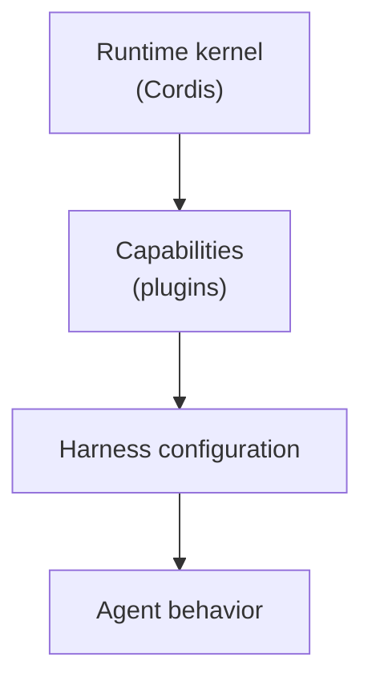
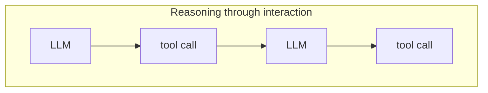
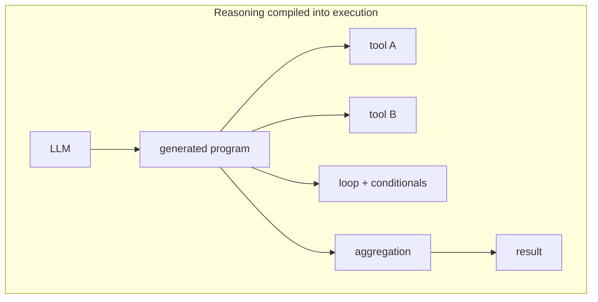
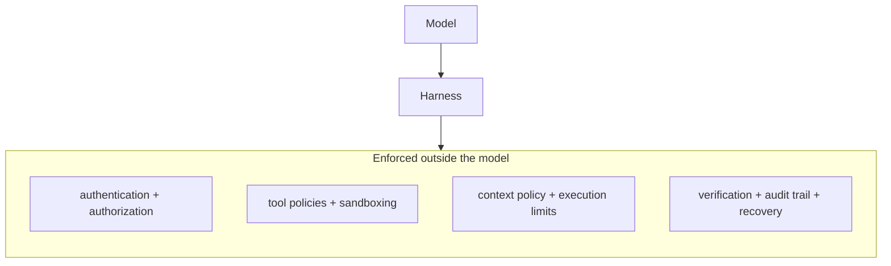
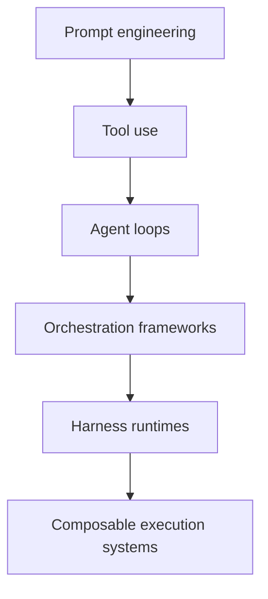

# The Harness Is Becoming the Runtime

For the last few years, most discussion around AI agents has focused on models, prompts, tools, and, increasingly, workflows. [DeepSeek Harness](https://github.com/deepseek-ai/deepseek-harness) points toward a different abstraction boundary: the harness itself as a programmable runtime.

DeepSeek describes an agent simply as:

> Agent = Model + Harness

The important part is what sits inside the second term.

In DeepSeek Harness, models, tools, skills, sessions, sandboxes, storage, execution loops, scheduling, and even the UI are plugins. They can be [selected, replaced, and recomposed through configuration](https://deepseek.com/harness/en/) rather than hard-coded into a single agent implementation.

This points toward a broader shift in agent architecture: from LLM-centric systems toward runtime-centric systems, where the model is no longer the system boundary but one component inside a larger operational substrate.

At first, this can sound like an implementation detail.

It is a significant architectural shift.

## From agent frameworks to harness runtimes

A conventional agent implementation often looks roughly like this:

```text
while task is not finished:
    construct context
    call model
    execute tool
    add result to context
```

Most agent frameworks extend this loop with graphs, routers, memory, planning, or tool abstractions. But the loop itself often remains application logic.

DeepSeek pushes the abstraction boundary lower.

Its architecture is closer to:



The kernel, called [Cordis](https://github.com/cordiverse/cordis), manages plugin mounting and unmounting, dependencies, services, and events. Agent capabilities are layered above it as plugins.

The important shift is that the system is no longer defined by one fixed execution loop. It is defined by a runtime capable of assembling and reconfiguring the loop itself.

The harness is no longer merely glue around a model.

It becomes an explicit software system.

## Everything is a plugin

DeepSeek takes this principle unusually far.

The following can all be treated as replaceable capabilities:

- model
- tools
- skills
- sessions
- sandbox
- storage
- agent loop
- scheduler
- UI

This creates an important distinction.

Most agent frameworks let us change what an agent does.

A composable harness runtime also lets us change how agency itself is implemented.

Two agents could share the same model and task while differing only in:

- context construction
- tool selection
- memory policy
- sandbox configuration
- planning loop
- subagent strategy
- scheduling policy

Those differences can materially change behavior.

The harness therefore becomes a first-class experimental variable.

## Agent capability is not model capability

This distinction becomes increasingly important as agent systems grow more capable.

Benchmarks often collapse observed system behavior into model performance. Once a model operates inside a non-trivial harness, that attribution becomes difficult to defend.

Suppose the same model is evaluated under two configurations:

**Harness A**

- shell
- file editor
- simple loop

**Harness B**

- search
- planning
- skills
- memory
- subagents
- workflow orchestration

If Harness B performs substantially better, attributing the entire improvement to the model would be misleading.

Observed performance is better thought of as a function of several interacting variables:

```text
Agent performance
    =
model capability
× harness capability
× model–harness compatibility
× environment
```

The multiplication is conceptual rather than literal, but the point matters: performance emerges from the system, not from one isolated component.

Once a model operates through tools, memory, orchestration, and execution policies, a benchmark is no longer measuring only a model.

It is measuring a configured agent system.

## Minimal mode as a reference harness

DeepSeek Harness exposes several runtime modes.

Standard mode provides a fuller coding environment with capabilities such as file editing, shell access, search, skills, planning, workflows, and subagents. [Minimal mode](https://deepseek.com/harness/en/) exposes only a persistent Bash environment and a file editor.

That distinction is methodologically useful because minimal mode can act as something close to a reference harness.

Instead of asking:

> How good is this agent?

we can ask:

> How does behavior change when the harness changes?

For example:

```text
Model fixed
Task distribution fixed

Minimal harness
        ↓
Standard harness
        ↓
Extended orchestration harness
```

Then measure:

- task success
- token usage
- latency
- tool calls
- trajectory length
- failure modes
- recovery behavior

This gives us a cleaner way to isolate the contribution of the surrounding system.

DeepSeek has already used constrained harness configurations in [benchmarking contexts](https://github.com/deepseek-ai/deepseek-harness/blob/master/BENCHMARK.md) to reduce tool-related confounding factors.

## Code Mode: orchestration becomes executable

Another important design is Code Mode.

Traditional agent execution is conversational, with each transition mediated by another model inference:



[Code Mode](https://deepseek.com/harness/en/) allows the model instead to generate a TypeScript program that orchestrates tools through an SDK:



Part of the control flow moves from repeated probabilistic inference into deterministic program execution.

This creates a useful architectural distinction:

> reasoning through interaction
>
> vs.
>
> reasoning compiled into execution

This is more than a latency or token optimization.

It changes where control flow lives.

Some decisions remain probabilistic at program-generation time, while subsequent orchestration can execute deterministically. That may improve efficiency, inspectability, reproducibility, and verification for certain classes of tasks.

## Execution as an event stream

DeepSeek's session model records execution as an [append-only event stream](https://deepseek.com/harness/en/). System prompts, tool calls, tool outputs, reasoning events, and subagent activity can be represented as part of a history that can be resumed, forked, or replayed.

Structurally, this resembles event sourcing:

```text
execution
    ↓
append-only event log
    ↓
state reconstruction
```

This matters because execution history stops being secondary metadata and becomes part of the system's operational state.

Such a model enables:

- trajectory analysis
- failure reconstruction
- counterfactual replay
- evaluation dataset generation
- runtime debugging
- behavioral auditing

It also makes the distinction between outcome and process explicit.

A correct result does not imply a correct trajectory.

An agent may succeed after violating policy, leaking information, taking unnecessary actions, or recovering from an earlier failure. If only the final answer is evaluated, those differences disappear.

## The harness as an assurance boundary

As agents gain access to real-world actions—querying internal systems, modifying records, executing code, calling APIs, sending messages, or spending money—the boundary around the model becomes increasingly important.

The harness can become the place where operational control is enforced:



At that point, the harness is no longer merely an execution layer.

It becomes part of the system's assurance boundary.

This reframes agent safety as partly an infrastructure problem. Model alignment still matters, but many concrete guarantees—what tools can be called, what data can be accessed, what actions require approval, what evidence must exist before execution, and how failures are contained—must be enforced outside the model.

## Cordis: spatiotemporal composability

DeepSeek Harness is built on Cordis, which DeepSeek describes as a framework for [spatiotemporal composability](https://github.com/cordiverse/paper).

The idea introduces two dimensions of composition.

Spatial composition concerns how capabilities depend on one another:

```text
planner
 ├── model
 ├── tools
 └── storage
```

Temporal composition concerns how the runtime changes over time:

```text
state A
 ↓ mount capability
state B
 ↓ execute
state C
 ↓ unmount capability
state D
```

This is an important departure from treating an agent as a static dependency graph.

The runtime itself can evolve during execution.

That opens the door to systems whose available capabilities, policies, and execution structures depend on task state, environment, user permissions, or previous actions.

## Creator Mode and reflexive runtimes

[Creator Mode](https://deepseek.com/harness/en/) introduces runtime inspection and plugin experimentation.

Conceptually:

```text
agent
 ↓
inspect runtime
 ↓
identify missing capability
 ↓
load plugin
 ↓
test behavior
 ↓
reconfigure harness
```

This introduces a deeper boundary:

> self-modifying behavior
>
> vs.
>
> self-modifying infrastructure

An agent that changes its plan is one thing.

An agent that changes the runtime through which it acts is qualitatively different.

Once the infrastructure becomes modifiable by the system it hosts, the system becomes reflexive. That immediately raises harder assurance questions:

- Which parts of the runtime must remain immutable?
- Who is allowed to introduce new capabilities?
- How are plugins validated before activation?
- Can permission boundaries change at runtime?
- Can previous configurations be reconstructed exactly?
- What evidence is required before a modified runtime is trusted?

Composable runtimes make these questions architectural rather than theoretical.

## What this architecture does not solve

High composability also introduces costs.

A plugin-oriented runtime can create:

- dependency explosion
- configuration drift
- plugin incompatibility
- hidden cross-component interactions
- larger security surfaces
- weaker reproducibility

The more dynamically configurable the system becomes, the harder it is to reason about globally.

A serious harness runtime therefore needs something analogous to a system-level lockfile:

- model version
- prompt version
- plugin graph
- tool schemas
- sandbox configuration
- context policy
- runtime version
- execution constraints
- environment

Without those inputs, "replay" may mean approximate reconstruction rather than reproducible execution.

DeepSeek also describes Harness as a [developer preview](https://github.com/deepseek-ai/deepseek-harness), with breaking changes expected. The architecture is therefore more interesting at this stage as a direction than as a settled standard.

## The deeper shift

A broader trajectory is becoming visible across agent engineering:



DeepSeek Harness makes that progression unusually explicit.

The important shift is not simply toward better agents.

It is toward systems in which the infrastructure surrounding the model becomes a primary locus of capability, control, experimentation, and evaluation.

The model remains important.

But it is increasingly one component inside a larger execution system that determines what context it receives, what actions it can take, how those actions are sequenced, what state persists, what policies apply, and what evidence is recorded.

The harness is therefore no longer just supporting infrastructure.

It is becoming the runtime substrate of agency itself.

And once that happens, agent engineering starts to look much more like systems engineering.

## Practical Takeaways

1. Treat the harness as an explicit software system, not glue. Context construction, tool selection, memory policy, and scheduling change behavior as much as model choice does.
2. When benchmarking a model, hold the harness constant — a minimal reference configuration isolates model capability from system effects.
3. Where task structure is stable, consider compiling orchestration into deterministic code; control flow that lives in a program is cheaper to inspect, replay, and verify than control flow spread across inference steps.
4. Record execution as an append-only event stream. Trajectory analysis, failure reconstruction, and eval dataset generation all require process data, not just final answers.
5. Enforce operational controls — authentication, tool policy, sandboxing, execution limits, verification, audit — in the harness, outside the model. Concrete guarantees need an enforcement point that is not the model itself.
6. If the runtime can change at runtime, treat the full configuration as the unit of reproducibility: model version, plugin graph, tool schemas, policies, and environment, pinned together.

## Positioning note

This article extends the harness-engineering thread of this site: where earlier notes argued that harness design dominates agent reliability, this one examines an open-source release that makes the harness explicitly programmable. It is analysis of a third-party project as shipped, not a specification, a product roadmap, or an adoption recommendation.

## Status & scope disclaimer

This note analyzes DeepSeek Harness as released in August 2026 — an MIT-licensed agent harness shipped as a developer preview, which DeepSeek states is still being tested and whose core plugins and APIs will continue to evolve. Descriptions here reflect the current architecture; they are not vendor documentation and should not be treated as stable API commitments. The interpretive claims — the harness as reference configuration, as assurance boundary, as reflexive infrastructure — are this article's own analysis, not DeepSeek's stated positions. This is personal lab analysis of a fast-moving open-source project; verify current behavior against the repository before building on it.

### Related

- [Enterprise AI Needs Harness Engineering, Not Better Chatbots](../enterprise-ai-needs-harness-engineering/) (Extends)
- [The Harness Gap: Measuring Model–Harness Fit in Coding Agents](../harness-gap/) (Complements)
- [Harness Engineering Is the Primary Lever for Agent Reliability in 2025–2026](../harness-new-model-agent-systems-2026/) (Context)
- [Beyond Evals: A Practical Assurance Model for Agentic Systems](../beyond-evals-assurance-model/) (Extends)
- [Deterministic Runtimes for Long-Horizon AI Agents](../deterministic-runtimes/) (Complements)
- [Loop Engineering: The Control System Around the Agent](../loop-engineering/) (Related)

## References

1. DeepSeek — [DeepSeek Harness: Everything Is a Plugin](https://deepseek.com/harness/en/) — developer preview announcement: plugin architecture, Cordis kernel, and the four runtime modes.
2. DeepSeek — [deepseek-ai/deepseek-harness](https://github.com/deepseek-ai/deepseek-harness) — source repository: README, developer documentation, and benchmark setup.
3. DeepSeek — [BENCHMARK.md](https://github.com/deepseek-ai/deepseek-harness/blob/master/BENCHMARK.md) — instructions for running benchmarks through the minimal harness variant.
4. Cordiverse — [Cordis: A Meta-Framework of Spatiotemporal Composability](https://github.com/cordiverse/cordis) — the plugin kernel underneath DeepSeek Harness.
5. Cordiverse — [A Programming Paradigm for Spatiotemporal Composability](https://github.com/cordiverse/paper) — the paper describing Cordis's design.
6. DeepSeek — [DeepSeek Harness documentation](https://deepseek-harness.github.io/deepseek-harness/en/) — reference documentation for plugins, tools, and the Code Mode SDK.
