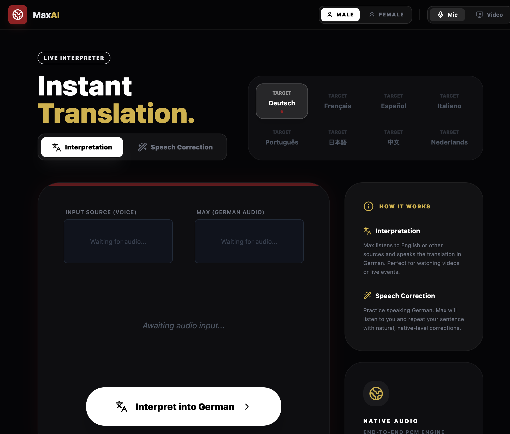

# The Software Replacement Age: Architecting for a Low-Cost Generation World

**Abstract**
We are entering the dawn of the software replacement age. As the marginal cost of code generation (standard, high-throughput models) collapses toward zero, the primary bottleneck in software engineering shifts from writing code to the cognitive load of verification and maintenance. When regeneration becomes cheaper than comprehension, replacement—not reuse—becomes the dominant strategy. This forces a return to the Unix philosophy: small, single-purpose tools bound by explicit Execution Contracts. In this era, interfaces are capital, implementations are disposable, and orchestration replaces ownership. When regeneration becomes cheaper than comprehension, teams must rely on governance and promotion gating (see [Earned Agent Autonomy](../earned-agent-autonomy/) for an autonomy ladder and evidence-driven promotions).

**Context & Motivation**
Historically, software was expensive to create but cheap to reuse—an economic reality that optimized for preservation, birthing complex frameworks and deep abstraction layers designed for multi-year maintenance. Today, agentic models can generate functional systems in minutes, but they cannot cheaply explain or verify the emergent complexity they produce. We are reaching the "Comprehension Threshold": the point where the cost of auditing generated code exceeds the cost of regrowing the logic from a known-good contract.

**Core Thesis**
The value of software has inverted. Durable systems are no longer defined by feature completeness or code longevity, but by their **replaceability**. As agentic development amplifies entropy—locally optimizing for task completion while accreting hidden state—software that cannot be safely replaced becomes a liability. Stability now comes from boundaries, not permanence.

**Mechanism / Model**
The replacement strategy rests on four structural pillars, aligned with the **Principle of Least Power**:

1.  **Interfaces as Capital**: Schemas, invariants, and failure modes are the true assets. This is the domain of **frontier reasoning models** (high-precision synthesis used to define durable contracts), where deep context and correctness are paramount. Code is merely a temporal realization of these contracts.
2.  **Disposable Implementations**: When a component’s internal logic becomes too opaque to verify cost-effectively, it is faster to delete and regenerate it using **balanced execution models** (high-throughput code production against an existing contract) than to debug its state.
3.  **Orchestration over Ownership**: Value is extracted from the relationships among programs rather than the programs themselves. Engineers shift from "owning" internals to validating boundaries via [failure-oriented orchestration](../failure-oriented-orchestration/).
4.  **Strict Boundary Enforcement**: Using deterministic inputs and outputs to contain **agentic entropy**. [Authority-First boundary enforcement](../authority-first-agent-architecture/) ensures agents remain within the Execution Contracts that make replacement safe.

**Concrete Examples**
*   **"Zero-Knowledge" Tooling**: Instead of integrating a heavy third-party SDK, an engineer describes the required interface and has an agent generate a local, single-purpose utility that satisfies the contract.
*   **Modular Regeneration**: A 500-line "black box" module is routinely deleted and regenerated whenever requirements shift, bypassing the "refactoring" phase entirely.
*   **Schema-Driven Composition**: Building complex workflows by piping data between small, independent programs via JSON Schema or Protobuf, rather than configuring a monolithic application framework.

**A Personal Example: The 15-Minute App**
As a concrete instance of this shift: recently, during a conversation, the topic of live translation came up. I thought there should be a product for this already. There were many, but none were exactly what we were looking for. So I rolled up my sleeves, went to [Google’s AI Studio](https://aistudio.google.com), and prompted my way into a functional live translation and speech coach app: [translator-dev.rmax.app](https://translator-dev.rmax.app).

I was flabbergasted. When the cost of generation is near zero, the gap between "I wish this existed" and "here is the URL" collapses.

**Trade-offs & Failure Modes**
*   **Coordination Overhead**: While individual tools are simpler, the rigor required to maintain contracts between them increases.
*   **The Loss of "Deep" Optimization**: Moving toward disposable code may sacrifice extreme performance for systemic agility.
*   **Contract Fragility**: If I/O boundaries are poorly defined, the replacement of a component can trigger a cascade of systemic failures.
*   **Performative Complexity**: Without exceptional taste and structure, the ease of generation leads to "disconnected snippets" rather than an engineered architecture.

**Practical Takeaways**
*   **One Tool, One Responsibility**: Adhere strictly to the Single Responsibility Principle to ensure the unit of replacement remains small and understandable.
*   **Explicit, Testable Contracts**: Every boundary must have a machine-verifiable schema. If you cannot test the contract, you cannot safely replace the implementation.
*   **Prefer Composition over Configuration**: Build systems by piping data between tools rather than toggling flags within a large, opaque system.
*   **Design for Deletion**: If a piece of code is harder to explain than it is to regenerate, it is already a candidate for replacement.

**Positioning Note**
This technical note adapts the classic Unix philosophy to the constraints and opportunities of the agentic era. It acknowledges that while agents accelerate code production, human comprehension remains the ultimate rate-limiting factor in software safety.

**Status & Scope Disclaimer**
*Status: Active / Applied Research.*
**Caution:** This paradigm assumes the existence of high-fidelity validation suites. Replacing code without rigorous contract testing leads to "hallucinated technical debt." Focuses on software architecture strategy and developer velocity. Excludes specific LLM benchmarking or hardware economics. Estimated observation half-life: 12 months.

> “The power of a system comes more from the relationships among programs than from the programs themselves.” — Doug McIlroy

**Related**
- [Authority-First Agent Architecture](../authority-first-agent-architecture/) (Implements)
- [Failure-Oriented Orchestration](../failure-oriented-orchestration/) (Extends)
- [Model Selection in GitHub Copilot: A Systems Design Approach](../github-copilot-model-selection-guidelines/)
