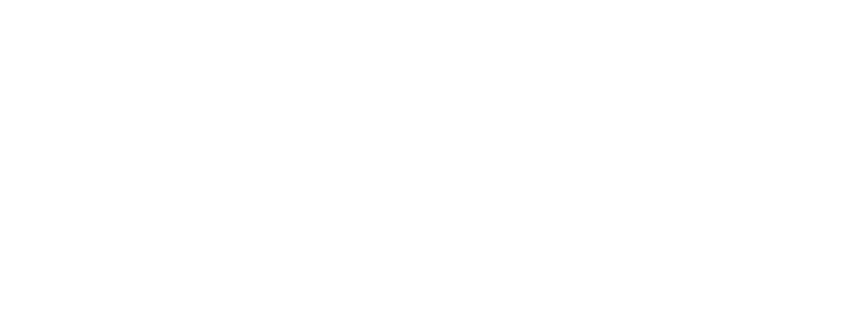
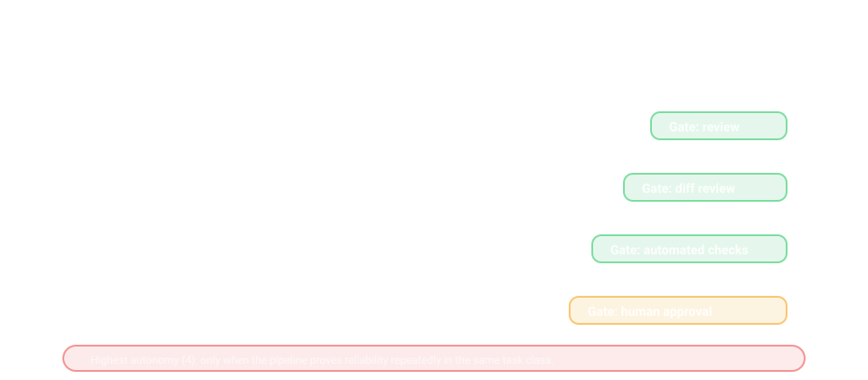

# Trust, Patience, and the Craft of Working With Modern Agentic AI

## Abstract
Modern agentic AI can be simultaneously high-capability and high-chaos: it may know more than any individual operator in a narrow domain, yet still pursue wrong paths confidently for a long time. The practical skill gap is not “prompting” but operational patience—building the conditions where an action-oriented system reliably converges on the intended outcome.

This note frames trust as an earned property of a workflow (constraints, tools, feedback loops), not a belief about a model, and offers concrete operator patterns for working with agentic systems without over- or under-delegating.

## Context & Motivation
A common failure pattern is: ask one question → get a mediocre answer → conclude “AI doesn’t work.” In many cases, the system is capable but underspecified. Agentic AI often behaves less like a cautious junior and more like a high-energy executor: eager to act, sure it’s right, and willing to spin for hours if the environment rewards motion over progress.

Work like this is prone to two opposite failure modes documented in the automation literature: [automation bias](https://www.sciencedirect.com/science/article/pii/S1071581999902525) and [algorithm aversion](https://pubmed.ncbi.nlm.nih.gov/25401381/). The practical target is [calibrated trust](https://journals.sagepub.com/doi/10.1518/hfes.46.1.50_30392): appropriate reliance grounded in visibility, overrides, and verification loops.

This changes what “skill” means for an operator:
- You are not only asking for outputs; you are designing a micro-environment.
- You are shaping incentives (what counts as “done”), constraints (what is forbidden), and feedback (what is checked).
- You are coordinating tools, context, and sometimes specialist sub-agents to create a reliable loop.

Patience matters because convergence is rarely immediate. Trust, when it becomes real, is not a vibe—it is the byproduct of repeated, verified successes under known constraints.

## Core Thesis
Trust in agentic AI should be treated as an operational capability that you earn through workflow design and repetition, not as a binary judgment about intelligence.

More concretely:
- The system may be “more knowledgeable than you” while still making “incredibly stupid mistakes.”
- The operator’s job is to make mistakes cheap, visible, and correctable.
- Patience is the discipline of running iterative loops—tight goals, explicit constraints, fast checks—until the output is both correct and maintainable.

In this frame, “letting go of ego” is not philosophical; it is procedural. You stop measuring your value by authorship and start measuring by throughput, correctness, and risk control.

## Mechanism / Model
A workable mental model is: agentic AI is a powerful search process that needs boundaries and evaluation to avoid pathological wandering.

Think of the workflow as four coupled components:

1. **Intent (What outcome is desired?)**
   - A crisp definition of “done.”
   - Explicit non-goals.
   - Priority ordering (what to optimize first).

2. **Constraints (What actions are allowed?)**
   - Scope boundaries: files, systems, time budget.
   - Safety boundaries: don’t publish, don’t delete, don’t touch secrets.
   - Style/compatibility boundaries: keep APIs stable, follow existing patterns.

3. **Instrumentation (How do we observe reality?)**
   - Tests, linters, type checks, build steps.
   - Logs, diffs, screenshots, reproduction steps.
   - “Show me the evidence” pathways, not “tell me.”

4. **Feedback Loop (How does it correct itself?)**
   - Small iterations with verification each round.
   - Stop conditions and escalation rules.
   - A bias toward reversible changes (small diffs, feature flags, branches).

Failure happens when any component is weak:
- Strong intent + weak instrumentation → confident hallucinations persist.
- Strong tools + weak constraints → impressive damage at high speed.
- Strong constraints + weak feedback → stagnation and thrash.

Patience is the operator stance that keeps the loop running until the evidence matches the intent.

## Concrete Examples
1. **From “answer me” to “prove it”**
   - Instead of: “Fix the bug in production.”
   - Use: “Reproduce locally, write a failing test, implement the fix, show the test passing, and keep the diff minimal.”
   - Result: the agent must anchor on an observable failure and demonstrate resolution.

2. **Timeboxing as a reliability tool**
   - “You have 20 minutes. If you can’t confirm the root cause, stop and return the top 3 hypotheses with how to falsify each.”
   - Result: reduces the probability of multi-hour circular work and forces epistemic humility.

3. **Context shaping beats repeated re-prompts**
   - If the agent keeps missing a constraint, don’t argue—encode it:
        - Add a brief contract in the task description: “Do not modify files outside the approved scope without approval.”
        - Provide the schema or interface definition it must satisfy.
   - Result: fewer “same mistake, new phrasing” loops.

4. **Delegation boundaries: agent writes, operator decides**
   - For risky actions (publishing, migrations, deletions):
     - Agent drafts, operator reviews, agent revises.
   - Result: preserves speed while keeping irreversible actions gated.

5. **Trust accrues to a pipeline, not to a personality**
   - Over time, you may trust the system more than your own first draft—because:
       - It has broader recall.
       - It can generate alternatives quickly.
       - Your pipeline catches the dumb mistakes.
   - The trust is earned by repetition: many cycles where verification consistently matches the intent.

## Trade-offs & Failure Modes
- **Over-trusting (delegation without verification)**
  - Failure mode: silent correctness bugs, security regressions, subtle API mismatches.
  - Symptom: “It looked right” becomes the acceptance criterion.

- **Under-trusting (treating the agent as autocomplete)**
  - Failure mode: you miss the leverage; you do the hard thinking and also the tedious work.
  - Symptom: high friction, low iteration speed, shallow exploration of options.

- **Misaligned incentives (“keep going” without stop rules)**
  - Failure mode: long, confident thrash.
  - Symptom: lots of activity, little evidence of progress.

- **Context rot**
  - Failure mode: the agent makes locally plausible changes that violate global constraints (architecture, style, contracts).
  - Symptom: repeated rework and “why did it touch that file?”

- **Ego entanglement**
  - Failure mode: operator fights the process to preserve authorship, not outcomes.
  - Symptom: rejecting correct solutions because they “don’t feel like mine.”

Patience does not mean tolerating poor performance indefinitely; it means structuring the work so performance can improve through feedback.

## Practical Takeaways
- Define “done” as an observable artifact: passing tests, validated schema, reproducible steps, minimal diff.
- Make constraints explicit and testable: scope boundaries, forbidden directories, approval gates.
- Prefer short loops: plan → change → verify → report evidence; avoid multi-hour “just keep working” instructions.
- Instrument the workflow: add checks that catch common failure modes (lint, types, unit tests, contract validation).
- Demand evidence, not confidence: ask for links, logs, diffs, or test outputs instead of explanations.
- Timebox exploration and require stop conditions: if not converging, return hypotheses and next experiments.
- Treat trust as cumulative: expand autonomy only after repeated verified success in the same class of tasks.

### Related

- [Earned Agent Autonomy: A Governance Model for AI Systems](../earned-agent-autonomy/) (Implements)

## Diagrams

*Figure 1: Trust calibration loop. Keep autonomy proportional to verified evidence, not confidence.*

*Figure 2: Autonomy ladder. Promote delegation only after repeated verified wins in the same task class.*

## Positioning Note
This is an operator’s perspective on working with agentic systems in real workflows: shaping constraints, tools, and feedback so capability becomes reliability. It is not a claim that current systems “understand” in a human sense, nor a prescription to replace engineering judgment. The emphasis is craft: how to steer high-variance capability into low-variance outcomes.

## Status & Scope Disclaimer
This note describes practical patterns, not guarantees. Agentic behavior varies across tasks, environments, and configurations; the same system can be excellent in one domain and reckless in another. Use these ideas to design safer, more observable workflows, and calibrate autonomy gradually based on measured results in your own context.

## Selected References

1. **Lee, J. D., & See, K. A. (2004).** [Trust in Automation: Designing for Appropriate Reliance](https://journals.sagepub.com/doi/10.1518/hfes.46.1.50_30392).
2. **Bainbridge, L. (1983).** [Ironies of Automation](https://ckrybus.com/static/papers/Bainbridge_1983_Automatica.pdf).
3. **Skitka, L. J., Mosier, K. L., & Burdick, M. (1999).** [Does automation bias decision-making?](https://www.sciencedirect.com/science/article/pii/S1071581999902525).
4. **Dietvorst, B. J., Simmons, J. P., & Massey, C. (2015).** [Algorithm aversion](https://pubmed.ncbi.nlm.nih.gov/25401381/).
5. **Peng et al. (2023).** [The Impact of AI on Developer Productivity: Evidence from GitHub Copilot](https://arxiv.org/abs/2302.06590).
6. **Osmani, A. (2026).** [My LLM coding workflow going into 2026](https://addyo.substack.com/p/my-llm-coding-workflow-going-into).
