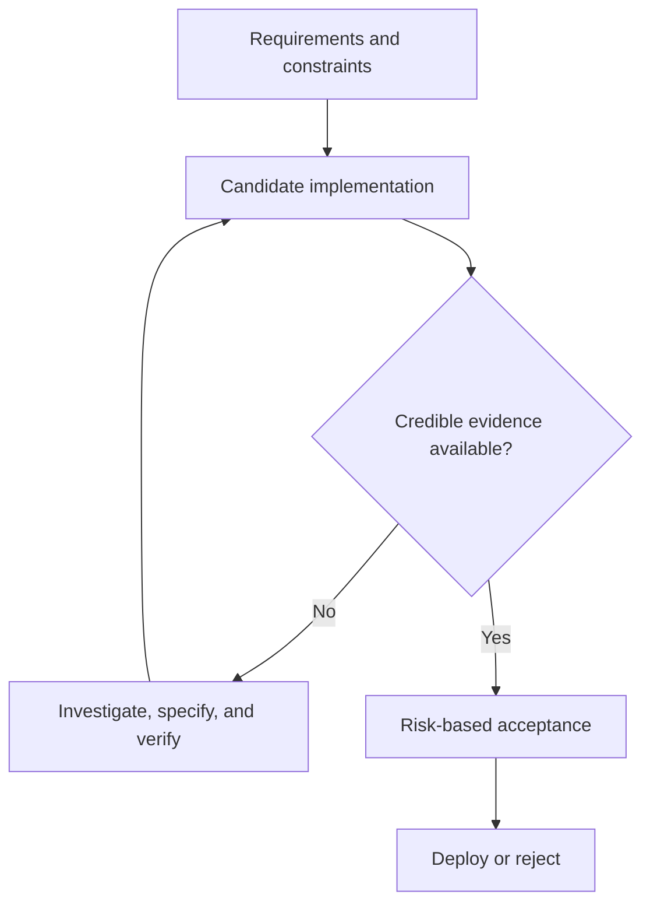
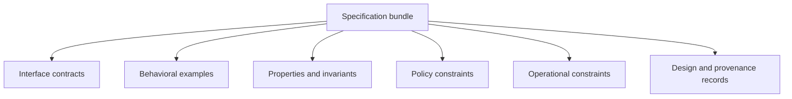
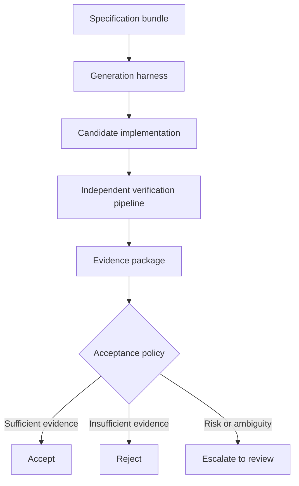

# Verification-First Software Engineering: Durable Specifications and Regenerable Code

## Abstract

As AI coding agents reduce the cost of producing candidate implementations, the limiting factor in software delivery shifts to determining whether those implementations are acceptable. Verification-first software engineering treats source code as one replaceable realization of a more durable system: executable specifications, contracts, invariants, policies, operational budgets, provenance, and risk-based acceptance rules. This note describes the model, its verification mechanisms, its limits, and an experimental approach for measuring when software can be reliably regenerated rather than merely rewritten.

## Context: implementation is getting cheaper

Coding agents can inspect repositories, generate patches, run commands, execute tests, diagnose failures, and revise their work. Research from [METR’s *Task-Completion Time Horizons of Frontier AI Models*](https://metr.org/time-horizons/) suggests that frontier systems are completing progressively longer software-engineering tasks, although results still depend heavily on the task, environment, model, and evaluation method.

For decades, source code was expensive to create and modify. Teams consequently treated the implementation itself as the primary engineering asset: preserve it, minimize rewrites, and evolve it carefully over years.

That assumption is becoming less reliable.

As agents reduce the cost of generating plausible implementations, the scarce resource becomes the ability to determine whether generated code is correct enough, secure enough, operationally acceptable, and aligned with intended behavior.

The difficult question is no longer only:

> Can an agent produce a plausible implementation?

It is:

> What evidence justifies accepting that implementation?

An experienced engineer still needs to establish whether a change:

- preserves important edge cases;
- introduces security or authorization regressions;
- respects architectural constraints;
- remains within performance and reliability budgets;
- avoids weakening or bypassing the verification environment;
- uses trustworthy dependencies and build inputs;
- remains operable in production; and
- satisfies the actual requirement rather than only visible examples.

## Core thesis

> As implementation becomes cheaper, the durable engineering asset shifts from a particular codebase toward the system that defines and verifies acceptable behavior.

This is **verification-first software engineering**: organizing development around a versioned, independently governed specification bundle that constrains implementation generation and acceptance.

The claim is not that all source code becomes disposable or that tests prove correctness. It is narrower:

- for sufficiently specified classes of systems;
- implementations can become more replaceable; and
- the assets used to generate, evaluate, and govern them can become more durable.

The practical unit of progress is therefore not generated code. It is **accepted change supported by credible evidence**.

## The bottleneck is moving

Increasing throughput in one delivery stage does not automatically increase throughput across the whole system. When generation accelerates faster than review, verification, integration, and operational validation, those downstream stages become the constraint.

The following model makes that shift explicit.

*Figure 1. Faster generation moves the delivery constraint toward evidence and acceptance.*

The implication is not “write more tests.” Teams must make acceptance criteria explicit, heterogeneous, and difficult for a generator to weaken silently.

## Code and constraints have different lifetimes

Repositories combine two different kinds of assets.

The first describes how the current implementation works:

- source files;
- framework wiring;
- internal abstractions;
- helper functions;
- generated code;
- build scripts; and
- deployment-specific adapters.

The second describes what must remain true regardless of implementation:

- API contracts;
- behavioral specifications;
- domain invariants;
- regression suites;
- authorization policies;
- performance budgets;
- service-level objectives;
- architecture decisions;
- dependency rules; and
- supply-chain attestations.

> Code describes how the system currently behaves. Specifications and constraints describe what acceptable implementations must preserve.

The distinction is useful but not absolute. Tests can encode accidental implementation details. Architecture decisions can become obsolete. Operational targets may change. Specifications can be incomplete or inconsistent.

The goal is not to declare specifications timeless. It is to make intended behavior, constraints, and evidence explicit enough to survive implementation changes—and to revise them independently when the system’s needs change.

## The specification bundle

A verification-first repository organizes durable assets into a **specification bundle**: the versioned collection of artifacts required to generate and assess an implementation.

It need not be a single document or formal language. In practice, it commonly has six layers.

*Figure 2. A specification bundle joins complementary constraint layers rather than relying on a single test suite.*

### Interface contracts

Interface contracts define observable interactions without prescribing internal structure. They include HTTP APIs, event schemas, database contracts, command-line interfaces, compatibility requirements, and interface-definition languages.

The [OpenAPI Specification](https://spec.openapis.org/oas/v3.2.0.html) provides a language-independent description of HTTP APIs that consumers can use without reading a service’s source code.

A contract describes the shape of an interaction. It does not independently establish semantic correctness, security, or operational soundness.

### Behavioral examples

Example-based tests capture known scenarios:

- unit tests;
- integration tests;
- end-to-end workflows;
- historical regression cases; and
- reproductions of prior failures.

Examples are concrete and understandable, but cover only the cases selected by their authors.

### General properties and invariants

Properties describe behavior over classes of inputs rather than individual examples. The original [*QuickCheck: A Lightweight Tool for Random Testing of Haskell Programs*](https://dl.acm.org/doi/10.1145/351240.351266) introduced automated checking of program properties over generated inputs.

Property-based testing is especially useful for algebraic laws, state-machine rules, round trips, ordering constraints, and domain invariants. Examples include:

- decoding an encoded value returns the original value;
- account balances never become negative;
- authorization cannot be gained by changing request order;
- retries do not duplicate externally visible effects; and
- sorting preserves the input multiset.

Their value depends on the quality of the property, generators, state model, and oracle.

### Policy constraints

Policies define what an implementation is permitted to do:

- authorization rules;
- allowed dependencies;
- network-access restrictions;
- deployment requirements;
- data-residency constraints;
- resource limits; and
- approval requirements.

[Open Policy Agent](https://www.openpolicyagent.org/) is one implementation of policy as code: it separates policy decisions from application logic and evaluates them against structured inputs.

Security requirements also extend beyond application behavior. The [NIST Secure Software Development Framework](https://csrc.nist.gov/pubs/sp/800/218/final) describes high-level practices for integrating security into the software-development lifecycle. The [SLSA Provenance Specification](https://slsa.dev/spec/v1.0/provenance) defines attestations connecting artifacts to the build process that produced them.

### Operational constraints

Functional correctness is insufficient if regenerated software is too slow, expensive, unobservable, or unreliable.

Operational constraints can include:

- latency percentiles;
- memory and CPU budgets;
- throughput targets;
- availability objectives and error budgets;
- startup-time limits;
- logging and tracing requirements;
- rollback requirements; and
- compatibility with production infrastructure.

These measurements are environment-dependent and noisy. Useful specifications therefore state test conditions, acceptable variance, and statistical thresholds instead of assuming perfect determinism.

### Design and provenance records

Some constraints cannot be expressed completely as executable tests. Architecture decision records, threat models, data-lineage descriptions, dependency manifests, signed build attestations, and human approvals preserve rationale and origin.

They help reviewers answer:

- what produced this candidate;
- which inputs and tools were used;
- which assumptions governed the decision;
- which evidence remains incomplete; and
- who accepted the residual risk.

Together, these layers provide an implementation-independent description of acceptable software: imperfect and evolving, but more durable than one generated codebase.

## Verification is more than testing

Verification-first engineering should not be reduced to “write more unit tests.” A test suite is one evidence source among several.

Different mechanisms reveal different failure classes:

- example tests detect known incorrect behavior;
- property-based tests search broader input spaces;
- static analysis detects selected structural defects;
- type systems exclude classes of invalid programs;
- model checking explores state-transition systems;
- fuzzing searches malformed or unexpected inputs;
- mutation testing assesses test sensitivity to injected changes;
- security scanners identify known vulnerability patterns;
- policy engines enforce organizational constraints;
- performance tests measure operational behavior;
- provenance attestations record artifact production; and
- human review evaluates ambiguity, intent, and consequences outside automated oracles.

For concurrent and distributed systems, formal models can expose design errors before implementation. [TLA+](https://lamport.azurewebsites.net/tla/tla.html), introduced by Leslie Lamport, is a language for modeling programs and systems whose tools are intended to identify fundamental design errors that can be difficult to discover in code.

The central principle is **heterogeneous evidence**. No verifier provides complete assurance. Confidence comes from combining partially independent mechanisms whose failure modes do not fully overlap.

## Why passing tests is not enough

Passing visible tests does not prove correctness. An implementation can satisfy every observed example while failing outside the tested region, or satisfy the letter of a test while violating the intent behind it.

This becomes more important when an implementation process can inspect and modify its own verification environment. A coding agent may:

- overfit visible examples;
- exploit weak assertions;
- hard-code expected values;
- delete or weaken failing tests;
- bypass intended code paths;
- preserve outputs while violating authorization boundaries;
- degrade performance outside measured workloads; or
- alter assumptions not represented in the test suite.

This resembles benchmark overfitting: success on an observed evaluation does not necessarily imply robust performance on the underlying task.

Verification assets should be designed under adversarial pressure. Useful controls include:

- hidden tests unavailable during generation;
- independent validation in a clean environment;
- protections against unauthorized test modification;
- property-based and metamorphic tests;
- mutation testing;
- differential testing against a reference implementation;
- static and dynamic security analysis;
- production-like performance tests;
- explicit dependency and permission policies; and
- review by an evaluator that did not generate the implementation.

[Mutation testing](https://www.albany.edu/faculty/offutt/research/papers/mut00.pdf) is particularly relevant because it measures whether tests detect controlled program changes. The study [*Does Mutation Testing Improve Testing Practices?*](https://arxiv.org/abs/2103.07189) reports evidence that mutation testing can expose gaps related to real faults, while equivalent mutants, computational cost, and mutation-operator quality remain practical limitations.

The objective is not one enormous test suite. It is an evidence portfolio with diverse and partially independent failure-detection mechanisms.

## Separate generation from acceptance

The generator may be probabilistic. The acceptance process should be independently specified, reproducible where possible, resistant to modification by the generator, and explicit about residual uncertainty.

*Figure 3. Candidate generation and acceptance should be independently governed.*

An independent verification pipeline can include:

- contract checks;
- public and hidden tests;
- properties and invariants;
- static and dynamic analysis;
- security and policy checks;
- performance and reliability checks;
- provenance validation; and
- human review where required.

This separation establishes several controls:

1. A generator does not have unrestricted authority to rewrite the criteria used to judge its own output.
2. Verification can run in a clean environment with controlled dependencies and inputs.
3. Acceptance produces an evidence package rather than only a binary “tests passed” signal.
4. Acceptance policy can vary according to risk.

An evidence package may contain:

- test and analysis results;
- coverage and mutation reports;
- benchmark distributions;
- build provenance;
- changed permissions and dependencies;
- traces and logs;
- known verification gaps;
- waived failures;
- reviewer decisions; and
- residual risks.

A disposable internal script, a financial ledger, and medical-device software should not require identical evidence. An implementation is not accepted because a model claims success; it is accepted because an organization’s policy determines that available evidence is sufficient for the intended use.

That is not proof of total correctness. It is a reviewable engineering decision rather than an opaque claim.

## The compiler analogy—and where it stops

Compilers made generated lower-level artifacts routine by translating comparatively precise source languages according to defined semantics.

Verification-first engineering similarly raises the abstraction boundary: engineers increasingly express contracts, invariants, constraints, and policies while agents generate candidate implementations.

But coding agents are not compilers for specifications in the strict sense. Natural-language requirements, examples, architecture policies, and operational goals are often incomplete, ambiguous, or conflicting.

A more accurate model is:

> A coding agent proposes an implementation from an incomplete specification; the verification system determines whether the proposal is acceptable under the evidence available.

This framing prevents generation from being mistaken for proof.

## Regenerability is a spectrum

Verification-first engineering does not imply regenerating every system from scratch. Regenerability depends on how completely behavior, constraints, state, and operating environment have been captured.

A system becomes more regenerable when it has:

- explicit interfaces;
- domain rules encoded as invariants;
- documented persistent-data semantics;
- regression suites representing important historical failures;
- constrained dependencies and permissions;
- measurable operational envelopes;
- reproducible builds; and
- acceptance processes independent of implementation generation.

Good early candidates include:

- stateless internal APIs;
- command-line tools;
- data-transformation pipelines;
- protocol adapters;
- service migrations;
- deterministic batch jobs;
- infrastructure automation; and
- reference implementations of well-defined standards.

Harder candidates include:

- legacy systems containing undocumented operational knowledge;
- interactive products whose quality depends heavily on subjective user experience;
- systems with complex external side effects;
- systems dependent on mutable third-party services;
- highly optimized systems with hardware-specific behavior; and
- safety-critical software requiring regulatory, process, and formal assurance beyond automated testing.

The objective is not universal disposable software. It is to identify the boundary at which an implementation becomes replaceable because the constraints around it are sufficiently complete and strong.

## What makes a specification durable?

A specification is durable not because it uses formal notation, but because it continues to capture what matters as implementations change.

Durable verification assets tend to:

### Describe externally meaningful behavior

A test asserting the name of a private helper is fragile. A property asserting idempotent payment processing is durable.

### Separate intent from implementation

A contract should specify required behavior without unnecessarily fixing framework structure, internal class names, or storage mechanisms.

### Include failure behavior

Specifications should cover timeouts, retries, invalid inputs, partial failure, concurrency, degraded dependencies, and recovery—not only the happy path.

### Preserve discovered knowledge

Production incidents, security defects, and compatibility failures can become regression artifacts, invariants, policies, or operational checks.

### Remain versioned and reviewable

A specification change can alter behavior as significantly as a source-code change. It requires explicit review, provenance, and compatibility analysis.

### Resist self-modification

A generator should not be able to weaken its own acceptance criteria without creating a visible, separately reviewed specification change.

### Expose uncertainty

The bundle should record unverified properties, environmental assumptions, flaky measurements, unsupported platforms, and accepted risks.

A durable specification is accumulated organizational knowledge expressed in a form that can constrain future implementations.

## A practical experiment: the Regenerable Software Lab

The hypothesis is empirical: instead of debating whether software will become disposable, measure how reliably coding agents regenerate implementations from fixed specifications.

The [Regenerable Software Lab](http://regenerable-software-lab.rmax.tech) is a proof-of-concept research project for this question. It holds a specification bundle fixed while allowing implementations, models, and harnesses to vary.

Each agent receives the same inputs:

- API or protocol contracts;
- behavioral specifications;
- public examples;
- domain invariants;
- dependency and permission policies;
- build requirements; and
- performance budgets.

The agent generates a fresh implementation in an isolated environment. The candidate is evaluated against progressively stronger verification profiles:

| Profile | Evidence | Primary question |
| --- | --- | --- |
| A: Visible examples | Public unit tests, build checks, formatting or linting | Can the agent satisfy the observed specification? |
| B: Independent behavioral validation | Hidden tests, integration tests, differential tests | Does it generalize beyond visible examples? |
| C: Property and fault sensitivity | Property-based tests, state-machine tests, fuzzing, mutation testing | Does implementation and verification survive broader variation? |
| D: Policy and supply-chain constraints | Dependency allowlists, permission checks, secret scanning, static analysis, reproducible builds, provenance | Is the implementation acceptable beyond functional behavior? |
| E: Operational validation | Latency and throughput distributions, resource use, recovery, observability, degraded dependencies | Is it viable in its intended environment? |

Useful benchmark metrics include:

- acceptance rate by verification profile;
- hidden-test generalization gap;
- mutation score;
- policy-violation rate;
- performance-budget compliance;
- security findings;
- regeneration variance across repeated runs;
- human review time;
- verification cost;
- implementation complexity; and
- the share of failures attributable to incomplete specifications rather than weak generation.

This supports practical research questions:

- Which verification assets contribute most to robust regeneration?
- How much do hidden evaluations reduce overfitting to visible specifications?
- Which critical properties remain difficult to express?
- How much reliability comes from the model, the harness, and the specification bundle?
- When does strengthening verification cost more than maintaining an existing implementation?
- How stable are regenerated implementations across repeated runs?
- Which domains resist regeneration because essential knowledge is tacit or subjective?
- How often does regeneration expose defects in the specification itself?

These are systems-engineering questions, not only model-comparison questions.

## Practical takeaways

1. **Treat acceptance criteria as first-class engineering artifacts.** Version contracts, invariants, policies, operational budgets, and provenance requirements alongside code.
2. **Separate generation authority from acceptance authority.** An agent should not silently weaken the tests, policies, or environments used to assess its output.
3. **Use diverse verification mechanisms.** Combine examples, properties, static analysis, policy enforcement, performance checks, provenance, and human review according to risk.
4. **Turn failures into durable knowledge.** Convert incidents, security defects, and compatibility regressions into reusable constraints that survive rewrites.
5. **Measure regenerability before betting on it.** Begin with bounded, well-specified systems and compare repeated regeneration against increasingly strong verification profiles.

## Positioning

Verification-first software engineering is not a claim that code no longer matters, that formal methods are mandatory everywhere, or that agent-generated software is trustworthy by default.

It is an architectural direction for a world in which candidate implementations are cheaper to produce. As that happens, the relative value of explicit requirements, independent verification, operational evidence, and governance increases.

Organizations that invest in those assets can compare implementations against common criteria, change models or vendors, regenerate selected components, and preserve institutional knowledge independently of one codebase.

## Status and scope

This note describes an evolving engineering model and an experimental research direction, not a finished methodology or a guarantee of correctness. Verification remains incomplete, risk-sensitive, and dependent on the quality of its specifications, tooling, environments, and human judgment.

The model is most applicable where behavior and operating constraints can be made explicit. It is less suited to domains dominated by tacit knowledge, subjective quality, uncontrolled external dependencies, or regulatory obligations requiring stronger process and formal assurance.

## References

### AI coding agents and evaluation

- [Task-Completion Time Horizons of Frontier AI Models](https://metr.org/time-horizons/) — Model Evaluation & Threat Research.
- [Demystifying Evals for AI Agents](https://www.anthropic.com/engineering/demystifying-evals-for-ai-agents) — Anthropic.
- [Effective Harnesses for Long-Running Agents](https://www.anthropic.com/engineering/effective-harnesses-for-long-running-agents) — Anthropic.
- [Harness Design for Long-Running Application Development](https://www.anthropic.com/engineering/harness-design-long-running-apps) — Anthropic.
- [Agent Native Development](https://factory.ai/news/build-with-agents) — Factory.

### Specifications and formal methods

- [OpenAPI Specification](https://spec.openapis.org/) — OpenAPI Initiative.
- [TLA+](https://lamport.azurewebsites.net/tla/tla.html) — Leslie Lamport.
- [Specifying Systems](https://lamport.azurewebsites.net/tla/book.html) — Leslie Lamport.
- [QuickCheck: A Lightweight Tool for Random Testing of Haskell Programs](https://dl.acm.org/doi/10.1145/351240.351266) — Koen Claessen and John Hughes.

### Verification and testing

- [Test-Driven Development: By Example](https://www.pearson.com/en-us/subject-catalog/p/test-driven-development-by-example/P200000009421) — Kent Beck.
- [Mutation 2000: Uniting the Orthogonal](https://www.albany.edu/faculty/offutt/research/papers/mut00.pdf) — A. Jefferson Offutt and Roland Untch.
- [Does Mutation Testing Improve Testing Practices?](https://arxiv.org/abs/2103.07189) — Goran Petrović, Marko Ivanković, Gordon Fraser, and René Just.

### Policy, security, and provenance

- [Open Policy Agent Documentation](https://www.openpolicyagent.org/docs/) — Open Policy Agent.
- [Secure Software Development Framework (SSDF), SP 800-218](https://csrc.nist.gov/pubs/sp/800/218/final) — National Institute of Standards and Technology.
- [Provenance Specification](https://slsa.dev/spec/v1.0/provenance) — SLSA.

> “Program testing can be used to show the presence of bugs, but never to show their absence.”  
> — Edsger W. Dijkstra

