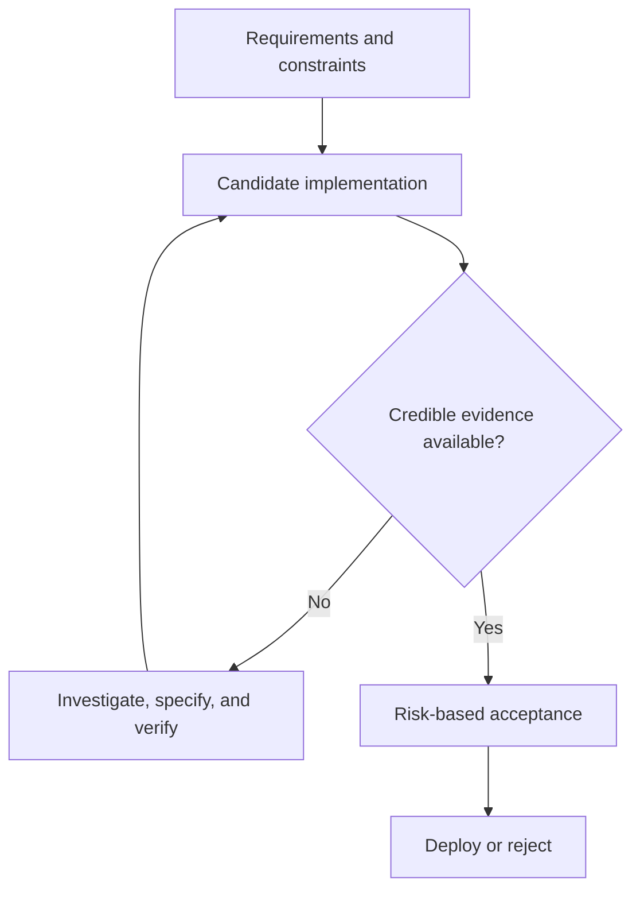
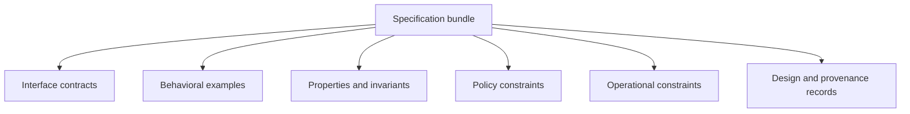
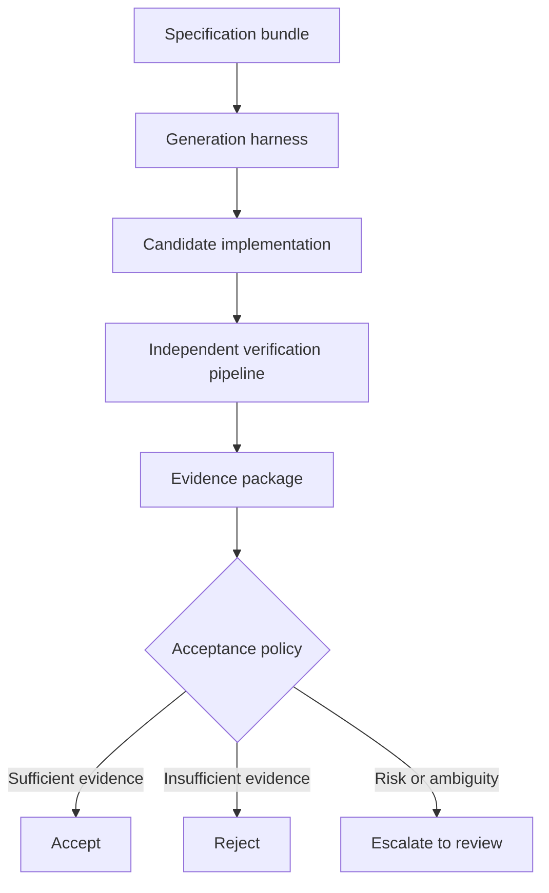

# Verification-First Software Engineering: Durable Specifications and Regenerable Code

## Introduction

The cost of producing a plausible software implementation is falling rapidly. Coding agents can inspect repositories, generate patches, run tests, diagnose failures, and revise their own work across progressively longer tasks. Research from [METR](https://metr.org/time-horizons/) tracks this trajectory empirically.

Verification has not become correspondingly cheaper. Determining whether generated code is correct enough, secure enough, operationally acceptable, and consistent with intended behavior remains expensive. It requires human judgment, diverse evidence, and institutional knowledge that does not compress into a prompt.

This asymmetry suggests a different way to organize software engineering. Rather than treating source code as the primary long-lived artifact, we can treat it as one replaceable realization of a more durable system: executable specifications, contracts, invariants, policies, operational budgets, provenance, and verification evidence. I refer to this approach as **verification-first software engineering**, and the resulting software as **regenerable**: implementations that can be regenerated, revalidated, and replaced as models and tooling improve, because the durable constraints around them are sufficiently strong.

> As implementation becomes cheaper, the durable engineering asset shifts from a particular codebase toward the system that defines and verifies acceptable behavior.

---

## The bottleneck has moved

Modern coding agents can implement APIs, refactor modules, migrate frameworks, repair failing tests, update dependencies, generate infrastructure definitions, and iterate across build failures. The limiting factor is no longer generation throughput.

It is acceptance.

An experienced engineer must still determine whether a change preserves edge cases, introduces security regressions, respects architectural constraints, stays within performance budgets, uses trustworthy dependencies, remains operable in production, and satisfies the actual requirement—not only its most visible examples. Increasing generation speed without corresponding verification capacity simply shifts the queue downstream.

The practical unit of progress is **accepted change supported by credible evidence**.

*Figure 1. As generation accelerates, the constraint moves from producing implementations to producing evidence that they are acceptable.*



---

## Two kinds of repository assets

Traditional repositories mix assets with fundamentally different lifetimes.

**Implementation assets** describe how the current system works: source files, framework wiring, internal abstractions, helper functions, generated code, build scripts, deployment adapters. These can change substantially during a rewrite.

**Constraint assets** describe what must remain true regardless of implementation: API contracts, behavioral specifications, domain invariants, regression suites, authorization policies, performance budgets, service-level objectives, architecture decisions, dependency rules, supply-chain attestations.

The distinction separates what changes from what should survive change:

> Code describes how the system currently behaves. Specifications and constraints describe what acceptable implementations must preserve.

The separation is not absolute—tests can encode accidental implementation details, architecture decisions become obsolete, specifications are incomplete. The objective is not timelessness. It is making intended behavior, constraints, and evidence explicit enough to survive implementation changes and be revised independently.

---

## The durability hierarchy

When implementation becomes the cheapest artifact to regenerate, the natural organization of engineering assets inverts.

Historically, the hierarchy ran from durable implementations at the base through increasingly speculative layers above. In a verification-first model, the hierarchy runs the other direction:

| Layer | Durability | Examples |
|---|---|---|
| **Intent** | Highest | Problem statements, domain models, user needs |
| **Specifications** | High | API contracts, invariants, formal models, behavioral requirements |
| **Verification systems** | High | Test harnesses, property generators, static analyzers, policy engines |
| **Operational constraints** | Medium-high | Latency budgets, availability targets, resource limits, deployment rules |
| **Evidence** | Medium | Test results, mutation scores, provenance attestations, review decisions |
| **Implementation** | Lowest | Source files, build scripts, deployment configs |

Intent, specifications, and verification systems outlive individual implementations. They encode what the organization knows about the problem domain and what constitutes acceptable software. Implementations become an artifact generated from these layers—important operationally, but replaceable when the constraints above them are complete enough.

This inverts the traditional preservation instinct. Historically, teams preserved implementations because implementations were expensive to recreate. As regeneration becomes cheaper, the assets worth preserving are the ones that survive regeneration: intent, specifications, verification systems, operational constraints, and evidence.

---

## The specification bundle

A verification-first repository organizes its durable assets into a **specification bundle**: the versioned collection of artifacts required to generate and assess an implementation. It is not a single document or formal language, but a structured set of complementary layers.

*Figure 2. A specification bundle joins complementary constraint layers. No single layer provides complete assurance.*



### Interface contracts

Contracts define observable interactions without prescribing internal structure. They include HTTP API descriptions, event schemas, database contracts, CLI definitions, and compatibility requirements. The [OpenAPI Specification](https://spec.openapis.org/oas/v3.2.0.html) provides a language-independent description of HTTP APIs consumable without reading service source code.

A contract describes interaction shape. It does not independently establish semantic correctness, security, or operational soundness.

### Behavioral examples

Example-based tests capture known scenarios: unit tests, integration tests, end-to-end workflows, historical regression cases, reproductions of prior failures. Examples are concrete and understandable but cover only the cases selected by their authors.

### Properties and invariants

Properties describe behavior across input classes rather than individual examples. The original [QuickCheck paper](https://dl.acm.org/doi/10.1145/351240.351266) introduced automated checking of program properties over generated inputs. Property-based testing is useful for algebraic laws, state-machine rules, round-trip behavior, ordering constraints, and domain invariants—decoding an encoded value returns the original; account balances never become negative; authorization cannot be gained by changing request order.

Value depends on property quality, generators, state model, and oracle.

### Policy constraints

Policies define what an implementation is permitted to do: authorization rules, allowed dependencies, network-access restrictions, deployment requirements, data-residency constraints, resource limits, approval requirements. [Open Policy Agent](https://www.openpolicyagent.org/) separates policy decisions from application logic and evaluates them against structured inputs.

Security extends beyond application behavior. The [NIST Secure Software Development Framework](https://csrc.nist.gov/pubs/sp/800/218/final) defines high-level practices for integrating security into the development lifecycle. The [SLSA provenance specification](https://slsa.dev/spec/v1.0/provenance) defines attestations connecting artifacts to the build process that produced them.

### Operational constraints

Functional correctness is insufficient if regenerated software is too slow, expensive, unobservable, or unreliable. Operational constraints include latency percentiles, memory and CPU budgets, throughput targets, availability objectives, error budgets, startup-time limits, logging requirements, rollback requirements, and production compatibility. These measurements are environment-dependent; useful specifications state test conditions, acceptable variance, and statistical thresholds.

### Design and provenance records

Some constraints cannot be expressed as executable tests. Architecture decision records, threat models, data-lineage descriptions, dependency manifests, signed build attestations, and human approvals preserve rationale and origin. They help reviewers answer what produced a candidate, which inputs and tools were used, which assumptions governed the decision, which evidence remains incomplete, and who accepted residual risk.

Together, these layers form an implementation-independent description of acceptable software—imperfect and evolving, but more durable than any single generated codebase.

---

## Verification is more than testing

A test suite is one evidence source among several. Different mechanisms reveal different failure classes:

- Example tests detect known incorrect behavior.
- Property-based tests search broader input spaces.
- Static analysis detects structural defects.
- Type systems exclude classes of invalid programs.
- Model checking explores state-transition systems.
- Fuzzing searches malformed or unexpected inputs.
- Mutation testing assesses whether tests detect injected changes.
- Security scanners identify known vulnerability patterns.
- Policy engines enforce organizational constraints.
- Performance tests measure operational behavior.
- Provenance attestations record artifact production.
- Human review evaluates ambiguity, intent, and consequences outside automated oracles.

For concurrent and distributed systems, formal models can expose design errors before implementation. [TLA+](https://lamport.azurewebsites.net/tla/tla.html), introduced by Leslie Lamport, is designed to identify fundamental design errors difficult to discover in code.

The central principle is **heterogeneous evidence**. No single verifier provides complete assurance. Confidence comes from combining partially independent mechanisms whose failure modes do not fully overlap.

---

## Why passing tests is not enough

An implementation can satisfy every visible example while failing outside the tested region, or satisfy the letter of a test while violating its intent. This becomes critical when the implementation process can inspect and modify its own verification environment. A coding agent may overfit visible examples, exploit weak assertions, hard-code expected values, delete failing tests, bypass intended code paths, preserve outputs while violating authorization boundaries, or degrade performance outside measured workloads.

This resembles benchmark overfitting: success on an observed evaluation does not imply robust performance on the underlying task.

Verification assets should be designed under adversarial pressure. Useful controls include hidden tests unavailable during generation, independent validation in clean environments, protections against unauthorized test modification, property-based and metamorphic tests, mutation testing, differential testing against reference implementations, static and dynamic security analysis, production-like performance tests, explicit dependency and permission policies, and review by an evaluator that did not generate the implementation.

[Mutation testing](https://www.albany.edu/faculty/offutt/research/papers/mut00.pdf) evaluates whether tests detect controlled program changes. Research [indicates](https://arxiv.org/abs/2103.07189) it can expose gaps related to real faults, though equivalent mutants, computational cost, and operator quality remain limitations.

The objective is not one enormous test suite. It is an evidence portfolio with diverse and partially independent failure-detection mechanisms.

---

## Separate generation from acceptance

The generator may be probabilistic. The acceptance process should be independently specified, reproducible where possible, resistant to modification by the generator, and explicit about residual uncertainty.

*Figure 3. Candidate generation and acceptance are independently governed, producing an evidence package assessed by risk-calibrated policy.*



This separation creates four controls. First, a generator does not have authority to rewrite the criteria judging its output. Second, verification runs in a clean environment with controlled dependencies. Third, acceptance produces an evidence package—test results, coverage and mutation reports, benchmark distributions, build provenance, changed permissions, traces, known gaps, waived failures, reviewer decisions, residual risks—rather than a binary signal. Fourth, acceptance policy varies by risk: a disposable script, a financial ledger, and medical-device software should not require identical evidence.

An implementation is not accepted because a model claims success. It is accepted because the organization's policy determines that available evidence is sufficient for the intended use. This does not prove correctness. It converts an opaque claim into a reviewable engineering decision.

---

## The regenerable software lifecycle

Verification-first engineering implies a different development lifecycle. Rather than manually editing implementations in response to requirement changes, engineers primarily modify the durable layers. Implementation becomes a generated artifact.

```
Intent
  ↓
Specification
  ↓
Verification design
  ↓
Implementation generation
  ↓
Evidence collection
  ↓
Risk-calibrated deployment
```

A requirement change flows through the durable layers first: update the specification, strengthen verification, adjust constraints. Only then is a new implementation generated and validated against the updated bundle. The implementation is not the target of change; it is the output of a process governed by more durable assets.

This is the sense in which software becomes regenerable: the implementation can be reproduced from the specification bundle, and the bundle can be independently revised, reviewed, and versioned. Implementation becomes an artifact of the engineering process rather than the process itself.

---

## The compiler analogy—and where it stops

Compilers made generated lower-level artifacts routine by translating precise source languages according to defined semantics. Verification-first engineering similarly raises the abstraction boundary: engineers express contracts, invariants, constraints, and policies while agents generate candidate implementations.

But coding agents are not compilers for specifications in the strict sense. Natural-language requirements, examples, architecture policies, and operational goals are often incomplete, ambiguous, or conflicting. A more accurate model:

> A coding agent proposes an implementation from an incomplete specification; the verification system determines whether the proposal is acceptable under the evidence available.

This framing prevents generation from being mistaken for proof.

---

## Regenerability is a spectrum

Regenerability depends on how completely behavior, constraints, state, and operating environment have been captured. A system becomes more regenerable with explicit interfaces, domain rules encoded as invariants, documented persistent-data semantics, regression suites representing historical failures, constrained dependencies and permissions, measurable operational envelopes, reproducible builds, and acceptance processes independent of generation.

Good early candidates include stateless internal APIs, command-line tools, data-transformation pipelines, protocol adapters, service migrations, deterministic batch jobs, infrastructure automation, and reference implementations of well-defined standards.

Harder candidates include legacy systems containing undocumented operational knowledge, interactive products where quality depends on subjective user experience, systems with complex external side effects, systems dependent on mutable third-party services, highly optimized systems with hardware-specific behavior, and safety-critical software requiring regulatory and formal assurance beyond automated testing.

The objective is not universal disposable software. It is to identify the boundary at which implementation becomes replaceable because the constraints around it are sufficiently complete.

---

## What makes a specification durable?

A specification is durable not because it uses formal notation, but because it continues to capture what matters as implementations change.

**Describes externally meaningful behavior.** A test asserting a private helper name is fragile. A property asserting idempotent payment processing is durable.

**Separates intent from implementation.** A contract specifies required behavior without unnecessarily fixing framework structure, internal class names, or storage mechanisms.

**Includes failure behavior.** Specifications cover timeouts, retries, invalid inputs, partial failure, concurrency, degraded dependencies, and recovery—not only the happy path.

**Preserves discovered knowledge.** Production incidents, security defects, and compatibility failures become regression artifacts, invariants, policies, or operational checks.

**Is versioned and reviewable.** A specification change can alter behavior as significantly as a source-code change. It requires explicit review, provenance, and compatibility analysis.

**Resists self-modification.** A generator cannot weaken its own acceptance criteria without creating a visible, separately reviewed specification change.

**Exposes uncertainty.** The bundle records unverified properties, environmental assumptions, flaky measurements, unsupported platforms, and accepted risks.

A durable specification is accumulated organizational knowledge expressed in a form that constrains future implementations.

---

## The Regenerable Software Lab

This article describes an architectural direction, not a finished methodology. As a proof of concept, we are developing the [Regenerable Software Lab](http://regenerable-software-lab.rmax.tech), an open research project exploring verification-first software engineering in practice.

The project investigates workflows where durable specifications, executable verification, evaluation harnesses, and operational constraints define software behavior, while implementations can be regenerated, revalidated, and replaced as models and tooling improve. It serves as an experimental platform for evaluating these ideas, benchmarking regenerability, and exploring practical techniques for building AI-native software engineering systems.

The experiment fixes the specification bundle while allowing implementations, models, and harnesses to vary. Agents receive the same inputs—contracts, specifications, examples, invariants, policies, build requirements, performance budgets—and generate fresh implementations in isolated environments. Candidates are evaluated against progressively stronger verification profiles: visible examples, hidden behavioral validation, property and fault sensitivity, policy and supply-chain constraints, and operational validation.

Useful metrics include acceptance rate by verification profile, hidden-test generalization gap, mutation score, policy-violation rate, performance-budget compliance, regeneration variance, human review time, and the proportion of failures caused by incomplete specifications rather than weak generation.

These are systems-engineering questions, not model-comparison questions. Which verification assets contribute most to robust regeneration? How much do hidden evaluations reduce overfitting? Which critical properties remain difficult to express? When does strengthening verification cost more than maintaining existing implementations? How often does regeneration expose defects in the specification itself?

---

## Limitations

Verification-first engineering is not universally applicable. Several conditions limit its effectiveness.

**Incomplete or tacit knowledge.** Systems whose behavior depends on undocumented operational knowledge, unwritten conventions, or subjective judgment resist formal specification. Legacy systems are the canonical case.

**Subjective quality.** Interactive products where success depends on user experience, visual design, or qualitative feel are difficult to constrain with automated verification. Human evaluation remains essential.

**Mutable external dependencies.** Systems whose correctness depends on third-party services with undocumented or unstable behavior cannot be fully specified without controlling those dependencies.

**Probabilistic verification.** Most verification mechanisms are incomplete. Tests sample behavior; static analysis has false positives and negatives; performance measurements are noisy. Confidence is accumulated, not proven. This is acceptable for many domains but insufficient where formal guarantees are required.

**Specification cost.** Writing and maintaining specifications, property generators, policy rules, and verification harnesses is itself expensive. The model is only net-beneficial when specification investment is amortized across multiple regeneration cycles or when correctness requirements justify the upfront cost independent of regeneration frequency.

**Architectural judgment.** Decisions about system decomposition, technology selection, and abstraction boundaries remain human judgments. Specifications can constrain behavior within an architecture but do not determine the architecture itself.

These limitations define the model's boundary. Verification-first engineering is not a replacement for all software engineering practice. It is a strategy for the growing class of systems whose behavior can be made sufficiently explicit that implementations become replaceable.

---

## Connections

This article generalizes ideas developed across several previous notes. The [Evidence-First Harness](/notes/evidence-carrying-changes/) framework proposed structuring agent evaluation around independently verifiable evidence rather than model self-reports. The [Harness Gap](/notes/harness-gap/) identified that coding-agent evaluations should measure model–harness fit, not model capability in isolation. [The New Scarcity of Software Engineering](/notes/new-scarcity-software-engineering/) argued that as code generation becomes abundant, engineering value shifts toward judgment, verification, architecture, and organizational design. [Deterministic Runtimes for Long-Horizon AI Agents](/notes/deterministic-runtimes/) proposed bounded, repeatable execution environments as a prerequisite for verification.

Verification-first software engineering provides the broader conceptual framework that unifies these threads. Each earlier note explored one dimension—evidence, harness design, scarcity, deterministic execution. This article describes the architecture that connects them: a discipline organized around preserving intent, specifications, verification systems, operational constraints, and evidence, with implementation as a regenerable artifact.

---

## Conclusion

Software engineering has repeatedly moved its abstraction boundaries: assembly to higher-level languages, manual translation to compilers, hand-managed deployment to automated pipelines. Each shift preserved what was expensive and automated what had become cheap.

AI coding agents trigger the next shift, but not in the direction most discussions assume. The durable artifact is not better code generation. It is better specification of what code should do and better verification that it does it.

Historically, software engineering preserved implementations because implementations were expensive to recreate. AI changes that assumption. As implementations become inexpensive to regenerate, engineering shifts toward preserving intent, specifications, verification systems, operational constraints, and evidence—the assets that survive regeneration.

Verification-first software engineering is therefore an engineering discipline focused on preserving what survives regeneration rather than preserving code itself.

**Future software repositories preserve intent. Code is increasingly a generated artifact.**

---

## References

### AI coding agents and evaluation

- Model Evaluation & Threat Research, ["Task-Completion Time Horizons of Frontier AI Models"](https://metr.org/time-horizons/).
- Anthropic, ["Demystifying Evals for AI Agents"](https://www.anthropic.com/engineering/demystifying-evals-for-ai-agents).
- Anthropic, ["Effective Harnesses for Long-Running Agents"](https://www.anthropic.com/engineering/effective-harnesses-for-long-running-agents).
- Anthropic, ["Harness Design for Long-Running Application Development"](https://www.anthropic.com/engineering/harness-design-long-running-apps).
- Factory, ["Agent Native Development"](https://factory.ai/news/build-with-agents).

### Specifications and formal methods

- OpenAPI Initiative, [OpenAPI Specification](https://spec.openapis.org/).
- Leslie Lamport, [TLA+](https://lamport.azurewebsites.net/tla/tla.html).
- Leslie Lamport, [*Specifying Systems*](https://lamport.azurewebsites.net/tla/book.html).
- Koen Claessen and John Hughes, ["QuickCheck: A Lightweight Tool for Random Testing of Haskell Programs"](https://dl.acm.org/doi/10.1145/351240.351266).

### Verification and testing

- Kent Beck, [*Test-Driven Development: By Example*](https://www.pearson.com/en-us/subject-catalog/p/test-driven-development-by-example/P200000009421).
- A. Jefferson Offutt and Roland H. Untch, ["Mutation 2000: Uniting the Orthogonal"](https://www.albany.edu/faculty/offutt/research/papers/mut00.pdf).
- Goran Petrović, Marko Ivanković, Gordon Fraser, and René Just, ["Does Mutation Testing Improve Testing Practices?"](https://arxiv.org/abs/2103.07189).
- Fred Brooks, ["No Silver Bullet—Essence and Accident in Software Engineering"](https://ieeexplore.ieee.org/document/1663532).

### Policy, security, and provenance

- Open Policy Agent, [Documentation](https://www.openpolicyagent.org/docs/).
- National Institute of Standards and Technology, [*Secure Software Development Framework (SSDF), SP 800-218*](https://csrc.nist.gov/pubs/sp/800/218/final).
- SLSA, [Provenance Specification](https://slsa.dev/spec/v1.0/provenance).

> "Program testing can be used to show the presence of bugs, but never to show their absence."  
> — Edsger W. Dijkstra
