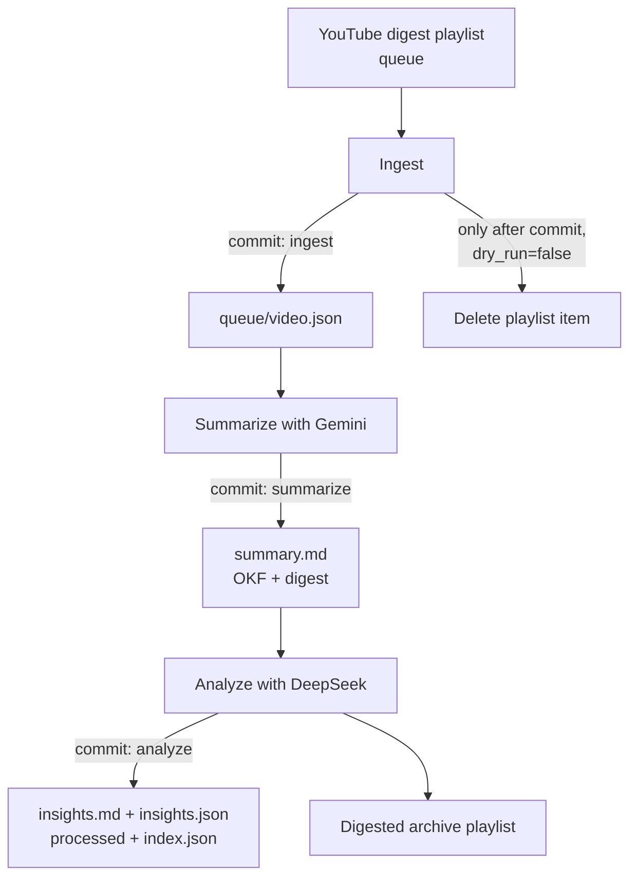
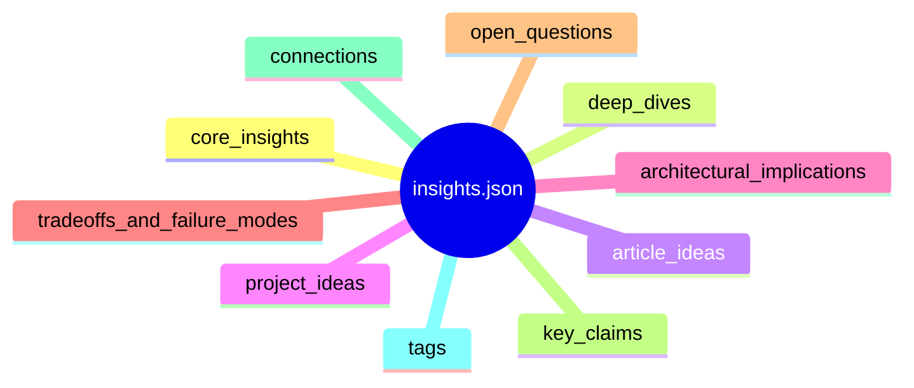
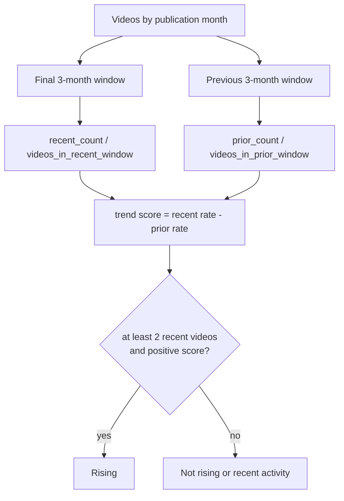

# From Watch Later to a Knowledge Pipeline

A watch-later playlist is usually a knowledge graveyard. Videos enter with an intention, then lose against the next meeting, the next release, or the next recommendation. Even when we watch them, the useful part remains trapped in a linear medium: a claim we cannot find again, an idea we cannot connect to the project it should change, a quote without a durable home.

We decided to treat digestion as a data-pipeline problem rather than a personal productivity problem. The result is a private, git-backed corpus and a public static explorer, [YT Insights Explorer](https://rmax.ai/yt-insights-explorer/). At the current snapshot, 83 index items contain 73 analyzed videos, 5 skipped items, and 5 failed items. Those videos yielded 1,326 concepts, 390 core insights, 500 claims, 283 article ideas, 270 project ideas, 316 deep dives, and 296 open questions, for $12.62 of model spend.

The result is not a general account of YouTube, AI research, or engineering discourse. It is one viewer's curated diet. That limitation is a feature if it is visible: a corpus should expose its sampling bias rather than pretend to be a survey.

## The queue is the interface; git is the store

The pipeline lives in a private repository in the [rmax-ai organization](https://github.com/rmax-ai). Its queue is a YouTube digest playlist. Its durable state is git: `queue/`, `artifacts/`, `processed/`, and `index.json` are committed data, not implementation exhaust. Cost per video is recorded in the index as first-class metadata, alongside status and source identity. This makes a mundane but important question answerable: what did this corpus cost to make?

The one-command path is `uv run yt-insights process`. It moves one item through ingest, summarize, and analyze. Each completed stage creates its own commit. The boundary is operationally useful. A malformed extraction does not obscure a successful ingest; an interrupted run can resume from committed state; and the history tells us which representation existed at each stage.

Ingest resolves the oldest playlist item, writes a queue record, and commits it before it can delete the playlist item. Deletion is behind a `dry_run` gate. The ordering is deliberate: the playlist is a convenient external queue, not the system of record. If an API operation fails after ingest, the source item remains recoverable from git. If deletion happens first, the failure mode is data loss.

Summarization creates `summary.md`, an OKF-frontmattered digest with an overview, topic map, and key points. The artifacts show Gemini-family models at this stage, including `gemini-3.5-flash-lite`. Analysis reads the digest and creates a human-readable `insights.md` plus `insights.json` through DeepSeek-family models, including `deepseek-v4-flash`. The model split is practical, not doctrinal: one stage turns a talk into a constrained digest; the other extracts a structured research surface from that digest.

Every Markdown artifact carries Open Knowledge Format metadata, including a URN, visibility, and review status. Each video is therefore a versioned unit that can be reviewed, diffed, or re-rendered rather than an opaque chat session. Older artifacts may include `transcript.md`; current processing does not depend on a transcript artifact.

The JSON schema has held exactly ten top-level sections across all 73 analyzed artifacts, with no observed schema drift:

That shape matters because it prevents a digest from becoming prose that only a model can reread. Core insights retain a type, why it matters, generalization, evidence quotes, evidence strength, and novelty. Project ideas retain a hypothesis, proof of concept, measurement, provenance, and a project-fit bucket: `beyond-evals`, `gatehouse`, `movement-lab`, or `new`. Claims retain their type and whether verification is needed.

Failure is also data. Five skipped and five failed records remain in the 83-item index. We do not delete the inconvenient cases to make completion look clean. A queue that hides failure cannot tell us whether it is draining reliably, and a corpus that only displays completed work launders operational uncertainty.

Cost is similarly concrete. The corpus totals $12.62. Across the 70 videos with cost observations, the minimum was $0.038, the median $0.143, and the maximum $0.919. At that level, compute is not the limiting resource. Choosing what is worth ingesting, checking what should be believed, and acting on the resulting backlog are more expensive than the calls.

## A static interface over structured artifacts

The [public explorer repository](https://github.com/rmax-ai/yt-insights-explorer) is a pure-Python static-site generator over the corpus. It emits 1,407 HTML pages, precomputed JSON, and vanilla JavaScript. The generated site is about 20 MB, under a 25 MB budget. It has no backend, framework, runtime fetch dependency, accounts, or analytics. Core pages, navigation, filters, and search work from `file://`, not just a server.

This is an intentionally static-first design. The corpus is small enough to precompute; the read path should be simple enough to audit; and a personal research tool should not require infrastructure merely to open it. The builder renders to a sibling temporary directory, verifies the tree, then atomically replaces the output. Two builds from the same corpus are byte-identical, verified through SHA-256 manifests. Sort order, absent build clocks, and the rejection of host paths make reproducibility a product property rather than a testing aspiration.

Each page has a narrow question:

- **Home** answers what is in the corpus now: counts, cost, recent videos, and growth.
- **Trends** answers what has recently appeared more or less often, and states the heuristic behind that answer.
- **Concepts** answers where terms occur and which explicit connections the source recorded. Its inline SVG graph deterministically shows the 60 highest-degree nodes in a concentric-ring layout; the full 1,326-concept inventory and 358 aggregate edges remain available as accessible lists.
- **Ideas** turns extracted work into an inventory, grouping project ideas by the real buckets they fit: beyond-evals, gatehouse, movement-lab, and new.
- **Claims** exposes the verification queue rather than implying epistemic closure.
- **Video pages** preserve the ten sections and link every extracted item back to a source video.

The trends page does not manufacture significance. It compares each concept's rate among videos in the most recent three calendar months with its rate in the immediately preceding three months. A concept with no prior window is labelled recent activity, not rising.

Provenance is the hard constraint, not a visual detail. The source data has no evidence timestamps and no external URLs in artifact bodies. Current links are therefore video-level: an insight, claim, or quote leads to its local video page and the original YouTube watch URL, not to a precise moment or an external paper. The normalized schema reserves nullable `timestamp_seconds` and `source_url` slots, but the UI does not invent controls for data it does not have. Capturing that provenance belongs upstream in extraction.

Public mode also requires an explicit acknowledgement because the records are private and unreviewed by default. Weekly regeneration is scripted, but publication was a deliberate human decision. Automation refreshes the projection; it does not certify the contents.

The implementation itself was a useful small experiment in delegated work. Codex produced a 630-line plan from verified data contracts. Gemini produced the design guidelines: a dark, dense interface, CSS bars and inline SVG rather than chart libraries, and glyphs as well as color for insight types. Factory Droid implemented the eight-task TDD plan with 54 tests and a real-corpus build. Hermes independently reran the gates and smoke-tested `file://` and HTTP rather than accepting the implementer's report. The chain worked because the contract was verified before delegation and verification was independent after it.

## What the corpus says, and what it cannot say

The corpus spans source videos from 2021 through 2026, but it is young in an important sense. Sixty-seven of 73 sources were published in 2026, and 48 of 73 were published in August and September 2026. Any apparent trend is a short-window heuristic over a curated feed, not a population estimate.

The top tags by video count are agents (12), artificial intelligence (10), ai agents (8), agent-architecture (6), human-in-the-loop (6), then AGI, ai, and evaluation (5 each). Tags use trim-and-casefold equality only. We do not stem or fuzzily merge them, because silently merging concepts is worse than exposing vocabulary fragmentation.

Within the recent-rate heuristic, **agents** rises by +0.204 with 11 recent videos. AI, evaluation, and Prompt injection rise by +0.074; multi-agent-systems, agent-orchestration, agentic-ai, alignment, MCP, and memory rise by +0.056. Meanwhile ai-native-sdlc declines by -0.286, with 3 videos overall and none recent; ai agents declines by -0.212; artificial intelligence declines by -0.156. The defensible story is modest: attention in this feed rotates on roughly a two-to-three-month half-life, while “agents” consolidates as the generic AI framing recedes.

The insight-type distribution identifies a second bias. Of 390 core insights, 89 are architecture, 72 mechanism, 71 mental model, 52 practice, 42 empirical result, 27 failure mode, 26 prediction, and only 11 tradeoff. That is a platform-engineering watchlist, and perhaps a discourse problem: people describe what they built more readily than what they surrendered. The claim queue has 500 entries, of which 440 require verification: 175 factual, 109 causal, 89 opinion, 83 comparative, and 44 prediction. The idea backlog is larger than a reasonable individual can execute: 283 article ideas, 270 project ideas, 316 deep dives, and 296 open questions. The purpose is not to celebrate volume. It is to create an explicit selection problem.

## Five insights worth carrying forward

The corpus is useful when it connects a source claim to an engineering decision without pretending that the extraction settled the claim.

First, [*Deep dive on LLM Inference at Scale*](https://www.youtube.com/watch?v=y2W4FNAuPEA) contributes a **mental model**: decode is a memory-streaming problem, not principally a compute problem. Each generated token reads weights and KV state from HBM; the extracted example puts Mistral-7B-scale KV cache at 131 KB per token. For long contexts and concurrent agent sessions, bytes moved per token, cache policy, and context size can matter more than headline FLOPs.

Second, [*Why The Harness Matters More Than The Model*](https://www.youtube.com/watch?v=n9xKblqyQ28) contains an **empirical result** with operational consequences: adding a meta-harness to Claude Code was attributed to an 18% accuracy gain on Terminal Bench 2. Its companion **architecture** models memory as an explicit L0–L3 state stack: weights, active context, ephemeral REPL or subagent state, and disk-backed persistent memory. If the harness produces a double-digit result change, it is not glue around the model. It is part of the product surface.

Third, [*GPT-6 Astra Saturates ARC-AGI-3...*](https://www.youtube.com/watch?v=1DB_QDiviH4) frames benchmark saturation as an **empirical result** with an expiry date. A static suite becomes a lagging indicator when models saturate it. Adding more static items preserves the category, not the guardrail. The design response is dynamic benchmark generation, with the usual caution that a generated test pipeline itself needs validation.

Fourth, [*Agents' next frontier: agent-to-agent and network effects*](https://www.youtube.com/watch?v=REascnFlq_8) offers a **mental model** that cuts through prompt folklore: agent execution is a search and context-placement problem. The skill is getting the right information into the context window at the moment before a tool call or response. Its **mechanism** for cross-silo work is also concrete: return computed signals, such as relationship strength, rather than raw messages.

Finally, [*Why companies are becoming a series of loops*](https://www.youtube.com/watch?v=LdIyXiq2DTY) supplies an **architecture** for agent-enabled work: cascading loops rather than a static org chart. The paired **mechanism** puts human judgment at an outer boundary, changing objectives when an automated loop reaches a plateau, rather than making a human a checker inside every iteration. Older systems work sharpens the point. [*Complex Systems Thinking*](https://www.youtube.com/watch?v=0-CSs1UEbFQ) and [*System Dynamics*](https://www.youtube.com/watch?v=o-Yp8A7BPE8) describe behavior as a property of interactions, information paths, decision rules, and feedback loops. The corpus lets those 2021–2022 talks land as 2026 agent-architecture notes, which is precisely what a searchable historical layer should do.

## Lessons from building it

**Decide provenance before extraction.** We captured text sufficient for a video-level link but not timestamps or external sources. No UI can reconstruct moment-level evidence from an artifact that never recorded it. Reserving fields is responsible; calling that a solution would not be. Link models are schema decisions, and schema decisions are cheapest before the corpus accumulates.

**Establish ground truth before delegation, then verify independently.** The planner found that `index.json` is an object containing `items`, not a bare list; the artifacts established the absence of timestamps and external URLs. Those facts constrained the implementation. The later independent verification was equally necessary. An implementer's self-report is an output, not evidence.

**Static-first is a good default for bounded knowledge.** A 20 MB site derived from a $12.62 corpus reverses the common assumption that the interface is cheap and data is expensive. The static tree has no service to keep alive, opens locally, deploys broadly, and is reproducible byte for byte. Its tradeoff is deliberate duplication and a larger search page, both acceptable at this scale.

**Render uncertainty honestly.** The claims page shows 440 verification-needed claims and refuses to display a “verified” state because the source schema has none. A “not needed” status is not verification. This is a small UI rule with a large effect: it stops an LLM-derived corpus from laundering extraction confidence into factual status.

**Make the corpus criticize its own diet.** The 89 architecture, 72 mechanism, and 71 mental-model insights against 11 tradeoffs show what this watchlist and its sources reward. That is not an argument to discard the corpus. It is an argument to use its sparsity, its failures, and its weak categories to choose the next queue items.

The pipeline has made watching tractable, not automatic. At a $0.143 median cost, compute is cheap enough that attention becomes the scarce resource again. That is the right outcome. We wanted a system that turns a playlist into reviewable artifacts, makes the backlog and uncertainty visible, and leaves the human with a better question than “what should we watch next?”
