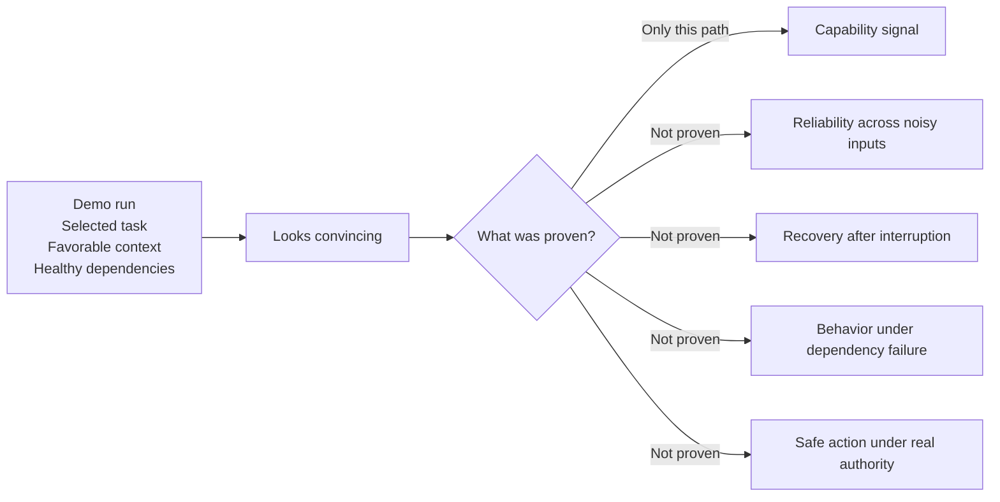
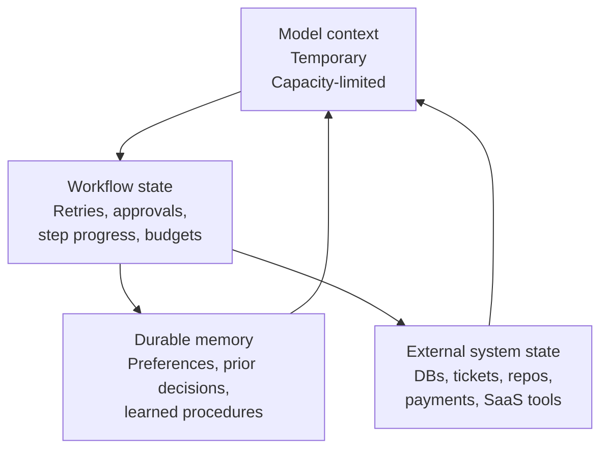
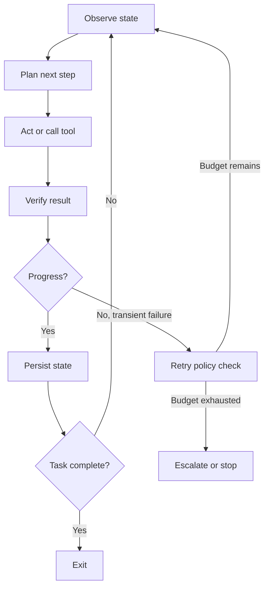
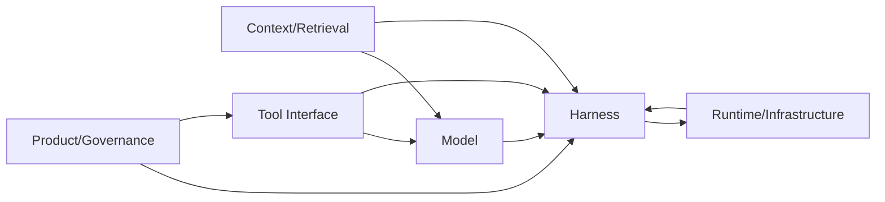

# Why Agentic Systems Fail Between the Demo and Production

## Abstract

Demos prove that a model can complete a selected task under favorable conditions. Production asks a harder question: can the surrounding system survive variable inputs, dependency failures, ambiguous state, repeated execution, and consequential actions without losing control? This note argues that the demo-to-production gap is mostly a control-system gap, not only a model-quality gap. That matters because many failures blamed on "the model" actually come from retrieval, tool contracts, state handling, orchestration, runtime behavior, and governance.

## Context and motivation

Agent demos have improved quickly. Teams can now show a model retrieving context, calling tools, drafting a response, and completing a task that looked difficult a year ago. That progress creates a predictable mistake. Organizations treat a convincing demo as evidence that the workflow is close to deployment.

Production exposes a different operating environment. Credentials expire. Customer records disagree. Policies change. Dependencies time out after a mutation succeeds. Events arrive twice. Some requests require judgment. Others require authority the agent should not have. The model still matters, but production reliability depends on the system that governs how the model observes, acts, retries, stops, and hands off control.

## Core thesis

The gap between an agent demo and a production system is not mainly closed by prompt refinement or marginal model improvement. It is closed by engineering the loop around the model: state, tool contracts, verification, retry policy, permissions, observability, budgets, and escalation.

A strong demo shows possibility. Production evidence must show controlled operation across a distribution of conditions.

## A demo samples a path; production exposes a distribution

A successful demonstration establishes that one configuration of model, prompt, context, tools, and environment can complete one selected task. It does not establish reliability across the conditions the deployed system will actually encounter.

Agents generate trajectories, not isolated responses. They choose tools, interpret results, revise plans, recover from errors, and decide when to stop. Two runs of the same task can follow different paths even when they end with similar final answers. Nondeterminism does not automatically make a system unreliable, but it changes what engineers need to measure.

OpenAI's evaluation guidance treats evals as structured tests for model and system behavior under nondeterminism [1]. Anthropic's guidance on agent evaluations recommends realistic tasks, repeated trials, and graders aligned to deployment properties rather than demo aesthetics [2].

The relevant production questions are broader than "Did the demo work?":

- How often does the system complete this class of task?
- Which inputs produce divergent or unsafe trajectories?
- What happens when tools fail or return partial results?
- Can execution resume safely after interruption?
- What costs, side effects, and retries occur along successful paths?

## Final answers conceal execution failures

A correct final response can result from an unacceptable process.

Google's agent-evaluation framework distinguishes final-response evaluation from trajectory evaluation [3]. Final-response evaluation asks whether the agent produced the desired result. Trajectory evaluation inspects the sequence of tool calls and actions that produced it. OpenAI's trace-grading documentation makes the same shift in scope [4].

That distinction matters because a plausible answer can hide:

- unnecessary tool calls;
- access to an unauthorized data source;
- incorrect intermediate conclusions;
- silently ignored failures;
- duplicated mutations;
- excessive latency or cost; and
- accidental success that will not survive a small input change.

### Example: the customer-support agent

Suppose the agent produces an accurate response and closes the ticket. An output evaluator scores it highly.

The trace shows a different story. The agent queried the wrong customer record, recovered after noticing a contradiction, fetched an obsolete policy page, then repeated an account update after the tool timed out. The service had already applied the first request, so the customer state changed twice.

The final response was correct. The execution was not.

The missing controls were authoritative identity resolution, versioned policy retrieval, idempotency for the mutation, explicit handling of ambiguous tool outcomes, and human approval before an irreversible change. A prompt can tell an agent not to repeat an action. An idempotency key stops the infrastructure from applying the same action twice.

## Prompt improvements cannot repair missing system controls

Prompts influence behavior. They can clarify objectives, define tool-use policies, ask for verification, and describe stopping heuristics. They cannot create properties that belong to the runtime.

A prompt cannot create:

- durable persistence after a crash;
- atomic updates across external systems;
- service-level authorization;
- reliable timeout handling;
- retry budgets;
- circuit breaking;
- resource isolation; or
- an audit trail the agent cannot rewrite.

Microsoft's Retry pattern recommends retrying only failures likely to be transient and bounding retry frequency and duration [5]. Its Circuit Breaker pattern stops a system from repeatedly calling a dependency that remains unhealthy [6]. These are executable runtime policies. They are not instructions the model may choose to follow.

## Mechanism: the missing control system

The missing control system has a concrete job. It must preserve state across runs, decide which actions are allowed, verify outcomes, bound retries and cost, and stop the loop before an uncertain process turns into an uncontrolled one.

Four parts of that mechanism do most of the work: state separation, bounded loops, failure-domain diagnosis, and evidence-driven evaluation.

## State turns a conversation into a system

Agent systems often collapse several kinds of state into one mental bucket. That makes recovery, consistency, and ownership much harder than they look in a demo.

The four layers are different:

- Model context: the information available in the current inference call. It is temporary, capacity-limited, and often reconstructed.
- Workflow state: the current execution position, including completed steps, pending operations, retry counts, approvals, intermediate artifacts, and remaining budgets.
- Durable memory: information intended to influence future sessions, such as preferences, prior decisions, or learned procedures.
- External system state: the records that live in databases, ticket systems, repositories, payment platforms, and other services the agent can inspect or modify.

These layers have different consistency, ownership, and retention requirements. When teams treat the conversation transcript as the workflow database, the model has to infer what already happened. When they treat retrieved text as authoritative external state, stale evidence can drive live decisions. When they treat an unconfirmed tool call as a failed call, they duplicate a successful mutation.

Anthropic's work on long-running agent harnesses describes progress files, source-control history, structured feature lists, and initialization procedures that preserve continuity across context windows [7]. That is evidence from coding-agent practice, not a universal architecture. The broader lesson still holds: critical execution state must survive outside the model's immediate context.

## Autonomy creates loops, and loops require boundaries

Agents work by looping. The model observes current state, chooses an action, receives a result, and decides what to do next. That loop may contain planning, tool use, retries, reflection, and delegation.

Looping is not the defect. It lets an agent adapt when the full solution cannot be scripted in advance. The defect is an unbounded loop with no progress criteria, state transitions, retry limits, resource budgets, or termination conditions.

A temporary API failure can produce hundreds of repeated calls. A planner can reformulate the same losing strategy without collecting new evidence. Two agents can delegate the same unresolved task back and forth. A reflection step can keep revising an answer after additional work no longer improves it.

Microsoft's agent-orchestration guidance includes iteration limits for iterative patterns and distinguishes deterministic workflows from patterns that permit dynamic agent decisions [8]. The unit that needs engineering is not just the prompt. It is the control loop that governs observation, action, verification, recovery, and termination.

## More agents do not remove complexity

Specialized agents can improve decomposition, parallel search, and context isolation. They also create more interfaces to manage.

Anthropic reports that its multi-agent research system benefited from parallel execution and separate contexts for open-ended research, but the same account also describes coordination, evaluation, reliability, and token-cost challenges [9].

Every additional agent creates more system work:

- responsibility must be assigned;
- results must be merged;
- disagreements must be resolved;
- shared state must remain consistent;
- failures must propagate or remain isolated;
- permissions must not expand through delegation; and
- traces must preserve causal relationships.

Anthropic's containment engineering highlights a related security risk: a system can incorrectly trust a sub-agent's output even when that output came from untrusted material [10]. Delegation can obscure provenance without making the information safer.

The right conclusion is not that multi-agent systems are inherently flawed. It is that their extra complexity should earn its place through measurable gains in task quality, latency, context management, or fault isolation.

## Diagnosis requires separating failure domains

Calling every bad outcome a hallucination prevents useful diagnosis. Production systems fail in several different places, and each place needs a different corrective control.

The six practical failure domains are:

- Model failures: incorrect reasoning, weak planning, instruction-following errors, hallucinated facts, poor tool selection.
- Context and retrieval failures: missing evidence, stale information, excessive context, incorrect ranking, prompt injection through retrieved content.
- Tool-interface failures: ambiguous descriptions, invalid parameters, weak schemas, misleading return values, unhandled partial success.
- Harness and orchestration failures: absent stopping conditions, repeated calls, recursive delegation, state corruption, uncontrolled concurrency, defective retry policy.
- Runtime and infrastructure failures: timeouts, rate limits, network errors, unavailable services, duplicate delivery, persistence failures.
- Product and governance failures: inappropriate autonomy, excessive permissions, absent approvals, unclear ownership, weak success criteria, no escalation path.

These domains interact. A model may choose the wrong tool because the tool description is ambiguous. Retrieval may return an obsolete procedure that the model follows correctly. A tool may complete an operation while the runtime reports a timeout, causing the harness to repeat the action.

### Example: the coding agent

A coding agent receives a bug report, modifies the repository, and passes the regression test provided with the task. The patch looks successful.

Inspection shows that the agent also changed unrelated configuration files, ignored a failing type-check command, attempted the same unsuccessful fix three times, and left generated artifacts in the working tree. The narrow test proved that one expected behavior now works. It did not prove that the repository remains coherent.

The missing controls were a clean-worktree checkpoint, file-scope constraints, bounded strategy retries, mandatory validation of command results, broader verification, and rollback after unsuccessful attempts.

## Production requires evidence, not confidence

Evaluation-driven development turns incidents into reusable evidence. Anthropic recommends building evals from representative tasks and expanding the test set with observed failures [2]. OpenAI describes the same cycle: collect traces, identify failure modes, add representative examples, and test system changes against those examples [1][4].

A credible evaluation program combines:

- representative task sets;
- repeated executions;
- malformed and adversarial inputs;
- tool-contract tests;
- outcome and trajectory scoring;
- human review for consequential cases;
- latency, token, cost, and tool-call measurements;
- regression suites;
- controlled rollout; and
- explicit failure classification.

Google's agent-observability guidance combines logs, metrics, traces, and prompt-response data to expose execution behavior, resource use, errors, and quality signals [11]. Conventional telemetry is still necessary, but agent systems add new questions:

- Which evidence influenced the decision?
- Why was this tool selected?
- How many times was it called?
- Which component initiated the action?
- What state changed before the failure?
- Did the system succeed through a valid process or through accidental error cancellation?

Without traces, teams can observe the wrong outcome but struggle to reconstruct the cause. Without evals, they can patch one incident but cannot tell whether the system improved.

## Minimum production-readiness checklist

Before a team describes an agent as production-ready, it should be able to answer:

- What task and input distribution did we evaluate?
- What counts as successful task completion?
- Which trajectories are unacceptable even when the final result is correct?
- What state is persisted, where, and for how long?
- Which actions are safe to retry?
- How is idempotency enforced?
- What are the retry, time, token, tool-call, and cost budgets?
- Which actions require human approval?
- What permissions does the agent have?
- Can every consequential action be attributed and traced?
- Can execution resume safely after interruption?
- How are model, retrieval, tool, harness, and infrastructure failures distinguished?
- What triggers rollback, escalation, circuit breaking, or shutdown?

No checklist proves reliability. It does show whether the team has defined the conditions under which reliability can be tested.

## Trade-offs and failure modes

This framing has its own limits.

- Small teams can overbuild control machinery before they know whether the workflow is worth automating.
- Some low-impact workflows do not justify the full operational overhead described here.
- Better base models still matter. Stronger reasoning and tool use reduce error frequency even when they do not remove the need for controls.
- Classification can become theater if the team names failure domains but does not attach preventive or detective controls to them.

The point is not to replace model work with platform ritual. The point is to match the control system to the authority, irreversibility, and blast radius of the task.

## Practical takeaways

- Treat a strong demo as evidence of possibility, not of readiness.
- Evaluate trajectories and side effects, not only final answers.
- Separate model context, workflow state, durable memory, and external system state.
- Put retry limits, budgets, verification, and termination rules around every agent loop.
- Diagnose incidents by failure domain so the corrective control targets the real cause.

## Positioning note

This note is not academic research, vendor documentation, or a hot-take blog post. It is an applied operator model built from current agent-evaluation, orchestration, and observability guidance plus practical failure patterns from long-running agent systems. The goal is durability: a framework for diagnosing why impressive demos fail when they meet real operating conditions.

## Status and scope disclaimer

This is a personal lab note for experienced engineers and operators. It is explanatory, not authoritative. It does not replace domain-specific security, legal, compliance, or safety review. The claims are strongest for consequential, multi-step, tool-using systems where the agent can change external state.

## References

1. OpenAI, "Evaluation best practices." https://developers.openai.com/api/docs/guides/evaluation-best-practices/
2. Anthropic, "Demystifying evals for AI agents." https://www.anthropic.com/engineering/demystifying-evals-for-ai-agents
3. Google Cloud, "Evaluate agents." https://docs.cloud.google.com/vertex-ai/generative-ai/docs/models/evaluation-agents
4. OpenAI, "Trace grading." https://developers.openai.com/api/docs/guides/trace-grading/
5. Microsoft, "Retry pattern." https://learn.microsoft.com/en-us/azure/architecture/patterns/retry
6. Microsoft, "Circuit Breaker pattern." https://learn.microsoft.com/en-us/azure/architecture/patterns/circuit-breaker
7. Anthropic, "Effective harnesses for long-running agents." https://www.anthropic.com/engineering/effective-harnesses-for-long-running-agents
8. Microsoft, "AI agent design patterns." https://learn.microsoft.com/en-us/azure/architecture/ai-ml/guide/ai-agent-design-patterns
9. Anthropic, "How we built our multi-agent research system." https://www.anthropic.com/engineering/multi-agent-research-system
10. Anthropic, "How we contain Claude." https://www.anthropic.com/engineering/how-we-contain-claude
11. Google Cloud, "Observability for AI applications and agents." https://docs.cloud.google.com/stackdriver/docs
