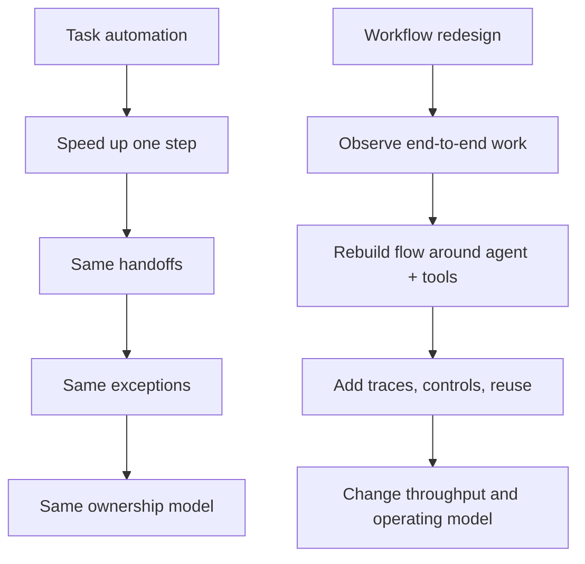
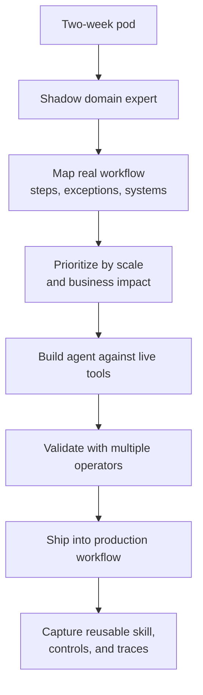
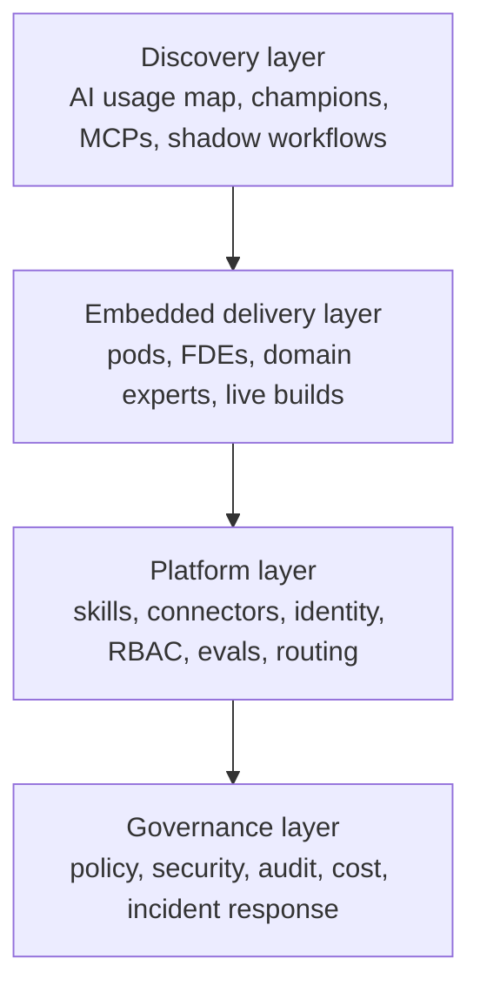
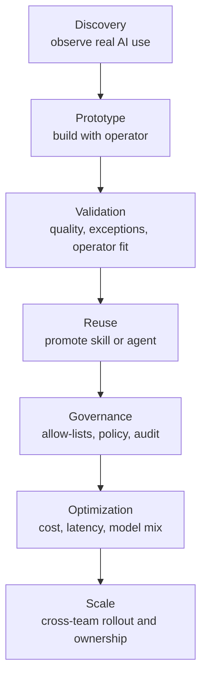

# Workflow-Centered Agent Deployment: What Uber's [Agentic Pods](https://x.com/praveenTweets/status/2074605343439810922) Reveal About Enterprise AI Adoption

**Abstract.** The next phase of enterprise AI adoption is not broader access to chat tools. It is redesigning work around agents, tools, controls, and reusable workflow artifacts. Uber's public description of Agentic Pods makes that shift concrete: pair AI-proficient engineers with domain experts, observe real work, build against live systems, validate with operators, and ship into production workflows. [Runlayer](https://www.runlayer.com/about) describes a vendor-side version of the same pattern through forward-deployed engineers, tool discovery, staged governance, and reusable agent skills. The important change is not that agents can perform tasks. It is that the workflow becomes the unit of automation.

## Core Thesis

The key shift is from task automation to workflow redesign.

A task-level mindset asks whether AI can help a person complete one step faster. A workflow-level mindset asks why that step exists, which upstream and downstream systems constrain it, where judgment actually matters, and whether the whole flow should be rebuilt now that an agent can reason, call tools, and produce traces.

That distinction makes the pod model notable. Teams do not simply hand the work to AI. They reconstruct the workflow around AI.

_Caption: Task automation speeds up a step. Workflow redesign changes the shape of the work._

## Context

Many enterprise AI programs still confuse access with adoption. Giving employees Claude, ChatGPT, Gemini, Cursor, or Codex may improve individual productivity, but it does not automatically change how the business operates. The harder problem is turning tacit work into reliable, governed, reusable workflows.

[Praveen Neppalli](https://x.com/praveenTweets/status/2074605343439810922) described Agentic Pods as an internal model for finance, legal, operations, marketing, customer support, HR, and procurement. In that account, Uber said 99% of engineers use AI tools, local or cloud agents help produce more than 70% of pull requests, and engineers have built more than 2,500 agent skills. These are self-reported company figures, but they still signal a meaningful operating shift: AI is no longer treated only as an individual assistant. It is being treated as operational infrastructure.

[A later report](https://www.aol.com/articles/ubers-cto-embedded-top-ai-152402016.html) summarized the same model and said Uber had run 16 pods across 16 business functions, with plans to expand the approach further. The important point is not the number of pods. It is the move from software access to workflow deployment.

## Mechanism and Model

The reported [Agentic Pods](https://x.com/praveenTweets/status/2074605343439810922) structure is simple. Uber paired roughly 30 AI-proficient engineers with domain experts from business functions. Each pod had two weeks. In that window, the pair shadowed the work, mapped the real workflow, prioritized the highest-value steps, built the agent against live systems, validated it with other operators, and shipped.

That order matters.

Enterprise workflows rarely match the official process diagram. The real workflow lives in spreadsheets, chat threads, side scripts, undocumented exceptions, approval habits, and personal judgment. Shadowing exposes that real path. Documentation alone usually captures only the official one.

This is why the model looks more like forward-deployed engineering than classic platform delivery. A central AI platform team can provide models, connectors, identity, logs, policies, and deployment paths. It usually cannot infer the deep structure of operational work from a distance. An embedded engineer can.

_Caption: The Agentic Pod works as a short, high-intensity discovery-to-shipping loop._

## Concrete Examples

The reported results are the kind of improvements that make this model worth examining. Uber says capital allocation across 150 cities dropped from 15 hours to 30 minutes. Financial pacing reports dropped from two days to 10 minutes. Marketing web QA dropped from two weeks to 50 minutes. Support workflow creation moved away from thousands of manual workflows toward self-service automation.

Those numbers do not establish a general rule. They do suggest where the model appears strongest: operational workflows with high repetition, fragmented tool surfaces, significant exception handling, and enough human judgment that brittle automation struggled before.

[Runlayer](https://www.runlayer.com/about) describes a productized variant of the same pattern. It pairs a forward-deployed engineer with an internal AI champion, maps which AI clients, [Model Context Protocol](https://www.anthropic.com/news/model-context-protocol) servers, and shadow connectors the team already uses, builds agents live with the customer team, turns successful patterns into reusable skills, optimizes each run for model choice and tool usage, and introduces controls in stages.

The important point is not whether Uber and Runlayer use the same stack. It is that both describe the same deployment shape: discovery first, embedded building second, then reuse and governance.

## What Is Actually New

None of the ingredients is new on its own. Embedded engineering is not new. Business process automation is not new. RPA is not new. Workflow mining is not new. Forward-deployed engineering is not new.

What is new is the recombination.

Agents make it possible to package workflow knowledge into semi-autonomous executable artifacts rather than only SOPs, scripts, dashboards, or brittle UI automations. The [official MCP specification](https://modelcontextprotocol.io/specification) matters here because enterprise agent workflows depend less on chat interfaces and more on controlled access to operational systems. A standard tool layer lets teams reuse the same agent workflow across systems instead of rebuilding connectors for each host.

A more accurate description, then, is not "more AI usage." It is "agent deployment as an operating model."

## The Four-Layer Enterprise Operating Model

A mature enterprise agent program likely needs four layers.

The first is a discovery layer that maps where AI is already being used, which teams have strong internal champions, which tools and MCP servers exist, and where shadow workflows are already forming.

The second is an embedded delivery layer, made up of pods or FDE-style teams that sit with operators, observe work, build against live systems, validate with users, and ship.

The third is a platform layer that provides reusable skills, connectors, identity, RBAC, logging, model routing, prompt and version management, evals, approval paths, and deployment mechanisms.

The fourth is a governance layer that handles policy, risk classification, auditability, security scanning, cost controls, incident response, and lifecycle ownership.

Many companies over-invest in the platform layer before they understand the discovery layer. Uber's account is notable because it starts with embedded discovery.

_Caption: Enterprise agent programs need discovery before platform, and platform before durable governance._

## Trade-offs and Failure Modes

This model has three obvious constraints.

First, governance cannot arrive only as blanket prohibition. If controls appear too early and only as hard stops, employees route around them. Shadow AI grows. Unapproved connectors spread. Credentials leak into tools. If controls arrive too late, the organization gives agents unbounded access to production systems and communications.

A staged model is more credible: observe real usage, classify risk, create a better paved road, then enforce.

Second, tool-connected agents expand the attack surface. The [Security Best Practices](https://modelcontextprotocol.io/docs/tutorials/security/security_best_practices) guidance for MCP highlights authorization and implementation risks. Two recent security papers show the same pattern: once agents can call tools, prompt injection can spread across systems, and weak server verification can let untrusted tools into the workflow — see [*Breaking the Protocol*](https://arxiv.org/abs/2601.17549) and [*Attested Tool-Server Admission*](https://arxiv.org/abs/2605.24248).

Third, cost becomes a design constraint. Operational agents consume tokens, tool calls, cloud compute, latency budgets, and human review time. A workflow that looks impressive in a demo can still be too expensive or too fragile at production volume. Optimization becomes part of the architecture, not a postscript.

Uber is also a useful security reference point here. [*ADR: An Agentic Detection System for Enterprise Agentic AI Security*](https://arxiv.org/abs/2605.17380) describes a production enterprise security framework deployed at Uber, processing more than 10,000 agent sessions daily across more than 7,200 hosts. That kind of control plane implies a harder lesson: logs are not enough. Serious deployment needs causal observability over agent runs.

_Caption: The durable deployment path runs from discovery to governed scale, with security and cost gates added as the workflow hardens._

The failure modes are familiar even if the technology is new. Organizations can automate the documented process rather than the real one. They can scale demos without clear ownership. They can accumulate maintenance debt through bottom-up adoption. They can burn budget faster than value appears. They can call a faster step "transformation" even when the surrounding workflow has not changed.

## Practical Takeaways

For operators and engineering leaders, the practical lesson is simple: start with a workflow that matters, not with a seat count.

Pick work with visible economic value, repeated execution, messy handoffs, and enough operator judgment that simple scripting is insufficient. Put an AI-proficient engineer beside the person doing the work. Shadow the real process. Build against the actual systems. Validate with multiple operators. Instrument quality, cost, and failure modes early. Package the result as a reusable capability only after it proves itself in use.

For platform teams, the job is to provide a paved road without pretending the road is the journey. Identity, connectors, logs, RBAC, model routing, eval tooling, and approval paths matter. They do not replace embedded workflow discovery.

For security teams, the relevant control surface is the tool layer. Once agents can act through tools, governance has to move closer to permissions, traces, admission, and runtime policy.

For engineers, the leverage shifts toward situated system design. The valuable engineer in this model is not simply the fastest coder or the best prompt writer. It is the engineer who can understand operations, define system boundaries, encode tacit knowledge, evaluate agent behavior, and make the successful pattern reusable.

## Positioning Note

This is not a note about whether copilots improve personal productivity. It is a note about how enterprise AI starts to become operational. The useful comparison is not "AI assistant versus no AI assistant." It is "seat-based enablement versus workflow-centered deployment."

That is why the Uber account is interesting. It describes a method for turning domain work into governed agent workflows. That is a more durable organizational claim than saying many employees use AI tools.

## Status and Scope Disclaimer

This note draws on Uber's public, partly self-reported claims, follow-on media coverage, Runlayer's public material, and published work on MCP security and enterprise agent observability. It is not an independent evaluation of Uber's internal systems, costs, or outcomes. The claims are useful as signals about deployment shape, not as proof that enterprise agent transformation has already been solved.

## References

- [Breaking the Protocol: Security Analysis of the Model Context Protocol Specification and Prompt Injection Vulnerabilities in Tool-Integrated LLM Agents](https://arxiv.org/abs/2601.17549)
- [Attested Tool-Server Admission: A Security Extension to the Model Context Protocol](https://arxiv.org/abs/2605.24248)
- [ADR: An Agentic Detection System for Enterprise Agentic AI Security](https://arxiv.org/abs/2605.17380)
- [How are AI agents used? Evidence from 177,000 MCP tools](https://arxiv.org/abs/2603.23802)
- [Agentic AI adoption and Agentic Pods at Uber (Praveen Neppalli Naga, public post, July 2026)](https://x.com/praveenTweets/status/2074605343439810922)
- [Runlayer's FDE-led enterprise agent rollout model](https://www.runlayer.com/about)
- [Uber's CTO embedded its top AI engineers in HR, finance, and legal, and found better ways to build](https://www.aol.com/articles/ubers-cto-embedded-top-ai-152402016.html)
- [Introducing the Model Context Protocol](https://www.anthropic.com/news/model-context-protocol)
- [Model Context Protocol Specification](https://modelcontextprotocol.io/specification)
- [Model Context Protocol Security Best Practices](https://modelcontextprotocol.io/docs/tutorials/security/security_best_practices)
