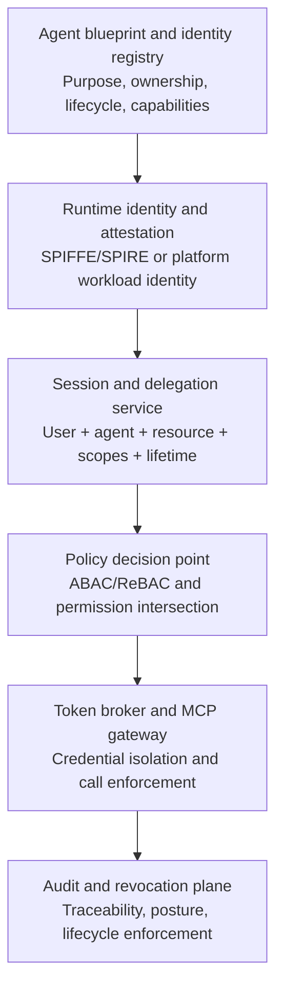

# Building First-Class Identities for Enterprise AI Agents

Enterprise AI agents are commonly deployed under credentials designed for software with predictable execution paths: service accounts, application credentials, API keys, or delegated human sessions.

This is increasingly the wrong abstraction.

A traditional workload executes code selected by its developers. An AI agent selects actions at runtime. It interprets natural-language instructions, retrieves untrusted context, chooses tools, constructs parameters, delegates work to other agents, and can perform state-changing operations across several systems.

The security question is therefore no longer only:

**Which application is making this request?**

It is also:

**Which agent is acting, on whose behalf, from which runtime, under which configuration, and within what currently authorized boundary?**

Answering that question requires treating the agent as a first-class identity principal: distinct from the human user, the hosting workload, and the tools it invokes.

This article develops a vendor-neutral architecture for that identity layer and introduces Agent Identity Lab, an open-source proof of concept for testing these patterns with agent runtimes and Model Context Protocol servers.

## Why service accounts are insufficient

Service accounts remain useful for deterministic workloads. A scheduled export job, for example, has a known executable, a fixed trigger, and a bounded set of API calls.

An agent behaves differently. Its execution path depends on:

- the user's request;
- the model and prompt configuration;
- retrieved documents and external messages;
- the available tool descriptions;
- intermediate model decisions;
- responses returned by downstream systems.

The same agent can answer a question, search a repository, edit an issue, send a message, or initiate a deployment. Its authority is exercised through a reasoning loop rather than a predefined call graph.

Giving such a system a broad service account creates **ambient authority**: every capability attached to the account is available during every run, whether or not the current task requires it.

Running the agent under the user's complete session is not much better. It creates a different failure mode: a compromised or manipulated agent inherits the user's entire access boundary.

Prompt injection makes this distinction operationally important. A document, issue, email, or web page can contain instructions intended to redirect the agent. Model-level protections may reduce the probability of successful manipulation, but they do not establish a reliable authorization boundary. The agent must remain unable to perform actions outside its approved authority even when its reasoning has been compromised.

Identity and authorization controls therefore need to assume that an agent **can** make a bad decision.

## The agent should be a distinct principal

An enterprise agent identity should not be synonymous with its process, model, or human operator. It should be a registered principal with its own lifecycle and policy boundary.

A useful agent identity contains four classes of information:

```
Agent identity =
    cryptographic identity
  + provenance attributes
  + operational ownership
  + dynamic security context
```

The **cryptographic identity** provides a verifiable identifier and signing or authentication material.

The **provenance attributes** identify what is running: the agent blueprint, code revision, container image, model, prompt package, and tool configuration.

The **operational ownership** identifies the accountable humans or teams: a technical owner, a business sponsor, and possibly a data owner.

The **dynamic security context** describes the current execution: environment, acting user, session lifetime, risk signals, requested operation, and resource sensitivity.

This produces a principal that can be authenticated cryptographically, governed administratively, and constrained at runtime.

## Two emerging architectural directions

Current platform designs suggest two complementary approaches rather than one settled standard.

### Directory-managed agent identities

[Microsoft Entra Agent ID](https://learn.microsoft.com/en-us/entra/agent-id/) extends enterprise directory concepts to agents.

Its central abstraction is the agent identity blueprint: a template defining shared agent characteristics, authentication settings, required resource access, and inheritable permissions. Multiple identities can be created from one blueprint while retaining distinct credentials and permissions.

The blueprint also has a tenant-local principal. Microsoft uses this principal to provision and deprovision child agent identities and to attribute those administrative operations in audit logs. Disabling a blueprint can prevent its identities from authenticating.

This model is strong in areas traditional identity systems already understand:

- inventory;
- ownership;
- lifecycle;
- policy inheritance;
- administrative delegation;
- access reviews;
- tenant-level auditability.

It answers the governance question: **What kind of agent is this, who is responsible for it, and how is its fleet managed?**

### Runtime-attested agent identities

[Google Cloud Agent Identity](https://docs.cloud.google.com/iam/docs/agent-identity-overview) starts closer to workload identity.

Each supported agent receives a unique, strongly attested identity based on [SPIFFE](https://spiffe.io/). The identity is tied to the hosted agent resource rather than shared across workloads. Google states that agent identities cannot be impersonated and do not expose long-lived service-account keys to developers.

A representative identifier looks like:

```
spiffe://agents.example.system.id.goog/
  resources/aiplatform/projects/123/
  locations/europe-west4/reasoningEngines/research-agent
```

The corresponding principal can be referenced directly in IAM policies. Google-issued access tokens are cryptographically bound to the agent's X.509 credential, reducing the usefulness of a stolen bearer token.

This model is strong in:

- workload attestation;
- secretless authentication;
- short-lived credentials;
- runtime-to-resource binding;
- cryptographic isolation;
- automatic credential rotation.

It answers the execution question: **Which deployed runtime is making this request, and can it prove that identity?**

The two approaches are not mutually exclusive. A complete architecture needs both:

- a directory and governance identity describing the **approved** agent; and
- an attested workload identity proving **which** runtime is executing it.

The directory object without runtime attestation can be copied or used from an unexpected environment. The workload identity without directory governance says little about business purpose, ownership, approved capabilities, or lifecycle.

## Agent authorization is an intersection

Authentication establishes which agent is running. It does not determine what the agent should be allowed to do during a particular task.

The effective permission boundary should be calculated dynamically:

```
effective authority =
    user authority
  ∩ agent authority
  ∩ blueprint authority
  ∩ tool policy
  ∩ resource policy
  ∩ environment constraints
  ∩ session constraints
```

Consider a research agent allowed to read GitHub repositories but never modify them.

A user asks it to inspect a private repository. The request should succeed only when:

- the user can read that repository;
- the agent identity is active;
- the agent blueprint permits repository access;
- the requested operation is read-only;
- the runtime satisfies the blueprint's attestation policy;
- the session has not expired or been revoked.

The fact that the user can create issues does not imply the research agent should be allowed to create issues. The fact that the agent can read repositories does not imply it can read repositories unavailable to the user.

The resulting authority is narrower than either principal independently.

This is a natural application of Attribute-Based Access Control. [NIST SP 800-162](https://csrc.nist.gov/pubs/sp/800/162/final) defines ABAC in terms of attributes associated with the subject, object, requested operation, and environment. Agent systems add useful subject and environment attributes:

```
subject:
  agent_id: research-agent-17
  blueprint: research-agent-v3
  acting_user: user-492
  model: deepseek-pro
  code_revision: 9b02f15
  runtime_digest: sha256:abc123

object:
  type: github_repository
  organization: rmax-ai
  repository: agent-identity-lab
  classification: public

action:
  operation: search_code
  required_scope: repository:read

environment:
  deployment: development
  session_age_seconds: 217
  risk_level: low
```

A policy engine such as [Open Policy Agent](https://www.openpolicyagent.org/docs/latest/) or [Cedar](https://www.cedarpolicy.com/) can evaluate this context at the moment of the tool call.

Static roles still have a place, but they become inputs to the decision rather than the complete decision.

## Delegation must preserve both user and agent identity

When an agent acts for a user, downstream systems need to distinguish the subject from the actor.

The **subject** is the identity whose resources or authority are being used. The **actor** is the agent currently exercising that delegated authority.

OAuth 2.0 Token Exchange, [RFC 8693](https://datatracker.ietf.org/doc/html/rfc8693), defines an `act` claim for representing this relationship:

```json
{
  "sub": "user:492",
  "aud": "https://github-gateway.example.com",
  "scope": "repository:read",
  "act": {
    "sub": "agent:research-agent-17"
  }
}
```

The token means that `research-agent-17` is acting under authority associated with `user:492`.

RFC 8693 also permits nested actor claims, making it possible to represent a multi-agent delegation chain:

```json
{
  "sub": "user:492",
  "act": {
    "sub": "agent:repository-reviewer",
    "act": {
      "sub": "agent:research-orchestrator"
    }
  }
}
```

This history is useful for attribution, but it should not be mistaken for automatic authorization. Each delegation step must narrow or preserve authority; it must never silently expand it.

A sub-agent should receive a capability scoped to its specific task, resource, and lifetime — not the root agent's complete session.

## Keep long-lived credentials outside agent memory

Even a correctly authenticated agent runtime should not hold unnecessary secrets.

An agent processes untrusted text and generates dynamic tool arguments. Storing API keys or OAuth refresh tokens in the same memory space increases the consequences of prompt injection, tool compromise, debugging mistakes, and accidental logging.

A safer architecture introduces a credential broker or token vault:

```
Agent runtime
    |
    | attested identity + requested tool operation
    v
Policy enforcement point
    |
    | approved resource + reduced scopes
    v
Token broker
    |
    | short-lived or directly injected credential
    v
Downstream API
```

Google's [Agent Identity auth manager](https://docs.cloud.google.com/iam/docs/auth-manager-overview) implements this separation for API keys, machine-to-machine OAuth, and user-delegated OAuth. When used with its gateway architecture, end-user credentials can be decrypted at the gateway so that the agent never receives the raw credential.

The important design principle is broader than one vendor:

> Agents should request capabilities, not retrieve secrets.

Where possible, the gateway should inject the credential into the outbound request and return only the tool result. The agent does not need to see the token at all.

Where direct token presentation is unavoidable, the broker should issue a short-lived credential restricted by:

- audience;
- resource;
- scope;
- session;
- agent;
- acting user;
- proof-of-possession key;
- expiration time.

## MCP is the natural enforcement boundary

The [Model Context Protocol](https://modelcontextprotocol.io/) standardizes how agent applications discover and invoke external tools. This makes the MCP boundary an appropriate place to enforce identity and authorization.

The MCP [authorization specification](https://modelcontextprotocol.io/specification/2025-11-25/basic/authorization) treats a protected MCP server as an OAuth resource server. It requires [OAuth Protected Resource Metadata, RFC 9728](https://datatracker.ietf.org/doc/html/rfc9728), for authorization-server discovery and requires clients to identify the target server using [OAuth resource indicators, RFC 8707](https://datatracker.ietf.org/doc/html/rfc8707).

A protected server can advertise metadata such as:

```json
{
  "resource": "https://tools.example.com/mcp",
  "authorization_servers": [
    "https://identity.example.com"
  ],
  "scopes_supported": [
    "repository:read",
    "issues:read",
    "issues:write"
  ]
}
```

This solves protocol-level discovery, but an enterprise agent architecture still needs a policy enforcement layer around it.

An identity-aware MCP gateway should:

1. authenticate the agent session;
2. identify the acting user;
3. validate the runtime and agent lifecycle state;
4. resolve the requested MCP tool to required scopes;
5. evaluate the permission intersection;
6. acquire or inject a downstream credential;
7. forward the tool request;
8. record the decision and result.

The gateway should also enforce the MCP prohibition against token passthrough. A token issued for one server must not be forwarded to another. The MCP specification requires clients to use the OAuth `resource` parameter and requires servers to validate that presented tokens were issued specifically for them.

This limits lateral movement when a token is exposed or one MCP server is compromised.

## Identity should be established before model execution

Many agent architectures request authorization only when the model decides to call a tool. That is necessary but incomplete.

An execution plan can declare its expected authority before an expensive or sensitive run begins:

```yaml
plan_id: plan-0182
agent_id: research-agent-17
acting_user: user-492

requested_operations:
  - tool: github.search_code
    resource: github.com/rmax-ai/agent-identity-lab
    scopes:
      - repository:read

  - tool: confluence.search
    resource: engineering-space
    scopes:
      - pages:read

constraints:
  network: enterprise-egress
  environment: development
  maximum_runtime_seconds: 900
```

The control plane can reject impossible or unauthorized plans before model inference starts.

This does not replace per-call authorization. The model may deviate from the plan, tool requirements may change, or the user's access may be revoked during execution. Preflight authorization provides an expected authority envelope; the gateway remains the final enforcement point.

Typed plans also improve auditability. Security reviewers can compare:

- authority requested before execution;
- authority granted to the session;
- tools actually invoked;
- authority used by each call.

Unexpected differences become observable events.

## The agent identity lifecycle

Agent identity is not only a token format. It requires an administrative lifecycle.

**Registration**
A developer or platform team registers an agent blueprint describing: business purpose, approved models, approved tools, maximum scopes, permitted environments, runtime requirements, session lifetime, technical owner, business sponsor.

**Provisioning**
A concrete agent identity is instantiated from the blueprint. It receives a unique principal identifier and registered verification material.

**Attestation**
At startup, the runtime proves relevant properties such as: workload identity, container digest, code revision, deployment environment, agent framework version, model identifier, prompt package version.

Software claims are not equivalent to hardware-backed attestation, but they still provide a useful verifiable binding for a proof of concept.

**Session issuance**
The agent requests a short-lived session for a specific user, task, resource set, and scope set. The identity control plane evaluates policy and issues a bounded credential.

**Continuous enforcement**
Every sensitive tool call is checked against the current state of the agent, user, session, runtime, resource, and policy.

**Suspension and revocation**
Suspending an agent identity should block subsequent calls even when an already-issued session token has not expired. The gateway therefore needs an online lifecycle or revocation check for sensitive operations.

**Decommissioning**
When an agent is retired, the platform should revoke its identities, remove credentials, archive its audit history, and detach its resources and policies.

This lifecycle prevents agent sprawl from becoming the next form of service-account sprawl.

## Audit records must connect reasoning to authority

Traditional API logs answer questions such as which IP address accessed an endpoint and which token identifier was presented.

That is not sufficient for autonomous workflows.

A useful agent audit record should connect three layers.

**Identity provenance**

- agent identity;
- acting user;
- blueprint and version;
- runtime identity;
- code and container digest;
- model and prompt version.

**Authorization decision**

- requested tool and operation;
- requested and effective scopes;
- target resource;
- policy version;
- decision and reason;
- human approval, when required;
- issued credential lease.

**Execution trace**

- plan and trace identifiers;
- tool arguments, with sensitive fields redacted;
- downstream response metadata;
- execution result;
- failure or denial reason.

A representative event could look like:

```json
{
  "event_type": "tool.authorization.allowed",
  "agent_id": "research-agent-17",
  "acting_user_id": "user-492",
  "session_id": "session-81",
  "trace_id": "trace-943",
  "blueprint": "research-agent-v3",
  "model": "deepseek-pro",
  "runtime_digest": "sha256:abc123",
  "tool": "github",
  "operation": "search_code",
  "resource": "rmax-ai/agent-identity-lab",
  "requested_scopes": ["repository:read"],
  "effective_scopes": ["repository:read"],
  "policy_version": "2026-07-10.1",
  "decision": "allow"
}
```

The aim is not to log every private reasoning token. The aim is to preserve enough evidence to reconstruct who exercised authority, why the platform permitted it, and what external effect resulted.

## Reference architecture

A vendor-neutral implementation can be divided into six components:



The components should remain decoupled.

The identity registry should not need to implement every policy language. The policy engine should not hold refresh tokens. The agent runtime should not manage long-lived credentials. MCP servers should not need to understand every upstream orchestration framework.

Clear boundaries make it possible to integrate existing enterprise systems instead of replacing them.

## Agent Identity Lab

[Agent Identity Lab](https://github.com/rmax-ai/agent-identity-lab) is a planned open-source reference implementation of this architecture.

The project is intended to make agent identity concrete enough to test, inspect, and challenge. It is not intended to replace an enterprise identity provider or certificate authority.

The initial proof of concept will include:

- blueprint-based agent registration;
- individual agent identities and lifecycle states;
- signed software runtime attestations;
- user-to-agent delegation grants;
- short-lived agent session tokens;
- permission intersection through a policy engine;
- an identity-aware MCP gateway;
- server-side credential injection;
- credential lease tracking;
- tamper-evident audit records;
- an integration example for the Hermes agent runtime.

The core demonstration will use a read-only research agent.

The agent will be allowed to search an approved repository when both the user and agent have read access. A write attempt will be denied even when the acting user independently possesses write permission. Suspending the agent identity will invalidate subsequent calls. External credentials will remain outside agent memory.

The intended request path is:

```
Hermes agent
    |
    | signed runtime attestation
    v
Agent Identity Lab session service
    |
    | short-lived agent session
    v
MCP gateway
    |
    | policy decision + credential injection
    v
GitHub or mock MCP server
    |
    | result + structured audit record
    v
Hermes agent
```

The repository will provide executable scenarios rather than only architecture diagrams:

```
make demo-authorized-read
make demo-denied-write
make demo-user-lacks-access
make demo-suspended-agent
make demo-invalid-runtime
make demo-secret-isolation
```

The most important invariant is simple:

> A denied action must never cause a downstream credential to be issued.

Other invariants include:

```
effective scopes ⊆ requested scopes
effective scopes ⊆ agent scopes
effective scopes ⊆ user scopes
effective scopes ⊆ blueprint scopes

revoked agent → no valid new session
suspended agent → no successful tool call
unknown tool mapping → deny
policy service unavailable → deny
```

These properties are testable independently of model quality. That is precisely their value.

## What agent identity does not solve

A dedicated identity layer does not make an agent trustworthy.

It does not eliminate:

- prompt injection;
- malicious tools;
- poisoned retrieval results;
- unsafe model behavior;
- incorrect planning;
- data leakage through legitimate outputs;
- excessive access granted by bad policy;
- compromised identity infrastructure.

Identity changes the **failure boundary**.

A manipulated research agent with unrestricted user credentials may modify repositories, send messages, or access unrelated systems. The same agent operating under a short-lived, attested, read-only identity remains dangerous within its allowed read boundary but cannot silently acquire write authority.

That is the security objective: not proving that the reasoning process is correct, but limiting what incorrect reasoning can do.

## Open questions

Several architectural questions remain unresolved.

**Cognitive-state attestation**
Infrastructure can attest a container image, executable, deployment, and key. It cannot yet prove that the agent's current context, memory, or planning state has not been manipulated.

The gap between workload attestation and cognitive-state integrity remains substantial.

**Multi-agent delegation semantics**
RFC 8693 can represent actor chains, but complex agent systems still need precise rules for delegation depth, scope reduction, revocation propagation, and accountability across orchestrators and workers.

**Cross-organization trust**
SPIFFE federation can establish workload trust across domains, but business authorization requires more than certificate validation. Organizations need interoperable ways to exchange agent provenance, approved capabilities, liability boundaries, and revocation signals.

**Identity granularity**
An identity can represent an agent product, deployment, replica, session, or individual task. Coarse identities are easier to operate but produce wider blast radii. Fine-grained identities improve isolation but increase lifecycle and observability costs.

**Policy latency**
Online token exchange, attestation validation, and dynamic policy evaluation add latency. Systems will need carefully bounded caches and rapid revocation channels rather than choosing between full online validation and long-lived authorization.

These are engineering problems, not reasons to continue using broad service accounts.

## Conclusion

AI agents combine the unpredictability of human-directed interaction with the execution privileges of software workloads. Neither human identity nor workload identity alone captures that combination.

A practical enterprise architecture should bind four things together:

1. the registered identity and lifecycle of the agent;
2. the attested identity of the executing runtime;
3. the delegated authority of the acting user;
4. the policy governing the current tool operation.

This produces an authorization boundary that can survive imperfect reasoning.

The agent may select the wrong tool. It may misunderstand a document. It may be redirected by hostile context.

But it should still be unable to exceed the authority explicitly granted to that agent, for that user, in that runtime, for that resource, during that session.

That is the purpose of first-class agent identity.

## References

1. Microsoft — [What is Microsoft Entra Agent ID?](https://learn.microsoft.com/en-us/entra/agent-id/)
2. Microsoft — [Agent identity blueprints in Microsoft Entra Agent ID](https://learn.microsoft.com/en-us/entra/agent-id/agent-blueprint)
3. Microsoft Graph — [agentIdentityBlueprint resource type](https://learn.microsoft.com/en-us/graph/api/resources/agentidentityblueprint?view=graph-rest-1.0)
4. Google Cloud — [Agent Identity overview](https://docs.cloud.google.com/iam/docs/agent-identity-overview)
5. Google Cloud — [Agent Identity auth manager overview](https://docs.cloud.google.com/iam/docs/auth-manager-overview)
6. SPIFFE — [SPIFFE overview](https://spiffe.io/)
7. SPIFFE — [SPIFFE ID and Verifiable Identity Document](https://spiffe.io/docs/latest/spiffe-about/spiffe-concepts/)
8. SPIFFE — [X.509-SVID specification](https://github.com/spiffe/spiffe/blob/main/standards/X509-SVID.md)
9. NIST — [SP 800-162: Guide to Attribute Based Access Control Definition and Considerations](https://csrc.nist.gov/pubs/sp/800/162/final)
10. IETF — [RFC 8693: OAuth 2.0 Token Exchange](https://datatracker.ietf.org/doc/html/rfc8693)
11. IETF — [RFC 8707: Resource Indicators for OAuth 2.0](https://datatracker.ietf.org/doc/html/rfc8707)
12. IETF — [RFC 9728: OAuth 2.0 Protected Resource Metadata](https://datatracker.ietf.org/doc/html/rfc9728)
13. Model Context Protocol — [Authorization specification](https://modelcontextprotocol.io/specification/2025-11-25/basic/authorization)
14. Open Policy Agent — [OPA documentation](https://www.openpolicyagent.org/docs/latest/)
15. Cedar — [Cedar policy language](https://www.cedarpolicy.com/)
16. RMax AI — [Agent Identity Lab](https://github.com/rmax-ai/agent-identity-lab)
