title: "Beyond RAG Memory: Treat Knowledge as Source Code and Retrieval as Compilation"
description: "Why durable AI-agent knowledge should remain human-readable, version-controlled and reproducible—while vector indexes, search engines and graphs become disposable compiled artifacts."
date: 2026-06-13
tags:
  - AI agents
  - RAG
  - agent memory
  - knowledge architecture
  - Open Knowledge Format
  - GitOps

---

Beyond RAG Memory: Treat Knowledge as Source Code and Retrieval as Compilation

Retrieval-augmented generation solved an important problem: language models cannot carry all relevant organizational or personal knowledge inside their parameters or context windows. RAG gave applications a practical way to retrieve external information and place it in the model's working context.

But a retrieval system is not automatically a memory system.

Many agent architectures quietly make a stronger assumption: once documents have been chunked, embedded and inserted into a vector database, the vector store becomes the agent's long-term memory. The original documents may still exist somewhere, but the operational system treats embeddings and retrieved chunks as the effective representation of what the agent knows.

This works for demonstrations. It becomes fragile when agents must operate over months or years, update their beliefs, distinguish current facts from historical ones, explain where knowledge came from, resolve contradictions and accept governed corrections from humans.

The problem is not RAG itself. The problem is treating a retrieval index as the canonical knowledge layer.

A more durable architecture follows a principle familiar from compilers:

Human-readable, version-controlled knowledge should be the source code. Vector indexes, search indexes, summaries and knowledge graphs should be compiled artifacts.

Under this model, retrieval infrastructure remains important. It may still provide the fastest way to locate relevant material. But it no longer owns the truth. If an index is corrupted, its embedding model becomes obsolete or its schema changes, the system rebuilds it from the canonical knowledge source.

This separation creates a stronger foundation for agent memory: inspectable, correctable, portable, temporal and governable.

RAG retrieves information; memory maintains knowledge

RAG systems usually follow a pipeline resembling this:

1.   Collect documents.
2.   Divide them into chunks.
3.   Generate an embedding for each chunk.
4.   Store the embeddings and associated text.
5.   Embed an incoming query.
6.   Retrieve semantically similar chunks.
7.   Insert those chunks into the model's context.

This is effective for document search and question answering. It gives a model access to information that was not present during training and avoids placing an entire corpus into every prompt.

But retrieval and memory solve different problems.

Retrieval asks: Which existing pieces of information are relevant to this query?

Memory must also answer:

-   What does the system currently believe?
-   Which claims are observations, hypotheses or verified facts?
-   When was a fact valid?
-   Where did it come from?
-   What has superseded it?
-   Which claims contradict one another?
-   Who approved a correction?
-   Which information should expire?
-   What did the system know at a specific point in time?

A vector index does not inherently answer these questions. It encodes numerical relationships that help estimate semantic similarity. It does not, by itself, provide a complete lifecycle model for knowledge.

The distinction becomes important as systems move from answering questions to taking actions. An inaccurate retrieval result may produce a weak answer. An inaccurate memory used by an autonomous agent may produce an incorrect payment, modify the wrong account, apply an obsolete policy or act on a superseded instruction.

Persistent agents therefore need more than good retrieval. They need explicit knowledge semantics.

The failure modes of vector-only memory

Vector databases are not defective. They are being asked to solve a problem they were not designed to own.

Vector databases generally provide data-management operations, not knowledge-governance workflows.

They do not inherently answer:

-   Who proposed this memory?
-   Which source justified it?
-   Who approved it?
-   What changed from the previous version?
-   Can we roll back the update?
-   What did the agent know before the change?

Teams can build these controls around a vector database, but once they do, they are implicitly acknowledging that the vector database is not the complete memory layer.

The compilation principle

A stronger architecture separates canonical knowledge from derived retrieval state.

The canonical layer should have several properties:

-   Human-readable
-   Machine-parseable
-   Versionable
-   Diffable
-   Source-linked
-   Correctable
-   Portable
-   Independently auditable
-   Rebuildable into multiple retrieval formats

Downstream systems can then compile this knowledge into forms optimized for particular workloads:

-   Vector embeddings for semantic retrieval
-   Inverted indexes for lexical search
-   Graph indexes for relationship traversal
-   Summaries for progressive disclosure
-   Structured databases for filtering and aggregation
-   Prompt fragments for runtime context
-   Evaluation datasets for regression testing

The relationship resembles source code and compiled binaries.

Developers do not normally treat a compiled executable as the authoritative representation of a software system. The executable is useful for runtime execution, but the source code is the form humans inspect, modify, review and rebuild.

Agent knowledge should work similarly.

```mermaid
flowchart TD
    RE[Raw Evidence] --> CKR[Canonical Knowledge Repository]
    CKR --> VI[Vector Index]
    CKR --> LI[Lexical Index]
    CKR --> KG[Knowledge Graph]
    CKR --> SU[Summaries]
    CKR --> PP[Prompt Packages]
    CKR --> ED[Evaluation Datasets]

    style CKR fill:#1a1a2e,stroke:#e94560,stroke-width:2px
    style RE fill:#16213e,stroke:#0f3460
    style VI fill:#16213e,stroke:#0f3460
    style LI fill:#16213e,stroke:#0f3460
    style KG fill:#16213e,stroke:#0f3460
    style SU fill:#16213e,stroke:#0f3460
    style PP fill:#16213e,stroke:#0f3460
    style ED fill:#16213e,stroke:#0f3460
```



Every derived artifact may be discarded and reconstructed.

The reverse operation should not be required. A system should never depend on reconstructing its authoritative knowledge from an opaque embedding index.

Open Knowledge Format as a possible source representation

Google introduced the draft Open Knowledge Format, or OKF, in June 2026 as a minimal specification for portable, human- and agent-readable knowledge.

OKF v0.1 represents a knowledge bundle as a directory of Markdown files containing YAML frontmatter. Each non-reserved document requires a type field. Files can be organized hierarchically and connected using ordinary Markdown links.

A minimal concept might look like this:

```yaml
---
type: Policy
title: Production refund approval
description: Approval requirements for production refunds.
tags:
  - payments
  - risk
  - approval
timestamp: 2026-06-13T10:00:00Z
---
```

```markdown
# Rule

Refunds above the defined risk threshold require approval from an
authorized reviewer before execution.

# Related concepts

- [Refund execution workflow](/workflows/refund-execution.md)
- [Risk thresholds](/policies/risk-thresholds.md)

# Citations

1. [Internal refund control policy](/sources/refund-policy.md)
```

The specification deliberately does not prescribe a database, query engine, schema registry or runtime. It standardizes only enough structure for humans and agents to exchange and traverse bundles.

This minimalism is both its strength and its limitation.

OKF provides a portable envelope. It does not automatically solve:

-   entity resolution,
-   temporal reasoning,
-   ontology alignment,
-   contradiction management,
-   access control,
-   provenance verification,
-   retrieval quality,
-   policy enforcement.

Those capabilities require additional schemas, validation and runtime components.

Still, OKF provides a useful foundation because it keeps canonical knowledge close to ordinary files and standard tools. It can be edited in a text editor, reviewed in Git, indexed by search engines and consumed without a proprietary SDK.

The OKF v0.1 specification explicitly recommends Git as a distribution mechanism because it provides history, attribution and diffs. Google's announcement frames the format as a way to formalize emerging "LLM wiki" patterns into an interoperable convention.

OKF remains a draft. It should currently be treated as an experiment and an interchange candidate, not as a mature industry standard.

From raw documents to compiled knowledge

The canonical repository should not merely contain copied source documents. Raw evidence and maintained knowledge serve different functions.

A useful architecture separates them:

```
knowledge/
├── raw/
│   ├── meetings/
│   ├── articles/
│   ├── reports/
│   └── imports/
├── concepts/
├── decisions/
├── policies/
├── projects/
├── people/
├── playbooks/
├── conflicts/
└── archive/
```

The raw directory preserves evidence. It may contain meeting transcripts, PDFs, messages, reports or web captures.

The other directories contain synthesized knowledge: maintained representations of what the system currently knows.

An ingestion agent can implement a compilation loop:

1.  Detect a new raw source.
2.  Parse its structure.
3.  Identify entities and claims.
4.  Search for existing concepts.
5.  Propose new concepts or modifications.
6.  Attach provenance.
7.  Mark contradictions or supersessions.
8.  Run schema and consistency checks.
9.  Submit the update for review.
10. Rebuild affected retrieval indexes after approval.

This is more demanding than chunking a document and inserting embeddings. It is also more useful.

A raw meeting transcript may contain 10,000 words. The durable knowledge extracted from it may consist of:

-   one decision,
-   three commitments,
-   two project-state changes,
-   one unresolved question,
-   one updated preference,
-   four source-linked observations.

The goal is not to remember every token equally. The goal is to maintain the knowledge that should affect future behaviour.

Recent research is beginning to explore this direction. ByteRover describes an agent-native memory architecture that stores curated hierarchical knowledge in human-readable files instead of delegating memory entirely to an external chunk-and-embedding pipeline. Compiled Memory goes further in another direction, treating memory as verified behavioural instruction distilled from experience rather than simply more text retrieved into context.

These approaches are early, but they indicate a broader transition: memory is moving from passive storage toward active knowledge maintenance.

A typed model of agent knowledge

A canonical repository becomes significantly more useful when it distinguishes different kinds of knowledge.

A practical type system might include:

-   Fact
-   Observation
-   Hypothesis
-   Decision
-   Commitment
-   Goal
-   Preference
-   Policy
-   Instruction
-   Workflow
-   Skill
-   Research
-   Conflict
-   ArchivedFact

Different types should have different lifecycle rules.

An observation may be retained for 30 days before review. A verified policy may remain active until superseded. A hypothesis should carry confidence and supporting evidence. A commitment needs an owner and due date. A decision should record its rationale. An instruction may require stricter authorization than an ordinary note.

Consider a research claim:

```yaml
---
type: Hypothesis
title: Structured memory improves temporal consistency
status: proposed
created_at: 2026-06-13T10:00:00Z
confidence: 0.68
verification_status: unverified
derived_from:
  - raw/research/memory-evaluation-notes.md
evidence:
  - research/byterover.md
  - research/compiled-memory.md
review_after: 2026-08-01
---
```

Compare it with an operational policy:

```yaml
---
type: Policy
title: Human approval for canonical knowledge changes
status: verified
created_at: 2026-06-13T10:00:00Z
verification_status: human_approved
sensitivity: internal
owner: team:ai-platform
valid_from: 2026-06-15
supersedes: policies/previous-memory-write-policy
---
```

Both are text files, but the agent should reason about them differently.

Typed knowledge makes those distinctions explicit rather than hoping that the language model infers them correctly from prose every time.

Temporal memory: facts have histories

A durable memory system should avoid overwriting history when facts change.

At minimum, it should distinguish two temporal dimensions:

-   Valid time: When was this fact true in the real world?
-   Observation time: When did the system learn or record it?

Suppose a customer changes account managers on May 1, but the agent learns about the change on May 10.

```yaml
valid_from: 2026-05-01
observed_at: 2026-05-10T09:32:00Z
```

Those dates answer different questions.

"Who managed the account on May 5?" depends on valid time. "What would the agent have answered on May 7?" depends on observation time.

This distinction is standard in bitemporal data systems but often absent from agent memory.

Without it, updates become destructive. The latest statement replaces the previous one, and the system loses the ability to reconstruct historical truth or its own past knowledge state.

Temporal metadata also allows retrieval systems to exclude superseded knowledge from current answers while retaining it for historical queries.

```yaml
type: Fact
title: Client X account owner — Alice
valid_from: 2025-09-01
valid_until: 2026-04-30
superseded_by: facts/client-x-owner-bob
status: archived
```

The old fact has not become false. It has become historical.

Git as a governance plane

Once canonical knowledge is represented as text files, Git becomes a natural governance layer.

Git provides:

-   Version history
-   Diffs
-   Attribution
-   Branches
-   Pull requests
-   Review comments
-   Rollbacks
-   Signed commits
-   Branch protection
-   Ownership rules
-   Continuous-integration hooks

An agent that wants to modify durable knowledge does not need unrestricted access to the production branch.

Instead, it can:

1.  Create a branch.
2.  Modify or add concepts.
3.  Attach source references.
4.  Run validation.
5.  Open a pull request.
6.  Request review from the relevant owner.
7.  Merge only after checks and approval pass.

This creates a visible boundary between proposed knowledge and accepted knowledge.

For low-risk domains, some changes may be automatically merged after validation. Sensitive changes—such as modifications to policies, agent instructions or access rules—can require human approval.

Signed commits add provenance by showing which key authorized a commit. They do not prove that a claim is true, that an agent reasoned correctly or that a key was uncompromised. But they provide a stronger attribution trail than an anonymous background update to an opaque memory service.

The result is knowledge governance using familiar engineering primitives rather than a bespoke administration system.

A hybrid runtime architecture

Git is not a suitable database for every form of agent state.

An agent may produce many intermediate observations, tool outputs, token streams and short-lived variables during one execution. Committing each event to Git would create latency, repository noise and merge conflicts.

A practical architecture separates three state classes.

1.  **Canonical knowledge.** Stored in version-controlled files: policies, verified facts, decisions, maintained concept pages, agent instructions, reusable playbooks, long-term preferences, crystallized lessons. This layer prioritizes integrity, reviewability and history.

2.  **Transient runtime state.** Stored in an operational database or cache: active conversations, intermediate tool results, temporary plans, execution checkpoints, locks, queues, short-lived observations. This layer prioritizes latency and concurrency.

3.  **Derived retrieval state.** Stored in replaceable indexes: embeddings, lexical indexes, graph projections, reranking features, cached summaries, entity-resolution tables. This layer prioritizes retrieval performance.

The flow looks like this:

```mermaid
flowchart TD
    CK[Canonical Knowledge\nMarkdown + metadata\nGit history + review] -->|compile| VI[Vector Index]
    CK -->|compile| LI[Lexical Index]
    CK -->|compile| KG[Graph Index]
    VI -->|retrieve| AEE[Agent Execution Engine]
    LI -->|retrieve| AEE
    KG -->|retrieve| AEE
    AEE --> TRS[Transient Runtime State]
    TRS -->|periodic synthesis| PKU[Proposed Knowledge Update]
    PKU --> CK

    style CK fill:#1a1a2e,stroke:#e94560,stroke-width:2px
    style VI fill:#16213e,stroke:#0f3460
    style LI fill:#16213e,stroke:#0f3460
    style KG fill:#16213e,stroke:#0f3460
    style AEE fill:#1a1a2e,stroke:#e94560
    style TRS fill:#16213e,stroke:#0f3460
    style PKU fill:#16213e,stroke:#0f3460
```



The slow path maintains integrity. The fast path serves execution.

This split avoids two common mistakes:

-   expecting Git to handle high-frequency transactional state;
-   expecting a vector database to provide canonical knowledge governance.

Retrieval still matters

Treating vector indexes as compiled artifacts does not make them unimportant.

Semantic retrieval remains valuable when:

-   terminology varies,
-   queries are exploratory,
-   relevant passages lack exact keyword overlap,
-   the corpus is too large to traverse directly,
-   users ask vague or conceptual questions.

Lexical search remains valuable for identifiers, product names, error messages and exact phrases.

Knowledge graphs are useful for explicit relationships and multi-hop traversal.

Structured databases are better for aggregations, filters and strongly typed queries.

An effective agent may use all of them.

The architectural change is that no individual retrieval mechanism owns the authoritative state. Each is a projection optimized for a different access pattern.

A query planner might use:

-   Exact identifier? → lexical lookup
-   Structured date filter? → metadata query
-   Conceptual similarity? → vector retrieval
-   Multi-hop dependency? → graph traversal
-   High-integrity policy? → direct canonical read

For sensitive operations, the system can retrieve candidates through an index and then read the canonical source before making a decision.

This is analogous to using a database index to find a record while treating the underlying row as authoritative.

```mermaid
flowchart LR
    Q[Query] --> QP[Query Planner]
    QP -->|Exact ID| LL[Lexical Lookup]
    QP -->|Date filter| MQ[Metadata Query]
    QP -->|Conceptual| VR[Vector Retrieval]
    QP -->|Multi-hop| GT[Graph Traversal]
    QP -->|High-integrity| DCR[Direct Canonical Read]
    LL --> R[Result]
    MQ --> R
    VR --> R
    GT --> R
    DCR --> R

    style Q fill:#1a1a2e,stroke:#e94560
    style QP fill:#1a1a2e,stroke:#e94560
    style DCR fill:#16213e,stroke:#e94560,stroke-width:2px
```



Knowledge CI

Once knowledge is maintained like source code, it needs continuous integration.

A knowledge CI pipeline can test:

**Structural validity.** Is the YAML parseable? Is the required type present? Does the file conform to its type-specific schema? Are timestamps valid? Are identifiers unique?

**Link integrity.** Do referenced concepts exist? Are circular dependencies acceptable? Have moved files left stale references? Are relationship types valid?

**Provenance.** Does every verified claim cite a source? Does the source exist? Has the source content changed? Is the source permitted for this sensitivity class?

**Temporal consistency.** Does valid_until precede a successor's valid_from? Are two mutually exclusive facts active simultaneously? Has a concept passed its review date? Is expired knowledge excluded from active indexes?

**Security.** Does the update contain secrets? Does it expose personally identifiable information? Is the target directory allowed for this agent? Does the author have permission to modify instructions or policies?

**Retrieval regression.** Do benchmark questions still retrieve the expected concepts? Did an index rebuild reduce recall? Does the system prefer current facts over superseded ones? Are sensitive concepts excluded for unauthorized identities?

These checks convert knowledge maintenance from an informal content process into an engineering discipline.

Where the model breaks

The source-code analogy is useful, but incomplete.

Knowledge differs from software in several ways.

**Knowledge is often ambiguous.** Software either passes a test or fails it. Knowledge may be uncertain, contested, incomplete or dependent on perspective. A knowledge system therefore needs confidence, evidence and disagreement—not just schema validity.

**Human-readable does not mean semantically consistent.** Markdown files can still contain duplicated entities, contradictory terminology and incompatible assumptions. Structure helps, but it does not replace ontology design, entity resolution or governance.

**Git has poor fine-grained access control.** Repository permissions are usually broader than enterprise knowledge permissions. Sensitive systems may require separate repositories, encryption, policy-aware gateways or storage backends with document-level authorization.

**Erasure is difficult.** Git preserves history by design. That conflicts with use cases requiring reliable deletion of personal or regulated data. Sensitive raw data should not be casually committed to permanent history. Systems may need encrypted external storage, references rather than copies, short retention periods or repositories designed for history rewriting.

**Concurrent agents create conflicts.** Several agents editing the same concept can produce merge conflicts or, worse, semantically inconsistent updates that merge cleanly. Concurrency control may require: smaller atomic concept files, ownership partitioning, optimistic locking, semantic merge checks, event streams, conflict-free replicated data types, centralized compilation queues.

**Compilation can be expensive.** Reprocessing a large knowledge corpus after each change is impractical. Incremental compilation, dependency tracking and selective re-indexing become necessary.

The right conclusion is not that every agent should store everything in Git.

The conclusion is that high-integrity knowledge deserves a canonical representation independent of the systems used to retrieve it.

A practical adoption path

Teams do not need to replace their existing RAG stack immediately.

A staged approach is safer.

**Stage 1: Preserve canonical sources.** Ensure every indexed chunk can be traced to an immutable or versioned source. Make vector indexes reproducible.

**Stage 2: Introduce typed metadata.** Distinguish policies, decisions, observations, facts, instructions and hypotheses. Add ownership, provenance and timestamps.

**Stage 3: Maintain synthesized concepts.** Create durable concept pages rather than relying only on raw-document retrieval. Link related concepts and record supersession.

**Stage 4: Add governed updates.** Require validation and review for modifications to high-impact knowledge. Use pull requests or an equivalent approval workflow.

**Stage 5: Compile multiple indexes.** Generate lexical, vector and graph projections from the same canonical repository.

**Stage 6: Evaluate memory behaviour.** Test not only retrieval relevance but also:

-   temporal accuracy,
-   contradiction handling,
-   source attribution,
-   correction latency,
-   policy compliance,
-   rollback capability.

This evolution retains the value of existing RAG infrastructure while correcting its architectural role.

The deeper shift: from storing context to maintaining knowledge

The first generation of RAG systems focused on getting more information into the model's context.

The next generation must focus on maintaining the quality of what agents know.

That requires decisions about:

-   representation,
-   provenance,
-   trust,
-   temporality,
-   contradiction,
-   lifecycle,
-   ownership,
-   review,
-   correction,
-   deletion.

These are not embedding problems. They are knowledge-engineering and governance problems.

A vector database can tell an agent which passages resemble a query. It cannot, by itself, determine which claim is authoritative, which fact is current, which policy was approved or which instruction should govern an action.

The architectural principle is therefore simple:

Store durable knowledge in a form that humans and machines can inspect, govern and rebuild. Compile it into whatever retrieval structures the runtime requires.

Open Knowledge Format offers one emerging representation for this pattern. Git offers one possible governance plane. Vector databases remain valuable retrieval components. None of them is the whole system.

The important boundary is between canonical knowledge and its projections.

Once that boundary is explicit, agent memory becomes less like a black box full of retrieved fragments and more like a maintained body of knowledge: sourced, typed, temporal, reviewable and capable of evolving without losing its history.

References

1. Google Cloud, Introducing the Open Knowledge Format, June 12, 2026.
2. GoogleCloudPlatform, Open Knowledge Format v0.1 Specification, draft specification.
3. GoogleCloudPlatform, Knowledge Catalog repository.
4. Andy Nguyen et al., ByteRover: Agent-Native Memory Through LLM-Curated Hierarchical Context, 2026.
5. James Rhodes and George Kang, Compiled Memory: Not More Information, but More Precise Instructions for Language Agents, 2026.
6. Divya Chukkapalli et al., CommitDistill: A Lightweight Knowledge-Centric Memory Layer for Software Repositories, 2026.
