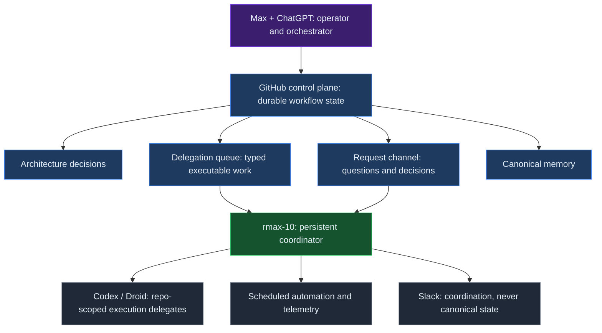
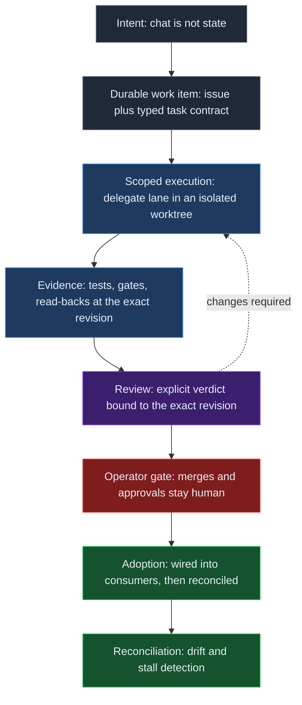
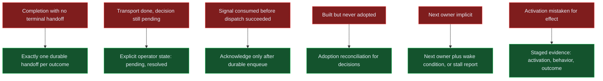

# Publication brief — One Week of rmax.ai: What We Learned Building an Autonomous Agent Control Plane

- **Target slug:** `one-week-rmax-ai-autonomous-agent-control-plane`
- **Time boundary:** 2026-09-18 → 2026-09-24 (the first week of the current control plane)
- **Venue:** rmax.ai notes — existing note content type. Binding contract: `docs/contracts/publish-technical-note.md`.
- **Central thesis:** **Reliable autonomy is durable state plus explicit ownership plus verified transitions.**

## How to use this brief

This file is the complete raw material for the note. It contains (1) the editorial brief, (2) the verified evidence base for every concrete claim, and (3) hard publication-boundary rules. Write the note from this material. Every concrete incident below was verified against the durable project record before drafting — treat the incidents as observed facts and preserve them; do not import additional facts from anywhere else.

## 1. Editorial brief

**What this is.** An engineering field report from the first week of operating a personal autonomous agent control plane. Not launch marketing. Prefer "we observed", "this failed", "we changed", "we cannot yet conclude" over triumphal language.

**Audience.** Engineers who build or operate agent systems: people who care about durable state, idempotency, acknowledgements, ownership, explicit state transitions, reconciliation, observability, and rollback.

**The core story.** The hard part of autonomy is not making an agent act. It is making work continue correctly across boundaries: sessions, agents, repositories, review states, human decisions, failures, and restarts. The first week's failures were control-plane failures rather than reasoning failures. Adding autonomy increased the importance of ordinary distributed-systems ideas.

**Epistemics.** Keep three registers clearly separated throughout: **observed** (verified against the record), **interpretation** (what we take it to mean), and **open hypothesis** (unresolved). Where an integration is still in review or a fix is not yet shipped, say so. One week of a personal lab system is not evidence of general production performance; frame lessons as engineering observations and hypotheses.

## 2. The system to explain

A compact architecture: a human operator working with an AI orchestrator (ChatGPT) at the top; a GitHub-based control plane as durable workflow state; a persistent coordinator agent (rmax-10, running on the Hermes agent framework) in the middle; repo-scoped coding-agent delegates (Codex, Droid — autonomous coding CLIs) and scheduled automation at the bottom.

- **GitHub is the durable source of workflow state** — work items are issues with typed task contracts; lifecycle is explicit (backlog → ready → in-progress → in-review → done); a project board mirrors it.
- **Channels:** an architecture decision log; a delegation queue for executable work (typed task items, atomic claims, subscription-lane routing); a request/answer channel for asynchronous questions and decisions; a canonical memory repository (merged text on its main branch is canonical; chat is never canonical).
- **rmax-10** is the persistent coordinator/runtime agent; Codex and Droid are repo-scoped execution delegates that are intentionally memory-light and know only their checked-out repository plus the task contract they were handed.
- **Slack is coordination, not canonical state.** Local runtime stores hold operational state; merges and important promotion decisions remain human-gated.

Use the first diagram below for this section.

## 3. Eight lessons — the incidents and what changed

Each lesson: what we observed (concrete), what changed, what remains open. These are the verified first-week incidents; keep them concrete, short, and example-led. Do not embellish.

**1. Completion needs a terminal handoff.** *Observed:* work could be finished or blocked, reported in a chat thread, and yet the orchestrator had no guaranteed machine-visible event telling it to resume — work sat until a human noticed. *Changed:* a workflow invariant — every asynchronous investigation ends with exactly one durable handoff message on success or terminal failure; a chat-thread update alone is not completion. *Open:* enforced so far by conventions and checks rather than a hard protocol rail.

**2. Transport completion is not workflow completion.** *Observed:* the request channel initially treated "answer delivered/consumed" as "nothing remains", but delivered answers often carried decisions that were still pending. *Changed:* transport state and workflow state were separated; a consumed answer no longer ends the thread when an operator decision or follow-up remains, with explicit pending/resolved operator lifecycle. *Open:* reconciliation of partial states is still maturing.

**3. Research is a prerequisite state, not a side conversation.** *Observed:* some work needed external research before execution, and doing that research in side channels spawned disconnected threads where the main work item lost its place. *Changed:* the research round-trip is modeled inside the same durable work item — a prerequisite state that gates execution without spawning parallel workflows (validated by a smoke test: issue → external research → result recorded back into the same item). *Open:* the gate is defined but only lightly exercised.

**4. "Built" is not "adopted".** *Observed, twice:* (a) a support tool passed its build acceptance and self-test, yet its consumer pipeline was never wired; a follow-through audit found the integration dead on arrival — a state artifact written during the build made the shipped tool fail closed, and the recorded claim that the live store "is intentionally not created at build time" turned out to be false. (b) Architecture decisions needed evidence of downstream integration, not just merged text. *Changed:* adoption is reconciled mechanically — decision records carry machine-readable impact/adoption state, and a reconciler cross-checks declared workstreams against actual work items; follow-through verification became its own pass (quarantine the bad artifact, rewire fail-open). *Open:* the reconciler itself is in review; adoption signals are only as good as their inputs.

**5. Never consume a signal before durable dispatch.** *Observed:* a scheduled gate deduplicated and marked monitoring signals as consumed at scan time using a positional fingerprint; when the follow-up dispatch failed (a CLI timeout), the signals were gone — no retry, no dead-letter — and recovery required manual archaeology through logs. *Changed:* the defect was filed with the fix direction — key consumption by stable per-run identity, make consumption transactional, acknowledge only after durable enqueue. *Open:* fix not shipped at the time of writing.

**6. Autonomous execution still needs ownership and review semantics.** *Observed:* repo-scoped worker agents are intentionally memory-light; when a task's next owner or wake condition was implicit, work stalled silently after the mechanical steps completed — reviews that nobody owned, pull requests technically complete but parked. *Changed:* every nonterminal item must carry an explicit next owner and wake-up condition or the system must report the item as a stalled workflow; review verdicts are bound to exact revisions so stale approvals cannot masquerade as current; reconciliation for review verdicts, gates, and stalls is being built. *Open:* reconciler pending; the stall discipline is young.

**7. Observability before self-improvement.** *Observed:* the honest next step after week one was not more autonomy — you cannot improve a control plane you cannot replay. *Changed:* a staged proposal was put forward: causal event ledger first, then continuation invariants, deterministic replay of historical failures, regression gates, a reviewed failure corpus, and only then constrained optimizer proposals. *Open:* proposed, not built.

**8. Measure effects, not activation.** *Observed:* an enforcement gate was designed, built, wired, and activated within the week — it steers heavy in-session work into delegated execution lanes. An audit a few days later verified it live-enforcing: it produced real block decisions across multiple sessions and some of that work visibly shifted into delegated lanes within minutes. But the fleet-level heavy-session share of spend was approximately flat relative to baseline after only about three days of post-activation data. *Changed:* the working distinction between implementation evidence, activation evidence, behavioral evidence, and outcome evidence — a deployed guard is not automatically a successful policy. *Open:* a planned two-week metric re-run decides next steps; **no aggregate efficiency claim is made.** Required public framing for this item: *the gate is verified active and has shifted some work into delegated lanes; fleet-level heavy-session spend share is approximately flat after only about three days, so no aggregate efficiency claim yet.*

## 4. What we deliberately did not automate

Merges and important promotions stay human-gated; acceptance authority stays human or review-gated; broad self-modification is out of scope. The system's autonomy is deliberately bounded: agents execute, contracts decide, humans refine the contracts (and hold the merge button). Use this section to make the boundary philosophy explicit.

## 5. Suggested structure (seven sections)

1. **The system we actually built** — actors, channels, durable state, human gates (diagram 1).
2. **What failed in the first week** — concrete short incidents, not a feature list (lessons 1-6, compressed).
3. **The architecture that emerged** — queue / request channel / canonical memory / control plane / reconciliation (diagram 2).
4. **Eight lessons** — the lessons above, compressed and example-led (diagram 3 can anchor the failure-to-mechanism mapping).
5. **What we deliberately did not automate** — section 4 above.
6. **Week two** — causal ledger, trajectory queryability, deterministic replay, adoption metrics, stronger reconciliation.
7. **Status and limits** — one week, personal lab, rapidly changing architecture; not a benchmark or a production reliability claim.

## 6. Public disclosure boundary (hard rules)

- Do **not** reference internal project identifiers: no private repository names or paths, no internal issue or record numbers, no internal codenames beyond `rmax-10`, `Hermes`, `Codex`, and `Droid`. Describe every incident generically ("the delegation queue", "the request channel", "the architecture decision log", "the canonical memory repository").
- Do **not** include chat/thread contents or links, local filesystem paths, credentials, raw prompts or traces, or anything from internal memory stores.
- **May link** public destinations only: rmax.ai note pages (related links below) and, at most sparingly, public product/documentation pages if genuinely load-bearing. Verify every link before publishing.
- Keep quantitative claims to: the time boundary (the first week, September 18-24, 2026), the required heavy-gate framing (section 3, lesson 8), and qualitative counts already in this brief ("eight lessons", "about three days of post-activation data"). Do not add spend figures, session counts, block counts, or internal telemetry numbers.
- Preserve the actor boundary: ChatGPT/operator orchestrates and reviews; rmax-10 is the persistent coordinator; Codex/Droid are repo-scoped execution delegates; Hermes is the underlying runtime framework.

## 7. House requirements for the published note

- **End sections (required by the structure audit):** `## Practical Takeaways` (bullets with bold lead-ins), `## Positioning Note` (what is actually new / proposed contribution), `## Status & Scope` (conceptual model, not a product spec; personal lab; not production guidance). Order: narrative close → Practical Takeaways → Positioning Note → Status & Scope → References.
- **Related rmax.ai links** (slugs verified against this repository; link the first three or four where they genuinely connect, and include them in the References section):
  - `/notes/when-ai-use-becomes-infrastructure/` — the preceding 128-day operational trace (direct predecessor).
  - `/notes/failure-oriented-orchestration/`
  - `/notes/earned-agent-autonomy/`
  - `/notes/agent-execution-contracts/`
  - `/notes/authority-first-agent-architecture/`
- **Mermaid diagrams:** exactly three, provided below with exact sources. Embed them byte-identically: in `index.md` as ` ```mermaid ` fenced blocks, in `index.html` as `<pre class="mermaid">` blocks (flush-left at column 0, content indented four spaces). Never use `<br/>`, `<`, or raw `&` inside diagram blocks. Copy the page-level Mermaid runtime (module import, `mermaid.initialize` with the dark `themeVariables`, `pre.mermaid` CSS rule) from the most recent published note — `notes/jev-vs-generative-models-for-typed-software-decisions/index.html`.
- **Frontmatter:** all mandatory fields per `notes/schema.yaml`; `slug` equals the directory name; `status: published`; `reading_time` calibrated from the prose-only word count (~206 wpm, rounded to a 2-minute range). Structural reference: the frontmatter of `notes/jev-vs-generative-models-for-typed-software-decisions/index.md`.
- **No tracking parameters** in any link. No "Editorial Notes" artifacts left in the file.

### Diagram 1 — the system (actors and durable state)



### Diagram 2 — the path work takes (and why every arrow must be a verified transition)



### Diagram 3 — first-week failure modes mapped to the mechanisms that answer them


