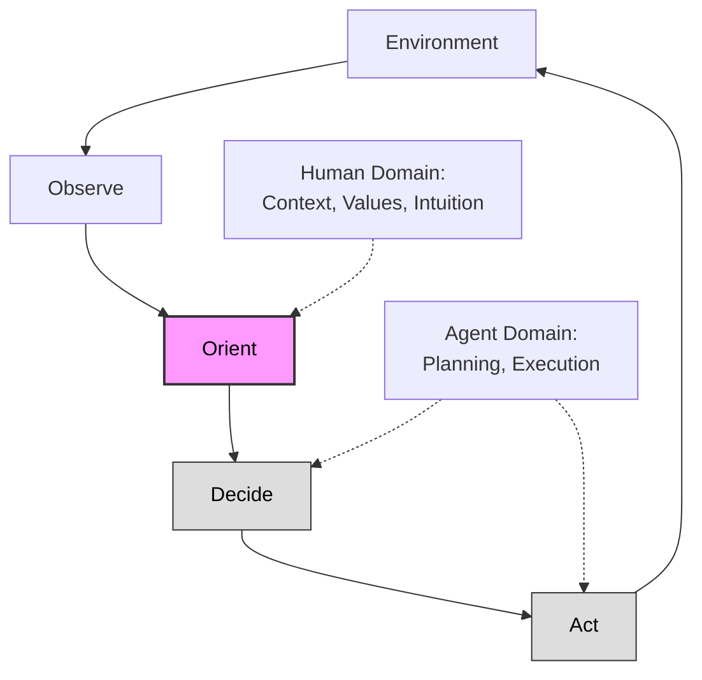
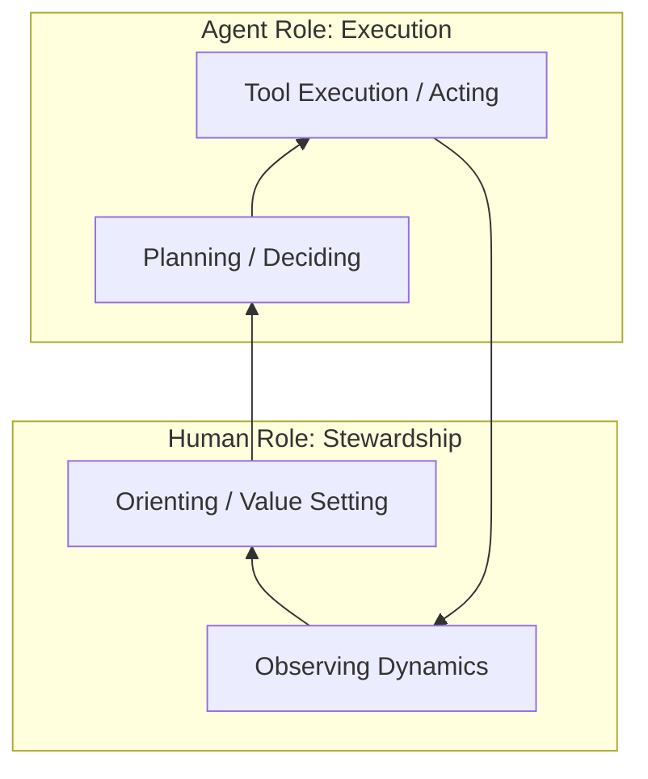

# Plan: Explanation & Expansion of "The Human Loop"

This document outlines the plan to expand `inbox/the-human-loop-orientation-autonomous-agents.md` into a fully researched and grounded article.

## 1. Core Thesis & Primary Frame: The OODA Loop

**Goal**: Establish the OODA loop as the rigorous framework for understanding automation, moving beyond simple "human-in-the-loop" rhetoric.

* **Concept**: The OODA Loop (Observe, Orient, Decide, Act) by John Boyd.
* **Application**:
  * **Act/Decide**: The domain of increasing automation (Copilots, Agents).
  * **Orient**: The "center of gravity" where meaning, values, and strategy are synthesized. This remains the human's primary domain.
* **Key References**:
  * Boyd, John R. *The Essence of Winning and Losing*. (Source of OODA).
  * Endsley, Mica R. "Toward a Theory of Situation Awareness in Dynamic Systems" (1995). (Maps "Orientation" to "Situational Awareness").
* **Diagram**: A visual representation of the OODA loop, highlighting the "Automated" half (Decide/Act) vs the "Human" half (Orient/Observe).

## 2. Historical Arc: Levels of Automation

**Goal**: Ground the "Assistive -> Agentic -> Orientation" phases in established Human Factors & Ergonomics (HF&E) literature.

* **Concept**: Sheridan & Verplank's "Levels of Automation" (1-10).
* **Mapping**:
  * **Assistive Phase**: Levels 2-4 (Computer suggests, Human executes).
  * **Agentic Phase**: Levels 5-6 (Computer executes, Human vets).
  * **Orientation Phase (Future)**: Levels 7-9 (Computer executes autonomously, Human monitors *system dynamics*).
* **Key References**:
  * Sheridan, T. B., & Verplank, W. L. "Human and Computer Control of Undersea Teleoperators" (1978).
  * Parasuraman, R., et al. "A Model for Types and Levels of Human Interaction with Automation" (2000).

## 3. The Orientation Bottleneck & Ironies of Automation

**Goal**: Explain *why* removing humans from execution makes "Orientation" harder, not easier.

* **Concept**: Bainbridge's "Ironies of Automation" (1983).
  * *Irony*: Automating easy tasks leaves humans with the impossible task of monitoring complex failure modes without active engagement (loss of feedback loop).
* **Key References**:
  * Bainbridge, Lisanne. "Ironies of Automation". *Automatica* (1983).
  * Woods, David D. "Cognitive Systems Engineering".
* **Argument**: "Human-on-the-loop" is cognitively more demanding than "Human-in-the-loop".

## 4. Intuition: Recognition-Primed Decision Making

**Goal**: Demystify "intuition" as a technical skill (compressed inference) rather than magic, grounded in cognitive psychology.

* **Concept**: Naturalistic Decision Making (NDM) and the Recognition-Primed Decision (RPD) model.
  * Experts make decisions by recognizing patterns (Orientation), not by comparing options (Decision).
  * AI agents lack the embodied/social signals to "Orient" correctly in novel situations.
* **Key References**:
  * Klein, Gary. *Sources of Power: How People Make Decisions*.
  * Kahneman, Daniel. *Thinking, Fast and Slow* (System 1 vs System 2).

## 5. Agents & Autonomy: The Hierarchy of Control

**Goal**: Position humans as "Stewards" of system dynamics rather than "Supervisors" of tasks.

* **Concept**: Resilience Engineering.
  * Agents drift (alignment decay).
  * Humans provide the "outer loop" correction (re-orienting).
* **Diagram**: Control Hierarchy.

## Execution Plan

1. **Draft Content**: Write the expanded sections using the references above.
2. **Integrate Diagrams**: Render the Mermaid diagrams.
3. **Review**: Ensure tone is "Analytic, not inspirational".
