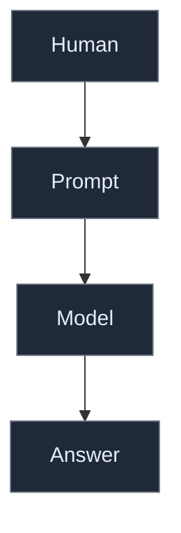
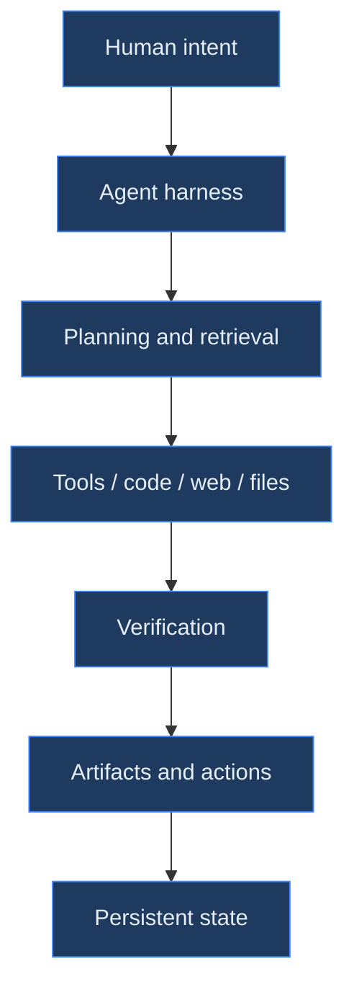
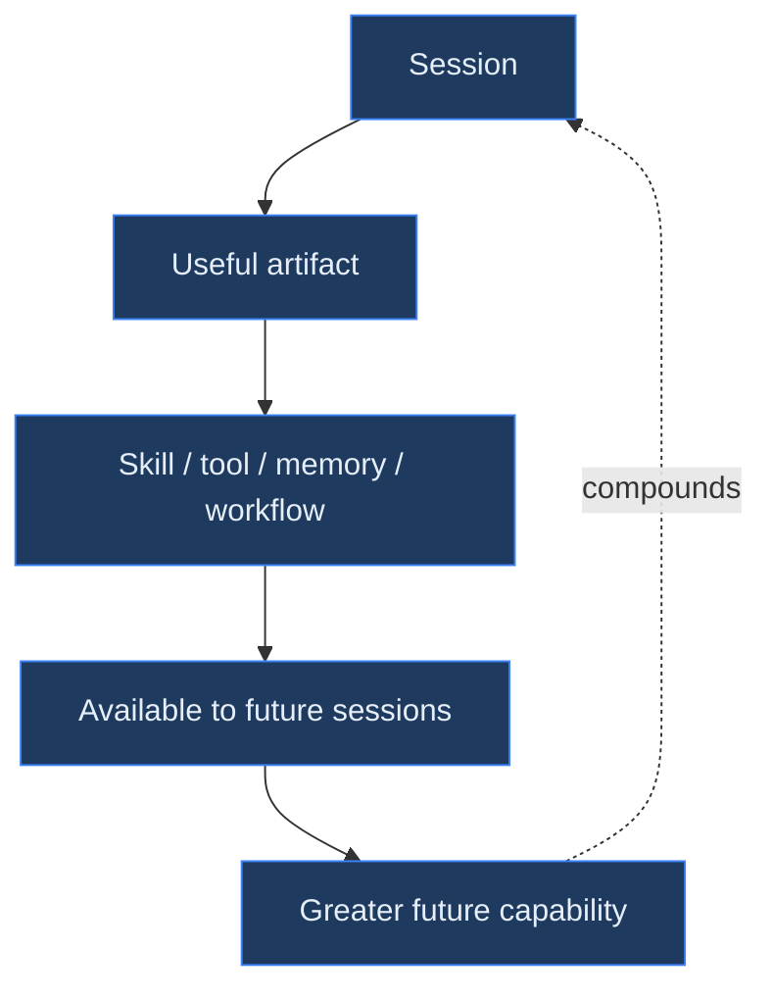
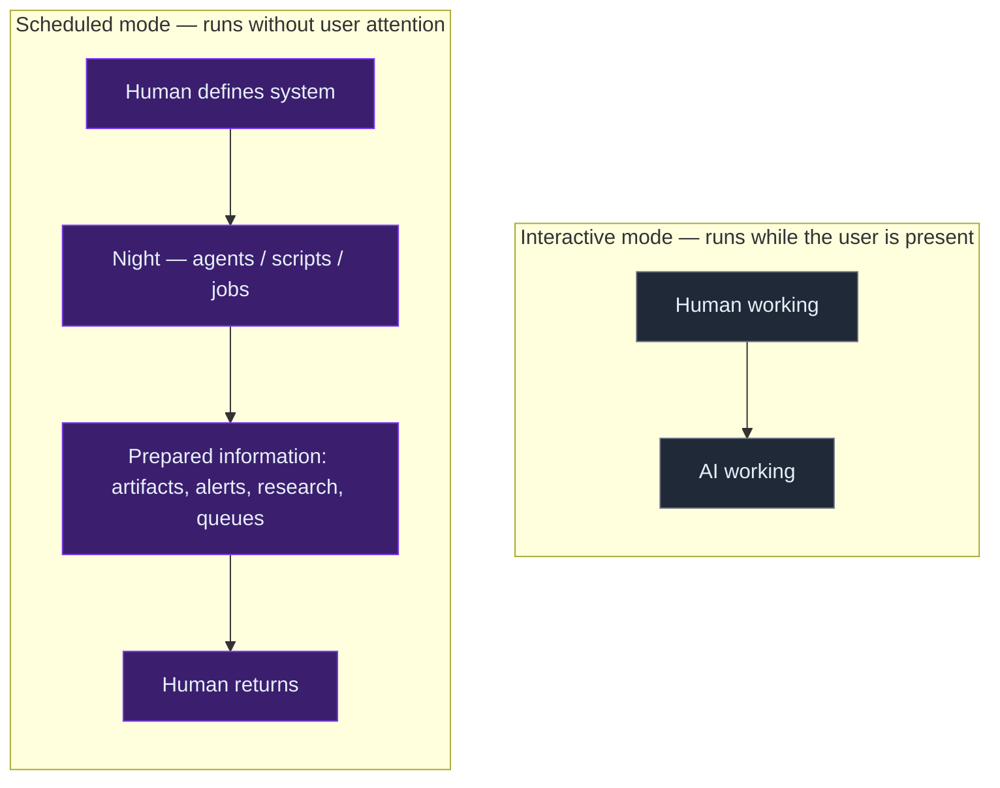
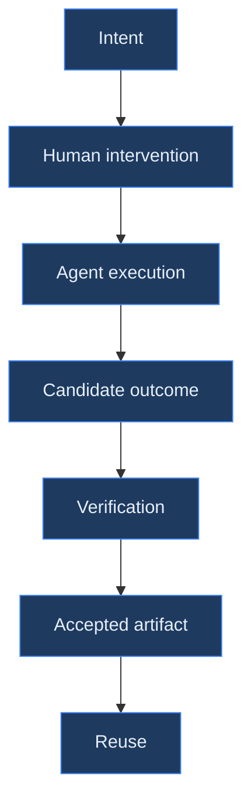
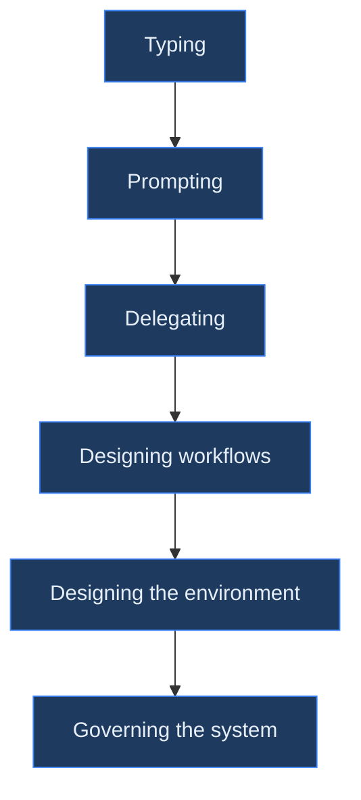

# When AI Use Becomes Infrastructure: 128 Days Inside a Personal Agent System

**What 6.6 billion tokens, 70,000 tool calls, 2,645 autonomous runs, and 244 skills reveal about the transition from using AI assistants to operating personal AI infrastructure.**

For most people, using AI still means opening a chat interface, asking a question, and receiving an answer.

That interaction has a simple architecture:

Human → model → response

But sustained use of capable agents can evolve into something structurally different.

Over 128 consecutive days, one software engineer operated a personal AI environment built around interactive agents, coding agents, scheduled jobs, persistent knowledge, custom skills, local databases, command-line tools, telemetry, and autonomous workflows.

The resulting activity was substantial:

- 3,385 agent sessions
- approximately 6.6 billion tokens
- 70,941 tool calls
- 2,645 autonomous runs
- 76 scheduled jobs
- 244 reusable skills
- 10 local signal stores
- 1,314 files in the knowledge base
- 494 coding-agent sessions consuming approximately 633 million tokens

The interesting observation is not the volume.

It is what the volume gradually produced.

The system stopped behaving primarily like an AI assistant and started behaving like personal computational infrastructure.

This 128-day trace offers a small, observational case study of what that transition looks like.

## The prompt stopped being the unit of work

A conventional chatbot interaction makes the human message the dominant unit of activity.

In this dataset, human messages represented only 4.1% of message traffic. Assistant messages accounted for approximately 42%, while tool results accounted for another 54%.

That corresponds to roughly one human message for every 24 subsequent system messages.

The interaction had therefore changed from:



into something closer to:



This distinction matters.

Anthropic's [Building Effective Agents](https://www.anthropic.com/research/building-effective-agents) similarly treats an agent as more than an LLM call. The useful building block is an augmented model equipped with capabilities such as retrieval, tools and memory, operating repeatedly against feedback from its environment.

OpenAI's [Agents SDK](https://github.com/openai/openai-agents-python) exposes essentially the same architectural shift through agents, tools, persistent sessions, handoffs, guardrails and tracing.

The model remains important, but the model is no longer the system.

That distinction has been a recurring theme in rMax.ai's work on agent harness engineering. The argument in [From MLOps to Agent Harness Engineering](/notes/mlops-agent-harness-engineering/) is that the LLM increasingly becomes a probabilistic runtime component surrounded by context management, tools, state, verification and operational control.

The personal-agent dataset provides a concrete instance of that architecture emerging organically through use.

## The workload became genuinely multi-step

Calling something an "agent" says little about how much agency is actually being exercised. The execution traces are more informative.

Across 628 classified interactive sessions:

- approximately 85% involved more than one step;
- 41% exceeded 20 tool calls;
- 18% exceeded 100 tool calls;
- the largest run reached 329 tool calls;
- the median session contained 72 messages and 38 tool calls;
- only about 7% of activity resembled pure question answering.

These are not merely long conversations. They are computational trajectories.

A request might trigger filesystem searches, shell commands, retrieval of previous sessions, web research, code generation, validation, patches, database queries and artifact creation before returning control to the human.

This is precisely why evaluating agents one response at a time becomes increasingly misleading. A previous rMax.ai note, [Stop Evaluating AI One Response at a Time](/notes/stop-evaluating-ai-one-response-at-a-time/), argues that the relevant unit for many human–AI systems is the trajectory and its eventual convergence toward a useful outcome.

The personal-agent traces make that argument tangible.

The useful unit of analysis is no longer: Was the answer correct? It becomes: Did the system successfully transform an intention into a useful result?

## Repeated use turned outputs into infrastructure

The most consequential numbers may not be the token counts at all. During the observation period, the system accumulated:

- 244 skills;
- 76 scheduled jobs;
- 10 SQLite signal stores;
- 9 dedicated query CLIs;
- 74 Git repositories;
- a 1,314-file knowledge base;
- usage and cost telemetry;
- spend watchdogs;
- an email-to-agent queue;
- media-processing pipelines;
- nightly reviews of the agent's own activity.

These artifacts are important because they change what the next interaction can do.

A useful term for this is agentic capital. Agentic capital is the stock of reusable knowledge, tools, procedures, interfaces, evaluations and automation accumulated through previous human–agent work.

Traditional software capital works similarly. A library written today reduces the effort required to build tomorrow's application. A CI pipeline makes every subsequent code change cheaper to validate. Documentation lowers the cost of future comprehension.

Agent systems can accumulate comparable assets:



This creates the possibility of compounding productivity.

The 100th session is not necessarily operating with the same effective capabilities as the first. It may inherit dozens of tools, hundreds of skills, accumulated knowledge, historical decisions and automated workflows created during previous sessions.

This distinction is poorly represented by most AI benchmarks, where each episode begins from a largely standardized environment. Real agent systems increasingly do not.

## Memory is becoming infrastructure

Long-running agents have a basic problem: context windows are temporary, while work is persistent.

Anthropic's experiments with long-running coding agents reached the same conclusion ([Effective harnesses for long-running agents](https://www.anthropic.com/engineering/effective-harnesses-for-long-running-agents)). Agents operating across multiple context windows performed better when important state was externalized into durable artifacts such as progress files, feature lists, Git history and reproducible initialization procedures.

The personal system followed a similar evolutionary path. Its knowledge base grew to more than 1,300 files. Local stores accumulated signals. Skills encoded recurring procedures. Session retrieval allowed previous work to influence current execution.

This reflects a broader architectural distinction explored in [Beyond RAG Memory](/notes/knowledge-as-source-code/): retrieval systems and durable knowledge are different things. Long-lived agent state benefits from canonical, inspectable representations rather than relying exclusively on whatever happens to fit inside the current model context.

There is also an important accounting distinction in the usage data. Approximately 97.5% of recorded input tokens were cache reads.

That does not mean caching and memory are the same mechanism. They are not. Persistent knowledge determines what information can survive across work. Prompt caching reduces the computational cost of repeatedly processing identical or reusable context.

Together, however, these mechanisms point toward an important property of long-running agent systems: the amount of accumulated state does not necessarily translate linearly into marginal inference cost.

This becomes increasingly important as agents operate over months rather than conversations.

## The system crossed from interactive to autonomous

Another threshold appeared when work stopped requiring a human to initiate every execution.

The system recorded approximately 2,645 autonomous runs during the 128-day period. Seventy-six cron jobs existed by the end of the observation window, of which 46 invoked LLMs and 30 were conventional scripts.

Roughly 20 scheduled jobs could complete before 09:00 local time on a normal day.

This changes the temporal model of AI-assisted productivity. Interactive AI operates primarily while its user is present. Scheduled agent infrastructure allows computation to occur independently:



The claim should not be exaggerated. An autonomous run cannot automatically be equated with an hour of human labour, and execution count is not equivalent to economic value.

But a real architectural transition has occurred. The AI system is no longer constrained to the operator's active attention window.

## Skills move intelligence into the environment

The accumulation of 244 skills suggests another important shift.

Early LLM use tends to place most instructions directly into prompts. As recurring patterns become understood, some of those instructions can be externalized into reusable procedures.

A skill may encode:

- how to research a particular type of question;
- how to prepare a document;
- how to query a particular system;
- what standards an artifact must satisfy;
- which tools should be invoked;
- how results should be checked.

That makes skills part of the system's effective capability.

This is consistent with the distinction developed in [Personas, Skills, Agents, and Harnesses in AI System Design](/notes/personas-skills-agents-harnesses/): reliable systems increasingly distribute behavior across several layers rather than expecting one large prompt to contain everything the agent needs to know.

Capability therefore becomes something closer to:

```text
System capability =
    Model × Context × Tools × Skills × Memory × Verification × Runtime
```

The exact mathematical form is not important. The architectural implication is.

Changing the model while keeping the environment fixed does not measure the same thing as changing the entire system.

This is the central argument behind [The Harness Gap](/notes/harness-gap/): agent performance should increasingly be understood as model–harness performance, because context selection, tool design, retries, validation and execution policies materially influence what a fixed model can accomplish.

The personal-agent dataset suggests the same phenomenon at individual scale.

## Cheap models become more useful when the system becomes stronger

Another interesting development occurred in model routing. Interactive workloads initially relied heavily on more expensive models. By September, much of that activity had shifted toward faster and cheaper models, while session volume continued increasing.

This suggests a hypothesis worth testing: a stronger harness may reduce how often every task requires the strongest available model. A task supported by good retrieval, clear tools, explicit procedures and deterministic verification may be solvable by a cheaper model than the same task attempted through an unstructured prompt.

This does not imply that model capability stops mattering. It suggests that intelligence can be distributed between model and environment.

That is potentially important economically.

The recorded wallet drain was approximately $128.60 across 124 days—roughly one dollar per day of observed marginal wallet expenditure—but this figure should not be confused with the total economic cost of the system. Subscription costs, partially tracked services, Gemini/Veo usage, some direct API callers, and other tooling were not completely represented. The internal ledgers also produced a higher tracked figure of roughly $197, so the cost data should currently be treated as a bound rather than an audited total.

The more defensible conclusion is therefore not that billions of tokens "cost one dollar per day." It is that routing, caching, subscriptions and differentiated model usage can make very high computational throughput surprisingly inexpensive at the margin.

## Six billion tokens do not prove productivity

This is the most important limitation of the dataset. The numbers demonstrate activity and architecture. They do not yet demonstrate productivity.

Six billion tokens might represent extraordinary leverage. They could also represent extraordinary waste. Seventy thousand tool calls might indicate sophisticated autonomous execution. They might also reveal unnecessary retries and inefficient loops. Two hundred and forty-four skills might represent a powerful procedural library. They could equally become an unmaintainable collection of obsolete instructions.

Automation makes both productive systems and dysfunctional systems scale faster.

This is related to the argument in [The New Scarcity of Software Engineering in the AI Era](/notes/new-scarcity-software-engineering/): when generation becomes cheap, the scarce resource moves toward judgment, verification and determining which outputs are worth keeping.

The same principle applies to personal agent systems. Token throughput is not the objective. Useful outcomes are.

## Beyond token counts: measuring agentic leverage

A better measurement framework would follow work from intention through outcome:



That suggests a different set of metrics:

- **Autonomous completion rate** — What fraction of tasks reach an acceptable outcome without additional human intervention?
- **Human intervention time** — How many minutes of human attention are required per successful task?
- **Accepted-output rate** — What proportion of produced artifacts survive human review?
- **Rework rate** — How often must agent output be substantially repaired?
- **Cost per accepted outcome** — How much inference and infrastructure expenditure produces one useful result?
- **Artifact reuse rate** — How often does today's work reduce the effort required tomorrow?
- **Skill marginal value** — Does adding a skill measurably improve later success, cost, latency or intervention requirements?
- **Recovery rate** — When an autonomous workflow fails, how often can the system diagnose and recover without manual reconstruction?
- **Off-attention useful work** — How much useful work is completed while the operator is not actively interacting with the system?

These metrics would transform the current dataset from telemetry about extreme AI usage into a longitudinal experiment in human–agent leverage.

Anthropic's current guidance on agent evaluation ([Demystifying evals for AI agents](https://www.anthropic.com/engineering/demystifying-evals-for-ai-agents)) makes a similar point from the systems side: because agents act over many turns, call tools and modify state, evaluating them requires examining trajectories and outcomes rather than only individual generations.

## From second brain to personal operating system

The trajectory also provides empirical support for an idea previously explored on rMax.ai. The January 2026 note [Personal Operating Systems and Micro-Apps](/notes/personal-operating-systems-micro-apps/) proposed that AI-assisted knowledge workers could move beyond the traditional "second brain"—a passive system for storing information—toward an active execution environment containing explicit state, decision rules, automation, feedback loops and governance.

Four months later, the architecture described there had begun to appear in operational telemetry.

The personal system now contained persistent state, scheduled execution, reusable procedures, specialized software, observability and automated feedback.

What began as interacting with models had become something closer to operating a small software-defined organization.

That organization has:

- memory;
- procedures;
- workers;
- scheduled processes;
- specialized tools;
- internal databases;
- budgets;
- telemetry;
- quality controls;
- institutional knowledge.

The analogy should not be taken literally. Agents are not employees, and tool executions are not human labour hours.

But as a systems abstraction, it is increasingly useful.

The human is moving upward in the control hierarchy:



rMax.ai describes a similar transition as [agent-first engineering](/notes/agent-first-software-engineering/): humans increasingly provide intent, constraints and verification while agents execute bounded work inside engineered environments.

## The emerging research question

This is a single-person observational dataset. It cannot establish causal claims about AI productivity. The activity categories are heuristic. Some model usage is absent from the ledgers. Cost accounting is incomplete. The operator is technically sophisticated and therefore not representative of the average knowledge worker.

Those limitations matter.

But the dataset exposes a research question that deserves considerably more attention:

What happens when an individual uses agents intensively enough that previous AI work becomes infrastructure for future AI work?

That question goes beyond prompt engineering. It concerns accumulation, path dependence and systems design.

If every completed task can leave behind better knowledge, another tool, a refined skill, stronger verification or a reusable workflow, then AI productivity may have a compounding component that ordinary per-task benchmarks fail to capture.

The most interesting quantity may therefore not be tokens per day. It may be the rate at which previous agent work increases the capability of future agent work.

That is agentic capital.

And if that hypothesis holds, the long-term difference between casual AI use and AI-native work may not come primarily from who has access to the smartest model. It may come from who has built the strongest system around it.

## Practical takeaways

- **Judge trajectories, not responses.** Track autonomous completion, accepted outputs, rework and cost per accepted outcome; per-response accuracy hides whether the system produced durable results.
- **Externalize state deliberately.** Skills, stores, procedures and retrieval are what let later sessions inherit capability instead of rebuilding it.
- **Let scheduled work use non-attention time.** In this system, roughly 20 scheduled jobs could complete before 09:00 local time on a normal day, so the operator reviewed prepared output rather than generating it.
- **Treat model choice as a routing decision.** The observed shift to cheaper interactive models coincided with rising session volume; a stronger harness may reduce how often the frontier model is required.
- **Account for caching and accumulated state.** In this dataset, 97.5% of recorded input tokens were cache reads, and retained context kept marginal inference cost from scaling linearly with accumulated state.

## Positioning note

This is an operational trace, not a productivity study. It is not academic research: there is no control group and no causal claim is made about AI productivity. It is not vendor documentation: no product is being sold, and the numbers describe one personal system. And it is not a benchmark report: the proposed metrics are a measurement agenda, not measured results. The narrower claim is that intensive personal use of agents can produce compounding infrastructure, and that the relevant unit of analysis shifts from the response to the trajectory.

## Status and scope disclaimer

This is exploratory personal lab work: one operator, one system, 128 days. The activity categories are heuristic, parts of the cost record are incomplete, and several usage sources are not represented in the ledgers; cost figures should be read as bounds, not audited totals. The operator is technically sophisticated and not representative of the average knowledge worker. The architecture and the metric list are offered as a template for what to measure and build, not as validated guidance.

## References and related work

**External**

1. Anthropic — [Building Effective Agents](https://www.anthropic.com/research/building-effective-agents) — the augmented-LLM view of agents: retrieval, tools and memory, operating iteratively against environment feedback.
2. Anthropic — [Effective harnesses for long-running agents](https://www.anthropic.com/engineering/effective-harnesses-for-long-running-agents) — externalizing state across context windows: progress files, feature lists, Git history and reproducible initialization.
3. Anthropic — [Demystifying evals for AI agents](https://www.anthropic.com/engineering/demystifying-evals-for-ai-agents) — evaluating agents over trajectories and outcomes rather than individual generations.
4. OpenAI — [Agents SDK](https://github.com/openai/openai-agents-python) — agents, tools, persistent sessions, handoffs, guardrails and tracing as primitives.
5. OpenAI — [Agents SDK: tools](https://openai.github.io/openai-agents-python/tools/) and [tracing](https://openai.github.io/openai-agents-python/tracing/) — tool definition and tracing documentation.

**rMax.ai**

6. [Personal Operating Systems and Micro-Apps](/notes/personal-operating-systems-micro-apps/) — the January 2026 argument for personal systems of explicit state, decision rules, automation and governance.
7. [From MLOps to Agent Harness Engineering: Why the Model Is the Small Box and the System Is the Product](/notes/mlops-agent-harness-engineering/) — the model as a probabilistic runtime component inside a larger engineered system.
8. [The Harness Gap: Measuring Model–Harness Fit in Coding Agents](/notes/harness-gap/) — agent performance as model–harness performance.
9. [Beyond RAG Memory: Treat Knowledge as Source Code and Retrieval as Compilation](/notes/knowledge-as-source-code/) — durable knowledge and retrieval as separate concerns.
10. [Stop Evaluating AI One Response at a Time](/notes/stop-evaluating-ai-one-response-at-a-time/) — the trajectory, not the response, as the unit of evaluation.
11. [Personas, Skills, Agents, and Harnesses in AI System Design](/notes/personas-skills-agents-harnesses/) — distributing behavior across design layers.
12. [The New Scarcity of Software Engineering in the AI Era](/notes/new-scarcity-software-engineering/) — judgment and verification as the scarce resources.
13. [Deterministic Runtimes for Long-Horizon AI Agents](/notes/deterministic-runtimes/) — compiling stochastic proposals into deterministic, verifiable execution.
